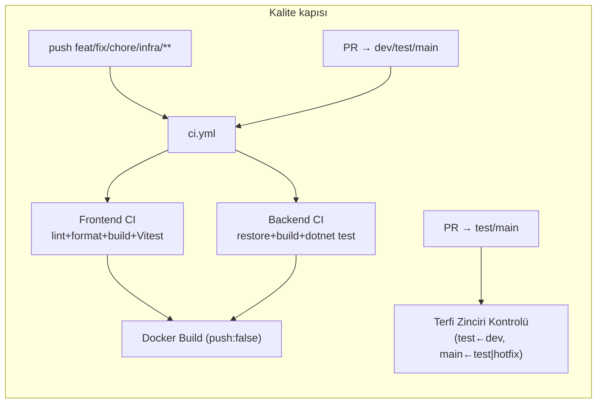
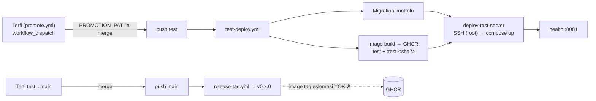
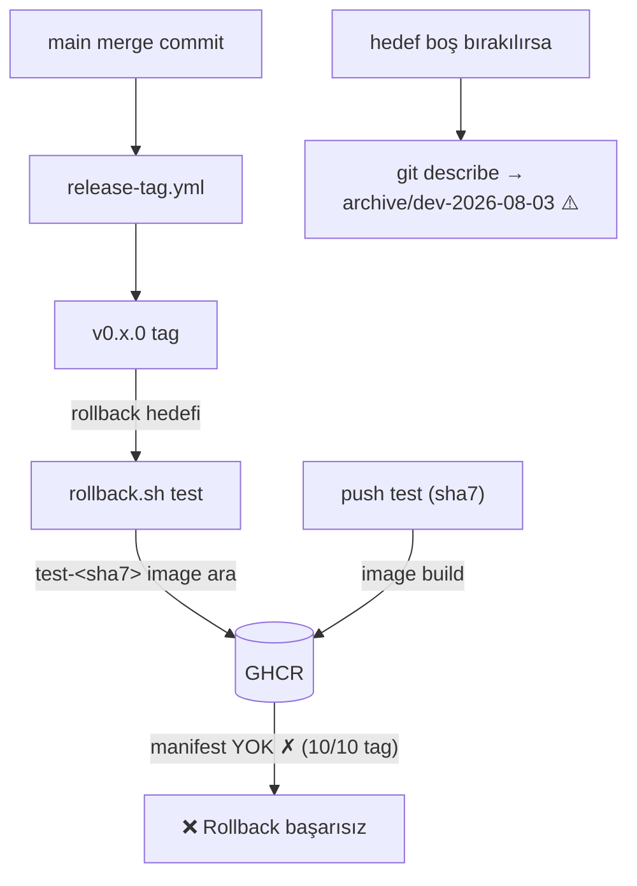
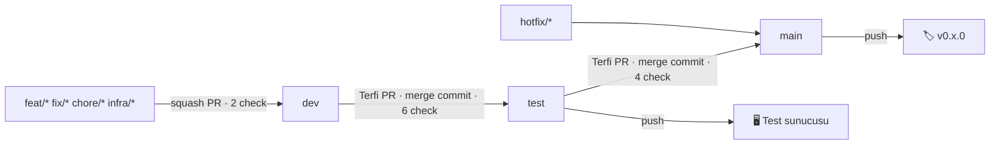

# Cargo Pilot — DevOps Denetim Raporu

**Denetim:** 2026-08-13 · **Son güncelleme:** 2026-08-13 (uygulama sonrası revizyon) · **Kapsam:** `Divizyon/cargo-pilot` (public) · **Yöntem:** 7 paralel denetim ajanı + her orta ve üzeri iddianın bağımsız şüpheci doğrulaması (38 iddia yeniden koşuldu: 37 doğrulandı, 1'i düzeltilerek işlendi). Her bulgunun kanıtı `dosya:satır` veya çalıştırılan komuttur. Denetimin aynı günü öncelik matrisinin iki hücresi uygulandı (PR #942–#945); rapor **denetim anı → bugünkü durum** karşılaştırmalı okunmalıdır.

---

## Yönetici Özeti

> ### Genel sağlık skoru: **63 / 100** — denetim günü **36** idi *(OpenSSF Scorecard kriterlerine göre tahmin, ±10; sıçramanın kaynağı: Dependency-Update-Tool 0→10, SAST 0→10, Vulnerabilities 0→10, Pinned-Dependencies 3→8)*

1. **🔴→🟢 Rollback güvencesi onarıldı.** Denetimde: 10 sürüm tag'inin hiçbirinin GHCR'da image'ı yoktu, `rollback.yml` hiç koşmamıştı, boş hedef arşiv tag'ine çözülüyordu. Şimdi: `release-tag.yml` her yeni tag'i `test-<sha7>` imajıyla eşliyor (#943), `rollback.sh` yalnız `v*` tag'lerine çözülüyor (#942). **Kalan:** gerçek bir tatbikat hâlâ yapılmadı — mekanizma ilk kez canlıda v0.11.0 ile doğrulanacak.
2. **🟠→🟢 Tedarik zinciri kapatıldı.** 28 action referansının tamamı commit SHA'sına pinli (#942), Dependabot `github-actions` ekosistemi pinleri güncel tutacak. **Kalan:** dispatch input'larının root SSH script'ine interpolasyonu ve Dockerfile digest'leri (orta öncelik).
3. **🟠→🟢 Güvenlik görünürlüğü kuruldu.** Dependabot alerts + secret scanning + push protection açık; CodeQL iki dilde PR kapısında (ölçülen: C# 2:13, TS 1:13); npm açıkları **10 → 0** (#944 + xlsx→SheetJS CDN 0.20.3 #945). NuGet ilk taramada temiz. **Kalan:** LICENSE ve SECURITY.md hâlâ yok; server-access.md hâlâ IP/port yayınlıyor.
4. **🟢 CI hattı sağlam, süreç disiplinli** *(değişmedi)*. %98,9 koşum başarısı; terfi zinciri 3 ruleset + `enforce-promotion` ile zorlanıyor. **Kalan:** 0/20 merge review'lu — 1-onay/CODEOWNERS kararı bekliyor; her işe ~1,5 terfi PR'ı yükü sürüyor.
5. **🟡 Dokümantasyon bayatlığı büyük ölçüde duruyor.** README parolası kaldırıldı (#942) ve devops-backlog güncellendi; ama snapshot/kod-taraması yanlışları, escape'li kök CLAUDE.md ve koordinat çelişkisi dahil ~11 dosya hâlâ düzeltilmedi.

---

## 1. Panorama — denetim anı → bugün

| Metrik | Denetim | Bugün | Metrik | Denetim | Bugün |
|---|---|---|---|---|---|
| SHA-pinned action | 0/28 | **28/28** ✅ | npm açığı | 9 high + 1 low | **0** ✅ |
| Dependabot / CodeQL | Yok / Yok | **Kurulu** ✅ | Secret scanning + push prot. | Kapalı | **Açık** ✅ |
| NuGet taraması | Yok | **Temiz (0 alert)** ✅ | Sürüm↔imaj eşleme | Yok (10/10 kopuk) | **Otomatik** (yeni tag'ler) ✅ |
| GitHub environment | Yok (rollback kırık) | **test + prod** (prod onaylı) ✅ | README'de parola | Var | **Kaldırıldı** ✅ |
| Dependabot alert (main) | — (kapalıydı) | **36 → 0** (terfi #946/#947 ile) ✅ | Eşlenen sürüm | 0/10 | **v0.11.0 canlıda eşlendi** ✅ |
| Review'lu merge PR (son 20) | 0/20 | 0/20 ⏸ | rollback.yml koşumu | 0 | 0 ⏸ (tatbikat bekliyor) |
| LICENSE / SECURITY.md | Yok | Yok ⏸ | Bayat doküman | 12 | ~11 ⏸ |
| Workflow / job | 7 / 14 | 8 / 15 (codeql) | CI başarı / ort. süre | %98,9 / 4,5 dk | değişmedi |
| Sürüm tag / Release | 10 / 0 | 10 / 0 (changelog önerisi açık) | Ölü secret (TEST_GHCR_*) | 2 | 2 ⏸ |

---

## 2. CI/CD Hattı

**Akış — kalite kapısı ve terfi/deploy zinciri:**





**Workflow envanteri** *(süreler son 20 koşumun `updatedAt-createdAt` ortalaması; kuyruk süresi dahil)*:

| Workflow | Tetikleyici | Job | Ort. süre | Başarı |
|---|---|---|---|---|
| ci.yml | iş branch'i push + PR→dev/test/main | 4 | 4,5 dk | %100 |
| test-deploy.yml | iş branch'i push + PR→test/main + push test | 4 | 3,9 dk | %100 |
| promote.yml ("Terfi") | workflow_dispatch | 1 | 1,6 dk | 4/4 |
| release-tag.yml | push main | 1 | 14 sn | %91 (10/11) |
| rollback.yml | workflow_dispatch | 1 | — | **0 koşum** |
| sync-base-images.yml | Pazar 02:00 | 1 | 71 sn | %100 |
| cache-cleanup.yml | PR close + Pzt 03:00 | 2 | 17 sn | %100 |

**Başlıca bulgular** *(tümü doğrulanmış; sağ sütun bugünkü durum)*:

| Önem | Bulgu | Kanıt | Durum |
|---|---|---|---|
| 🟠 Yüksek | 28/28 action mutable tag'li, SHA pin yok | `grep uses:` → @v3…@v1.0.3 | ✅ #942: 28/28 SHA-pinli |
| 🟠 Yüksek | `appleboy/ssh-action` root + SSH key ile, tag mutable | test-deploy.yml:309-315, rollback.yml:51-67 | ✅ pin #942 · root/fingerprint ⏸ |
| 🟡 Orta | rollback.yml hiç koşmamış — ilk deneme arıza anında olacak | `gh run list` → boş | ⏸ tatbikat bekliyor |
| 🟡 Orta | Aynı push'ta çifte image build (farklı cache scope) | ci.yml:139-177 vs test-deploy.yml:150-229 | ⏸ açık |
| 🟡 Orta | build-push-action v5/v6 karışık | ci.yml @v6, test-deploy.yml @v5 ×4 | ⏸ açık (SHA-pinli ama iki sürüm) |
| ⚪ Düşük | 13/14 job'da `timeout-minutes` yok | yalnız promote.yml:65 | ⏸ açık (yeni codeql.yml'de var) |
| ⚪ Düşük | Backend test adımı `find` guard'ı ile **sessizce atlanabilir** | ci.yml:120-127 | ⏸ açık |

---

## 3. Secrets & Güvenlik

**Envanter:** 19 benzersiz ad referanslı → **8 tanımlı** (6'sı kullanımda + 2 ölü), **12 referanslı-ama-tanımsız** (fallback'le veya boş geçiyor).

| Secret | Durum | Kullanım |
|---|---|---|
| `GITHUB_TOKEN` | builtin | GHCR login, cache API, PR sorguları — amaca uygun |
| `PROMOTION_PAT` | ✅ tanımlı | Terfi merge (push tetiklerini çalıştırmak için şart) — yüksek değerli hedef |
| `TEST_SSH_HOST` / `TEST_SSH_PRIVATE_KEY` | ✅ tanımlı | Deploy + rollback SSH — **repo seviyesinde**, environment koruması yok |
| `JWT_SECRET`, `VITE_API_BASE_URL`, `VITE_OAUTH_GOOGLE_URL` | ✅ tanımlı | Geçici stack + build-arg (VITE_* aslında secret sınıfı değil) |
| `TEST_GHCR_PAT`, `TEST_GHCR_USER` | ⚠️ **ölü** | Hiçbir workflow kullanmıyor (#483'te kaldırıldı) — silinmeli, PAT revoke |
| `PROD_SSH_*`, `TEST_MSSQL_*`, `TEST_MINIO_*`, `SEED_DEFAULT_ADMIN_PASSWORD`, `RESEND_*`, `VITE_OAUTH_MICROSOFT_URL` | ❌ tanımsız | Fallback değerlerle veya boş geçiyor |

**Doğrulanmış riskler** *(durumlarıyla)*:

- 🟠→🟢 `rollback.yml`'in dayandığı `test`/`prod` environment'ları mevcut değildi → **ikisi de kuruldu** (2026-08-13, API ile); `prod` required-reviewer korumalı — prod rollback artık insan onayı arkasında. ⏸ Kalan: `PROD_SSH_*` hâlâ tanımsız; `TEST_SSH_*`'ın environment secret'ına taşınması manuel (değerlerin yeniden girilmesi gerekir).
- 🟡 `workflow_dispatch` input'ları `${{ }}` ile doğrudan script gövdesine giriyor; rollback'te bu, **sunucuda root olarak koşan** SSH script'i (rollback.yml:36,58,70). ⏸ Açık — env üzerinden geçirilmeli.
- 🟡 SSH'ta host key `fingerprint` pinning yok; kullanıcı `root`. ⏸ Açık — dedike deploy kullanıcısı sunucu tarafı iş.
- ⚪ 6/14 job'da `permissions` bloğu yok — repo default'u `read` olduğu için bugün güvenli. ⏸ Açık (yeni codeql.yml job'ı açık izinli).
- 🟡 Ölü `TEST_GHCR_PAT`/`TEST_GHCR_USER` secret'ları hâlâ duruyor. ⏸ Açık — silinmeli + PAT revoke.
- ✅ Güçlü yönler: `pull_request_target` yok, self-hosted runner yok, fork PR'ları cache job'unda doğru dışlanmış, default token izni `read`.

---

## 4. Release & Paketler

Sürümleme tamamen otomatik: test→main terfisi → `release-tag.yml` → sıradaki `v0.<minor>.0` (semver biçimli ama yalnız minor artan sayaç). **10 günde 10 sürüm**, 0 GitHub Release, changelog yok. GHCR'da 4 public image: uygulamalar `:test` + immutable `:test-<sha7>` (165'er tag birikmiş, temizlik yok), base image'lar haftalık MCR aynası.



**🔴→🟢 Kritik bulgu — ONARILDI (#942 + #943):** Denetimde 10 v0.x tag'inin kısa SHA'ları GHCR tag listesiyle tek tek karşılaştırılmıştı — hiçbirinin imajı yoktu; `git describe` de filtresiz olduğundan boş hedef arşiv tag'ine çözülüyordu. Uygulanan onarım: `release-tag.yml` artık her yeni tag'i merge commit'in `^2` parent'ının (test head) mevcut `test-<sha7>` imajıyla `imagetools` üzerinden eşliyor (kaynak imaj yoksa **açık hata**), `rollback.sh` yalnız `v*` tag'lerine çözülüyor. **Canlıda doğrulandı (terfi #947, 2026-08-13):** v0.11.0 atıldı ve retag adımı başarıyla koştu — `ghcr.io/divizyon/cargo-pilot-backend:v0.11.0` ve `cargo-pilot-frontend:v0.11.0` GHCR'da mevcut. Tag tabanlı rollback artık **v0.11.0 ve sonrası için gerçekten çalışır**. **Not:** geçmiş 10 tag (v0.1.0–v0.10.0) eşlenmemiş — istenirse tek seferlik elle retag yapılabilir.

**Onarım (release-tag.yml'e ek adım):**

```yaml
- name: Image'lara sürüm tag'i ekle
  run: |
    SHA=$(git rev-parse --short=7 "${GITHUB_SHA}^2" 2>/dev/null || git rev-parse --short=7 "$GITHUB_SHA")
    for IMG in cargo-pilot-backend cargo-pilot-frontend; do
      docker buildx imagetools create \
        --tag "ghcr.io/divizyon/${IMG}:${TAG}" \
        "ghcr.io/divizyon/${IMG}:test-${SHA}"
    done
```

+ `rollback.sh:37,42` → `git describe --tags --abbrev=0 --match 'v*'` + sakin bir günde **rollback tatbikatı** (0 koşumlu bir mekanizmaya güvenilemez) + `gh release create "$TAG" --generate-notes` ile otomatik changelog.

---

## 5. Branch Stratejisi

Mevcut model: **GitLab Flow (environment branches)** — sıkı disiplinli, ruleset + CI ile zorlanmış:



Ruleset gerçeği *(klasik branch protection API'si 404 döner — korumalar ruleset ile)*: 3 aktif ruleset; üçünde de **`required_approving_review_count: 0`** ve `strict_required_status_checks_policy: false`. Bypass: dev/test'te 2 takım, **main'de 1 takım** (pull_request modunda). Son 20 merge: **12'si terfi PR'ı**, 20/20 review'suz, tümü tek kişi tarafından açılıp merge edilmiş.

**Alternatif senaryolar:**

| | A — Mevcut modeli otomasyonla ucuzlat | B — GitHub Flow (tek main) | C — Trunk-based + imaj terfisi |
|---|---|---|---|
| **Öz** | Model aynı; head branch auto-delete + promote.yml PR'ı da açsın + kritik yollara CODEOWNERS | dev/test silinir; main push → test sunucusu; prod = environment onayı + tag | Tek dal; "terfi" = image tag'ini ortama atamak (`:test`→`:prod` retag), git merge değil |
| **Artı** | En düşük risk; alışkanlık/doküman korunur | Terfi yükü (%60) tamamen kalkar; BEHIND/PAT karmaşası biter | "Test edilen imaj = prod imajı" garantisi; rollback = eski tag'i geri atamak |
| **Eksi** | 12/20 terfi-PR yükü yapısal kalır | QA'de bekletme kaybolur; feature flag şart | En büyük geçiş maliyeti; tüm workflow + doküman yeniden yazılır |
| **Ne zaman** | Bugün — prod yokken | CI'a tam güven varsa (zaten tek kapı CI) | **Prod pipeline'ı kurulurken** — zaten yazılacakken hedefe geçmek en ucuz an |
| **Etki / Efor** | orta / düşük | yüksek / orta | yüksek / yüksek |

**Öneri:** Kısa vadede **A**, prod kurulumu gündeme geldiğinde **C**'ye evrilme.

---

## 6. OpenSSF Scorecard — denetim → bugün

| Kriter | Denetim | Bugün | Not |
|---|---:|---:|---|
| Dangerous-Workflow | 10/10 | 10/10 | `pull_request_target` yok |
| Maintained | 10/10 | 10/10 | 90 günde 822 commit |
| CI-Tests | 9/10 | 9/10 | `find` guard'ı sessiz atlama riski sürüyor |
| **Dependency-Update-Tool** | 0/10 | **10/10** | dependabot.yml (5 girdi) + alerts açık |
| **SAST** | 0/10 | **10/10** | CodeQL PR kapısında, iki dil (C# 2:13, TS 1:13) |
| **Vulnerabilities** | 0/10 | **10/10** | npm audit 0 açık; NuGet ilk taramada temiz |
| **Pinned-Dependencies** | 3/10 | **8/10** | 28/28 action SHA-pinli; Dockerfile'lar hâlâ digest'siz |
| Branch-Protection | 4/10 | 4/10 | 0 zorunlu onay — karar bekliyor |
| Token-Permissions | 4/10 | 4/10 | Top-level permissions hâlâ eksik |
| Code-Review | 0/10 | 0/10 | 0/20 review'lu merge |
| License | 0/10 | 0/10 | LICENSE hâlâ yok |
| Security-Policy | 0/10 | 0/10 | SECURITY.md hâlâ yok |
| **Toplam (ort. ×10)** | **≈36** | **≈63** | ±10; sıradaki en ucuz puanlar: LICENSE + SECURITY.md |

---

## 7. Dependabot & CodeQL — ✅ KURULDU (2026-08-13, PR #942)

**Envanter:** 73 npm (51+22) · 36 NuGet / 6 csproj · 2 Dockerfile · 8 action. CodeQL kapsamı: C# (~0.9-1.1 MB, migration'lar hariç) + TypeScript (1.67 MB); taranan kritik yüzeyler: `AllowAnonymous` controller'lar (Shares/Contact/Me/Subscriptions), public `/share/:token`, JWT, ERP outbound, billing.

Aşağıdaki iki config **uygulandı ve canlıda doğrulandı** — CodeQL kendi PR'ından itibaren her PR→dev'de koşuyor, ilk koşumlar 0 açık alert döndü (tam repo taban çizgisi ilk haftalık cron'da). İlk Dependabot taraması Pazartesi 06:00 (Europe/Istanbul).

**İki kritik kısıt (doğrulandı ve tasarıma işlendi):**
1. **`target-branch: dev` zorunlu** — varsayılan davranış PR'ı `main`'e açar; `enforce-promotion` + ruleset zorunlu check'i bu PR'ları **merge edilemez** kılar.
2. **Dependabot güvenlik güncellemeleri `target-branch`'i yok sayar**, daima default dala (main) açılır → security updates **kapalı tutulmalı**, yalnız alerts + haftalık sürüm PR'larına güvenilmeli (veya enforce-promotion'a `dependabot/**` istisnası).

**`.github/dependabot.yml` (önerilen tam içerik):**

```yaml
version: 2
updates:
  - package-ecosystem: "npm"
    directory: "/apps/frontend"
    target-branch: "dev"        # enforce-promotion main'e dış PR kabul etmez
    schedule: { interval: "weekly", day: "monday", time: "06:00", timezone: "Europe/Istanbul" }
    open-pull-requests-limit: 5
    labels: ["dependencies", "npm"]
    commit-message: { prefix: "chore(deps)" }
    groups:
      npm-minor-patch:
        applies-to: version-updates
        update-types: ["minor", "patch"]
    ignore:                      # 3D sahne ve routing major'ları manuel QA istiyor
      - { dependency-name: "three",          update-types: ["version-update:semver-major"] }
      - { dependency-name: "@types/three",   update-types: ["version-update:semver-major"] }
      - { dependency-name: "@react-three/*", update-types: ["version-update:semver-major"] }
      - { dependency-name: "react-router*",  update-types: ["version-update:semver-major"] }
  - package-ecosystem: "nuget"
    directory: "/apps/backend"
    target-branch: "dev"
    schedule: { interval: "weekly", day: "monday", time: "06:00", timezone: "Europe/Istanbul" }
    open-pull-requests-limit: 5
    labels: ["dependencies", "nuget"]
    commit-message: { prefix: "chore(deps)" }
    groups:
      nuget-minor-patch:
        applies-to: version-updates
        update-types: ["minor", "patch"]
  - package-ecosystem: "docker"
    directory: "/apps/frontend"
    target-branch: "dev"
    schedule: { interval: "weekly", day: "monday" }
    open-pull-requests-limit: 5
    labels: ["dependencies", "docker"]
  - package-ecosystem: "docker"
    directory: "/apps/backend"
    target-branch: "dev"
    schedule: { interval: "weekly", day: "monday" }
    open-pull-requests-limit: 5
    labels: ["dependencies", "docker"]
  - package-ecosystem: "github-actions"
    directory: "/"
    target-branch: "dev"
    schedule: { interval: "weekly", day: "monday" }
    open-pull-requests-limit: 5
    labels: ["dependencies", "ci"]
    groups:
      actions-all:
        patterns: ["*"]
```

**`.github/workflows/codeql.yml` (önerilen tam içerik):**

```yaml
name: CodeQL

# Yalnızca dev'e açılan PR'lar + haftalık tam tarama.
# feat/** push'larına bilerek bağlı DEĞİL: C# analizi ~8-15 dk sürüyor.
on:
  pull_request:
    branches: [dev]
  schedule:
    - cron: '0 3 * * 1'

jobs:
  analyze:
    name: CodeQL Analiz (${{ matrix.language }})
    runs-on: ubuntu-latest
    permissions:
      security-events: write
      packages: read
      actions: read
      contents: read
    strategy:
      fail-fast: false
      matrix:
        include:
          - { language: csharp,                build-mode: none }  # derlemesiz analiz
          - { language: javascript-typescript, build-mode: none }
    steps:
      - uses: actions/checkout@v4
      - uses: github/codeql-action/init@v3
        with:
          languages: ${{ matrix.language }}
          build-mode: ${{ matrix.build-mode }}
          config: |
            paths-ignore:
              - '**/docs/**'
              - '**/tests/**'
              - 'apps/backend/CargoPilot.Engine.Tests/**'
              - 'apps/backend/CargoPilot.Infrastructure.Tests/**'
              - '**/*.test.ts'
              - '**/*.test.tsx'
      - uses: github/codeql-action/analyze@v3
        with:
          category: "/language:${{ matrix.language }}"
```

**Gürültü beklentisi:** ilk hafta ~10-15 PR (gruplama limitiyle), sonrasında haftada ~4; ilk CodeQL taraması için ~2-4 saat triyaj bloke edilmeli. Public repo → Actions **ücretsiz**. *(Ölçüldü, PR #942: `build-mode: none` ile C# analizi **2 dk 13 sn**, TS 1 dk 13 sn — 8-15 dk tahmininin çok altında.)* `xlsx` sorunu **çözüldü (#945):** SheetJS CDN 0.20.3 tarball'ına geçildi, iki advisory de kapandı; URL bağımlılığını Dependabot izleyemediği için kalıcı çözüm (exceljs geçişi) `devops-backlog.md` madde 12'ye kapsam + QA notuyla yazıldı.

---

## 8. Dokümantasyon

39 md / ~9.650 satır; yapı iyi (SUMMARY + doc-map + context kütüphanesi) ama **12 dosyada bayatlık/çelişki**:

| Önem | Dosya | Sorun |
|---|---|---|
| 🟠 | `CLAUDE.md` (kök) | Tüm markdown `\#`, `\-` ile escape'li — render bozuk (107/248 satır) |
| 🟠 | `docs/context/project-snapshot.md` | Test kaynağı "main push" (doğrusu: test), backend testleri "yok" (var: Engine.Tests + Infrastructure.Tests), promote.yml listede yok, "1 onay" (kaldırıldı) |
| 🟠 | `docs/context/kod-taramasi-2026-08.md` | "Backend test projesi hiç yok, dotnet test atlanıyor" — artık yanlış |
| ✅ | `README.md` | ~~Default admin parolası canlı URL'le yan yana~~ — **#942'de kaldırıldı**, giriş bilgisi `local-setup.md`'ye devredildi |
| 🟠 | `docs/devops/server-access.md` | Sunucu IP, root SSH, internete açık MSSQL 1433/1434 public dokümante; secret adları da yanlış |
| 🟡 | `doc-map.md` + `SUMMARY.md` | Koordinat dokümanları indekste yok; sayılar eski (37→39 dosya) |
| 🟡 | `docs/devops/deployment.md` | Eski branch prefix'leri + yanlış tetikleyici tablosu |
| 🟡 | `docs/devops/secret-management.md` | Ölü TEST_GHCR_* listeli; fiilen kullanılan 10+ secret listede yok |
| 🟡 | `apps/backend/docs/developer-setup.md` | global.json konumu, yollar ve "SDK 8.0.419 pinli" iddiası yanlış |
| 🟡 | Koordinat rehberleri | COORDINATE_STANDARD `depth`'i yasaklıyor; 3 CLAUDE.md hâlâ öğretiyor |

Eksik standart dosyalar: **LICENSE, SECURITY.md, CHANGELOG, CODEOWNERS, issue template.** Ayrıca kökte `tip1_animasyonlu_planlayici (1).html` prototip artığı duruyor.

---

## 9. Öneri Öncelik Matrisi

**Etki × Efor** *(önce sol üst köşe; ✅ = 2026-08-13'te uygulandı)*:

| | **Efor: Düşük** | **Efor: Orta** | **Efor: Yüksek** |
|---|---|---|---|
| **Etki: Yüksek** | ① Rollback tatbikatı ⏸ · ② ssh-action SHA pin ✅ · ③ Dependabot + alerts ✅ · ④ CodeQL ✅ · ⑤ README parola temizliği ✅ · ⑥ rollback.sh `--match 'v*'` ✅ · ⑦ main/test'e 1 onay ⏸ karar | ⑧ v0.x ↔ image eşleme ✅ · ⑨ `npm audit fix` + xlsx ✅ (exceljs → backlog 12) · ⑩ test/prod environment ✅ + deploy kullanıcısı ⏸ | ⑮ Senaryo C: imaj terfisi (prod kurulumuyla birlikte) |
| **Etki: Orta** | ⑪ LICENSE + SECURITY.md · ⑫ Ölü secret sil · ⑬ GitHub Release `--generate-notes` · ⑭ Doküman bayatlığı düzeltmeleri, top-level permissions, timeout'lar, backend test guard `exit 1` | Çifte image build tekilleştirme · dispatch input'larını env'e taşıma · Dockerfile digest pin | GHCR tag temizlik workflow'u |

**Şu an → Önerilen → Beklenen fayda:**

| # | Şu an | Önerilen | Beklenen fayda |
|---|---|---|---|
| 1 | Rollback hiç denenmemiş, tag→image eşleşmesi yok | Tatbikat + `imagetools` retag adımı + `--match 'v*'` | Arıza anında **gerçekten çalışan** geri dönüş |
| 2 | 0/28 SHA pin, root SSH'lı 3. taraf action | Önce ssh-action, sonra tümü SHA+yorum | Tag hijack'te sunucu anahtarı sızmaz |
| 3 | Dependabot/CodeQL/alerts kapalı, 9 high açık | 4 ekosistem + `target-branch: dev` + CodeQL PR→dev | Açıklar otomatik görünür; 9 high ilk haftada kapanır |
| 4 | Default parola + canlı URL public README'de | Parolayı kaldır, sunucu seed'ini doğrula | Bilinen şifreyle hesap ele geçirme riski kapanır |
| 5 | 0/20 review, 0 zorunlu onay | main/test ruleset'inde 1 onay veya kritik yollara CODEOWNERS | Üretime giden kodda ikinci göz |
| 6 | 10 sürüm / 0 release / changelog yok | `gh release create --generate-notes` | Sürüm içeriği görünür, denetim izi oluşur |
| 7 | Terfi başına manuel PR + dispatch | promote.yml PR'ı da açsın; head branch auto-delete | Terfi yükü yarıya iner, dal çöplüğü biter |

---

## 10. Uygulama Durumu — 2026-08-13

Öncelik matrisinin sol üst köşesi aynı gün uygulandı → **[PR #942](https://github.com/Divizyon/cargo-pilot/pull/942)** (`infra/devops-sertlestirme` → dev):

| Kalem | Durum | Not |
|---|---|---|
| 28 action referansı SHA pin | ✅ PR #942 | v5'ler v5 SHA'sında; eski tag satır sonunda yorum |
| `.github/dependabot.yml` | ✅ PR #942 | 5 ekosistem girdisi, tümü `target-branch: dev` |
| `.github/workflows/codeql.yml` | ✅ PR #942 | PR→dev + haftalık cron; codeql-action da SHA-pinli |
| README default parola | ✅ PR #942 | Giriş bilgisi `local-setup.md`'ye devredildi |
| `rollback.sh --match 'v*'` | ✅ PR #942 | İki `git describe` çağrısı da sınırlandı |
| Dependabot alerts | ✅ Repo ayarı (API) | Security updates **bilinçli kapalı** (kısıt 2) |
| Secret scanning + push protection | ✅ Repo ayarı (API) | Denetim kapsamı dışıydı, planın 3. adımıydı |
| Rollback **tatbikatı** | ⏸ Manuel | Canlı test sunucusuna dokunur — Actions → "Manuel Rollback" → environment=test; #943 sonrası ilk yeni sürümden itibaren v0.x tag'iyle de denenebilir |
| main/test ruleset'ine 1 onay | ⏸ Karar bekliyor | Tek kişilik akışta PR yazarı kendi PR'ını onaylayamaz → terfi zinciri kilitlenebilir; alternatif: kritik yollara CODEOWNERS |

**"Etki yüksek / efor orta" hücresi — 2026-08-13 (devamı):**

| Kalem | Durum | Not |
|---|---|---|
| v0.x ↔ GHCR image eşleme | ✅ [PR #943](https://github.com/Divizyon/cargo-pilot/pull/943) merge | `release-tag.yml` artık yeni tag'i `test-<sha7>` imajına `imagetools` ile eşliyor; kaynak imaj yoksa açık hata |
| `npm audit fix` (9/10 açık) | ✅ [PR #944](https://github.com/Divizyon/cargo-pilot/pull/944) merge | Yalnız lockfile değişti; 166 test yeşil |
| xlsx → SheetJS CDN 0.20.3 | ✅ [PR #945](https://github.com/Divizyon/cargo-pilot/pull/945) | `npm audit`: **0 açık**; iki advisory de kapandı; kod değişikliği yok |
| xlsx → exceljs geçişi | 📋 Backlog | `devops-backlog.md` madde 12 (Kategori 5'te kapsam + QA notu) |
| test/prod GitHub environment | ✅ API ile kuruldu | `prod` required-reviewer korumalı; `test` korumasız (otomatik terfi akışı bozulmasın) |
| SSH secret'larının environment'a taşınması | ⏸ Manuel | Secret değerleri okunamaz — Settings → Environments altında yeniden girilmeli |
| Dedike `deploy` kullanıcısı (root yerine) | ⏸ Manuel | Sunucu tarafı iş: docker grubunda kullanıcı + workflow'larda `username` değişimi + root login kapatma |

---

## 11. Metodoloji ve Sınırlar

7 paralel keşif ajanı (dokümantasyon, CI/CD, secrets, release, branch, standartlar, Dependabot/CodeQL) yapılandırılmış bulgu+kanıt üretti; orta ve üzeri önemdeki **38 iddia**, dosyaları yeniden açan ve komutları yeniden koşan bağımsız şüpheci doğrulayıcılara verildi: **37 doğrulandı**, 1'i düzeltmeyle işlendi (main ruleset'inde bypass 2 değil 1 takım). Doğrulanamayanlar rapora alınmadı.

**Bilinen sınırlar:** Sağlık skoru resmi Scorecard CLI değil, kriter kriter manuel değerlendirme (±10). Süre ortalamaları kuyruk beklemesi içerir ve son 20 koşumla sınırlıdır. Sunucu içi durum (rollback.sh'ın sunucudaki kopyası, UFW/cron, seed parolasının gerçek değeri) SSH olmadan doğrulanamadı. Org seviyesi secret/ayarlar admin yetkisi olmadığından görülemedi. NuGet bağımlılıkları zafiyet taramasından geçirilmedi (lokalde dotnet SDK yok). npm audit sayıları 2026-08-13 advisory veritabanına göredir.
