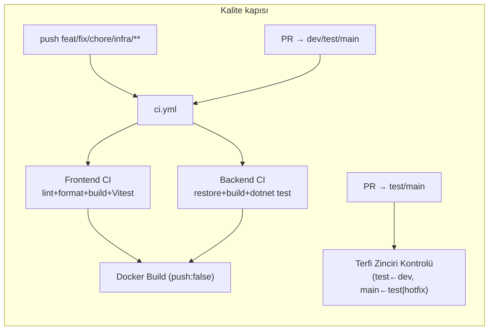
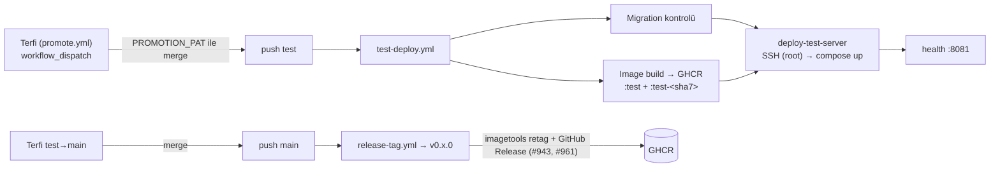
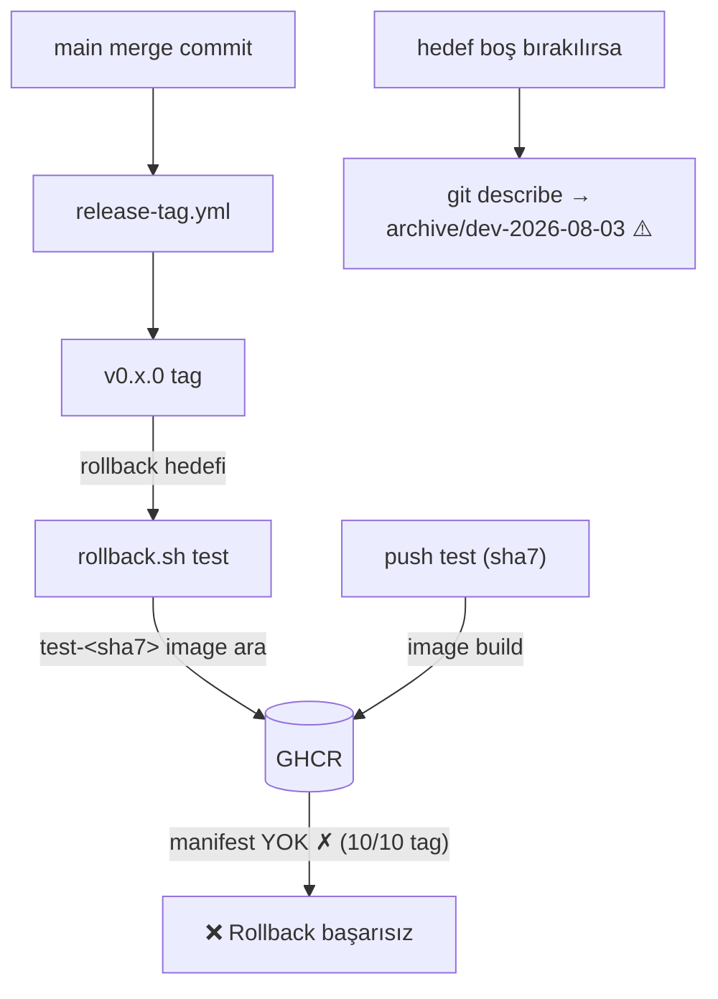
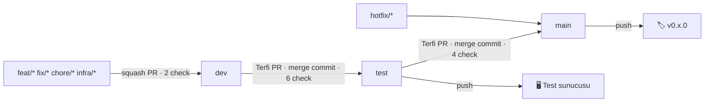

# Cargo Pilot — DevOps Denetim Raporu

**Denetim:** 2026-08-13 · **Son güncelleme:** 2026-08-16 (doküman konsolidasyonu; dosya
repo kökünden `docs/devops/`'a taşındı, `.md` envanteri yeniden ölçüldü) · **Kapsam:** `Divizyon/cargo-pilot` (public) · **Yöntem:** 7 paralel denetim ajanı + her orta ve üzeri iddianın bağımsız şüpheci doğrulaması (38 iddia yeniden koşuldu: 37 doğrulandı, 1'i düzeltilerek işlendi). Her bulgunun kanıtı `dosya:satır` veya çalıştırılan komuttur. Denetimin aynı günü öncelik matrisinin iki hücresi uygulandı (PR #942–#945); rapor **denetim anı → bugünkü durum** karşılaştırmalı okunmalıdır.

---

## ⚠️ Tazeleme Notu — 2026-08-15

Bu rapordaki bazı sayılar bağımsız yeniden ölçümle **yanlış** çıktı. Aşağıdaki tablo düzeltmelerin
özetidir; ilgili bölümlerin metni de yerinde güncellendi. Ölçüm günü **2026-08-15**, komutlar
sütunda verilmiştir — bir sonraki okuyucu aynı komutu koşarak bayatlığı kendisi ölçebilir.

| Rapordaki iddia | Gerçek (2026-08-15) | Doğrulama komutu |
|---|---|---|
| "%98,9 koşum başarısı", "ci.yml %100" | Ana CI workflow'u **%58,8 – %81** (örneklem penceresine göre) | `gh run list --workflow=ci.yml --limit 100` → 81/100 · son 100 koşumun 34'ü ci.yml, 20'si yeşil → %58,8 |
| "test-deploy.yml %100" | **29/30 = %96,7** | `gh run list --workflow=test-deploy.yml --limit 30` |
| "8/8 workflow'da `contents: read`" | **7/8** — `promote.yml:55` `contents: write` (terfi merge'i için meşru) | `grep -n "contents:" .github/workflows/*.yml` |
| "SAST 10/10 · CodeQL PR kapısında" | CodeQL **hiçbir ruleset'te zorunlu check değil**, merge'ü bloke etmiyor (advisory) | `gh api /repos/Divizyon/cargo-pilot/rulesets/{id}` × 4 |
| "Rollback onarıldı, üç kez canlıda doğrulandı" | Yalnız `release-tag.yml` tarafı. `rollback.sh:69` **hâlâ** hatalı SHA türetiyor | `grep -n "TARGET_SHA=" infra/scripts/rollback.sh` |
| "10 eski tag eşlenmemiş" | Git'te **14** sürüm tag'i, GHCR'de yalnız **4**'ünün imajı (v0.11–v0.14) → v0.1–v0.10'a rollback imkânsız | `git tag -l 'v*'` (14) + GHCR `tags/list` (4 adet `v*`) |
| "41 md / 10.125 satır" | **45 md / 11.315 satır** (tazeleme sonrası) | `git ls-files '*.md' \| wc -l` ve `xargs wc -l` |
| "166 test yeşil" (frontend) | **16 dosya / ~151 test-case** — bu bir **alt sınır**, `it.each`/`describe.each` kalıpları regex sayımını kaçırabilir | `grep -oE '^\s*(it\|test)\(' apps/frontend/**/*.test.ts*` |

**Sağlık skoru bu düzeltmelerle düşer:** SAST 10/10 → **6/10** (CodeQL koşuyor ama merge kapısı
değil), Token-Permissions 9/10 → **8/10** (7/8). Yeni tahmini toplam **≈71 / 100** (±10).

### ⚠️ Tazeleme Notu — 2026-08-15, **ikinci tur** (`dev` @ `96e9fd8b`)

Yukarıdaki birinci tur notu aynı gün erken saatte yazıldı. Sonrasında `dev`'e PR
**#989, #990, #991, #992, #994, #997, #1002, #1004** girdi ve `dev → test` terfisi yapılıp
test sunucusuna deploy indi. Birinci turun aşağıdaki üç ifadesi **artık yanlıştır**:

| Birinci turun yazdığı | Gerçek (2026-08-15, ikinci ölçüm) | Doğrulama komutu |
|---|---|---|
| "`rollback.sh:69` **hâlâ** hatalı SHA türetiyor; düzeltme yalnız `infra/yedekleme-rollback-sertlestirme` dalında, `dev`'e terfi etmedi" | ✅ **Düzeltme `dev`'e girdi (#994).** `infra/scripts/rollback.sh:72` artık `git rev-parse --short=7 "${TARGET_REF}^2"` deniyor, başarısızsa commit'in kendisine düşüyor — tek-parent hotfix push'u da kapsanıyor | `grep -n "TARGET_SHA=" -A2 infra/scripts/rollback.sh` |
| "Aynı push'ta çifte image build ⏸ **açık**" | ✅ **Kapandı (#992).** `ci.yml`'deki image build job'u artık yalnız `dev`'e açılan PR'da koşuyor (`ci.yml:203` → `if: github.event_name == 'pull_request' && github.base_ref == 'dev'`); `test-deploy.yml`'in deploy job'undaki `cache-to` yazıcıları kaldırıldı, yalnız `cache-from` kaldı (`test-deploy.yml:221, 237`) | `grep -n "cache-to\|base_ref" .github/workflows/{ci,test-deploy}.yml` |
| "45 md / 11.315 satır" | **47 md / 11.956 satır** | `git ls-files '*.md' \| wc -l` (47) · `… \| xargs wc -l \| tail -1` (11956) |

**Bu turda çıkan yeni bulgu — SHA pinleme %100 değil:**
`.github/workflows/*.yml` içinde **45 `uses:` referansının 38'i** 40 haneli SHA'ya pinli;
kalan **7'si mutable tag** ve hepsi `test-deploy.yml`'in e2e job'undadır:
`checkout@v4` (`:314`), `setup-buildx-action@v3` (`:317`), `login-action@v3` (`:320`),
`build-push-action@v5` (`:327`, `:340`), `setup-node@v4` (`:354`), `upload-artifact@v4` (`:397`).
Rapordaki "28/28" ve panoramadaki "32/32 ✅" değerleri o job eklenmeden önceye aittir.
Doğrulama: `grep -rn "uses: " .github/workflows/*.yml | grep -v "@[0-9a-f]\{40\}"` → 7 satır.

**Bu turda yeniden ölçülmeyenler:** CI başarı oranları, ruleset/CodeQL durumu, GHCR tag eşlemesi,
frontend test sayısı, sağlık skoru. Birinci turun değerleri olduğu gibi duruyor —
**doğrulanmadılar, çürütülmediler.**

---

## Yönetici Özeti

> ### Genel sağlık skoru: **≈71 / 100** — denetim günü **36** idi *(OpenSSF Scorecard kriterlerine göre tahmin, ±10; sıçramanın kaynağı: Dependency-Update-Tool 0→10, SAST 0→6, Vulnerabilities 0→10, Security-Policy 0→10, Pinned 3→8, Token-Permissions 4→8)*
>
> *2026-08-15 düzeltmesi: skor önce 75 yazılmıştı; SAST (CodeQL merge kapısı değil) ve Token-Permissions (7/8) yeniden puanlanınca ≈71'e indi. Bkz. yukarıdaki Tazeleme Notu.*

1. **🔴→🟡 Rollback güvencesi kısmen onarıldı.** Denetimde: 10 sürüm tag'inin hiçbirinin GHCR'da image'ı yoktu, `rollback.yml` hiç koşmamıştı, boş hedef arşiv tag'ine çözülüyordu. Şimdi: `release-tag.yml` her yeni tag'i `test-<sha7>` imajıyla eşliyor (#943), `rollback.sh` yalnız `v*` tag'lerine çözülüyor (#942). **v0.11.0–v0.14.0** GHCR'da imajlarıyla mevcut.
   **⚠️ 2026-08-15 düzeltmesi — "üç kez canlıda doğrulandı" ifadesi yanıltıcıydı:** doğrulanan yalnız `release-tag.yml` tarafıdır (yeni tag → imaj eşlemesi). Geri dönüş script'inin kendisi o an hatalı SHA türetiyordu — `git rev-parse --short=7 "${TARGET_REF}"` bir merge commit'in `^2` (test head) parent'ını almadığı için `test-<sha7>` imajı bulunamıyordu.
   **✅ 2026-08-15 ikinci tur düzeltmesi:** bu onarım **`dev`'e girdi (#994)**. `infra/scripts/rollback.sh:72` artık önce `"${TARGET_REF}^2"` deniyor, tek-parent hotfix push'unda commit'in kendisine düşüyor ve SHA türetilemezse `exit 1` veriyor (`:74-77`). Birinci turdaki "düzeltme yalnız `infra/yedekleme-rollback-sertlestirme` dalında" ifadesi **artık geçersizdir**.
   **⚠️ Kapsam:** git'te **14** sürüm tag'i var (`v0.1.0`…`v0.14.0`), GHCR'de yalnız **4**'ünün imajı (`v0.11.0`–`v0.14.0`). **v0.1.0–v0.10.0 için rollback fiilen imkânsız.**
   **Kalan:** gerçek bir rollback tatbikatı hâlâ yapılmadı; önce `rollback.sh` düzeltmesi terfi etmeli.
2. **🟠→🟢 Tedarik zinciri kapatıldı.** 28 action referansının tamamı commit SHA'sına pinli (#942), Dependabot `github-actions` ekosistemi pinleri güncel tutacak. **Kalan:** dispatch input'larının root SSH script'ine interpolasyonu ve Dockerfile digest'leri (orta öncelik).
3. **🟠→🟢 Güvenlik görünürlüğü kuruldu.** Dependabot alerts + secret scanning + push protection + **private vulnerability reporting** açık; CodeQL iki dilde PR'larda koşuyor (ölçülen: C# 2:13, TS 1:13) — **ancak 2026-08-15 doğrulaması: CodeQL hiçbir ruleset'in `required_status_checks` listesinde değil, yani merge'ü bloke etmiyor; advisory seviyede** (`gh api /repos/Divizyon/cargo-pilot/rulesets/{id}` × 4); npm açıkları **10 → 0** (#944 + xlsx→SheetJS CDN 0.20.3 #945). NuGet ilk taramada temiz. `.github/SECURITY.md` eklendi (#962). **Kalan:** LICENSE bilinçli ertelendi; server-access.md hâlâ IP/port yayınlıyor (silmek geçmişten kaldırmadığı için ayrı karar).
4. **🟡 CI hattı ayakta ama başarı oranı düşük.** **⚠️ 2026-08-15 düzeltmesi:** "%98,9 koşum başarısı" yanlıştı — ana CI workflow'u (`CI — Kod Kalite ve Build Kontrolü`) örneklem penceresine göre **%58,8 – %81** arasında. Son 100 koşumun 34'ü bu workflow ve 20'si yeşil (%58,8); `--workflow=ci.yml --limit 100` ile daha geniş pencerede 81/100 (%81). En uzun kırmızı seri: 12 ardışık başarısızlık (`feat/ERP-toplu-iyilestirme`, `Frontend CI` job'u, 2026-08-13 → 08-14). Terfi zinciri 3 ruleset + `enforce-promotion` ile zorlanıyor. Buna ek olarak (#961): **7/8** workflow'da top-level `contents: read` (`promote.yml:55` bilerek `contents: write` — terfi merge'i için), 15/15 job'da `timeout-minutes`, backend test guard artık sessizce geçmiyor, sürüm etiketine otomatik changelog'lu GitHub Release bağlandı. **Kalan:** 0/20 merge review'lu — 1-onay/CODEOWNERS kararı bekliyor; her işe ~1,5 terfi PR'ı yükü sürüyor.
5. **🟡 Dokümantasyon bayatlığı ilk turda kapatıldı, ikinci turda yeniden açıldı.** Denetimde 12 bayat dosya vardı; hepsi düzeltildi (#942, #962): README parolası, escape'li kök CLAUDE.md (111 escape, içerik birebir korundu), snapshot/kod-taraması yanlışları, secret envanteri, doc-map yeniden ölçümü. **⚠️ 2026-08-15 yeniden taraması 45 md dosyasının 20'sinde bayat/çelişkili içerik buldu** (ölü motor yolu ×8, `useInMemoryRepository` varsayılanı, Grafana portu, kurgusal `Cargo` entity "kanıtı", sayı hataları); bunlar `docs/dokuman-tazeleme` turunda düzeltildi. Güncel hacim: **47 md / 12.322 satır** (`git ls-files '*.md'`, 2026-08-16 **konsolidasyon ölçümü**) — rapordaki eski "41 / 10.125" ve birinci turun "45 / 11.315" değeri bayat. **İkinci turda 11 dosya daha bayat çıktı** (#989–#1004 sonrası: koordinat çapraz-referans notları, LIFO "yumuşak ceza" tarifi, motor satır sayısı, backend test sayıları, md envanteri) ve düzeltildi. **Kalan:** koordinat kapı modeli — `doors` listesi / `top door` / `clearanceCm` kodda yok, `COORDINATE_STANDARD.md` §10 bunu açık kayıt olarak tutuyor. `docs/archive/koordinat-denetimi-2026-08-12.md` (2026-08-12) bayat işaretlendi; güncel kaynak `docs/KOORDINAT-UYUM-RAPORU.md` §0'dır.

---

## 1. Panorama — denetim anı → bugün

| Metrik | Denetim | Bugün | Metrik | Denetim | Bugün |
|---|---|---|---|---|---|
| SHA-pinned action | 0/28 | **38/45** ⚠️ (2026-08-15 ikinci sayım; 7 mutable tag `test-deploy.yml` e2e job'unda) | npm açığı | 9 high + 1 low | **0** ✅ |
| Dependabot / CodeQL | Yok / Yok | **Kurulu** ✅ | Secret scanning + push prot. | Kapalı | **Açık** ✅ |
| NuGet taraması | Yok | **Temiz (0 alert)** ✅ | Sürüm↔imaj eşleme | Yok (10/10 kopuk) | **Otomatik** (yeni tag'ler) ✅ |
| GitHub environment | Yok (rollback kırık) | **test + prod** (prod onaylı) ✅ | README'de parola | Var | **Kaldırıldı** ✅ |
| Dependabot alert (main) | — (kapalıydı) | **36 → 0** ✅ | Eşlenen sürüm | 0/10 | **4/14** ⚠️ (v0.11–v0.14) |
| SECURITY.md | Yok | **Var** ✅ | Bayat doküman | 12 | 20/45 → 11/47 → konsolidasyon turunda **7/47** ⚠️ (08-16) |
| Top-level `permissions` | 1/7 workflow | **7/8** ✅ (promote.yml bilerek `write`) | `timeout-minutes` | 2/15 job | **15/15** ✅ |
| Backend test guard | Sessizce atlıyor | **`exit 1`** ✅ | Ölü secret (TEST_GHCR_*) | 2 | **0** ✅ |
| Review'lu merge PR (son 20) | 0/20 | 0/20 ⏸ | rollback.yml koşumu | 0 | 0 ⏸ (tatbikat bekliyor) |
| LICENSE | Yok | Yok ⏸ (ertelendi) | GitHub Release | 0/11 sürüm | **v0.12.0 + v0.13.0** ✅ (otomatik changelog) |
| Dependabot ignore kuralı (main) | — | 4 → **17** ✅ | İşlenen Dependabot PR | — | **17** (8 merge / 9 kapatma) |
| Workflow / job | 7 / 14 | 8 / 15 (codeql) | CI başarı (ana workflow) | %98,9 ❌ bayat | **%58,8 – %81** ⚠️ (2026-08-15) |
| CodeQL zorunlu check | — | **Hayır** ⚠️ (advisory) | md dosya / satır | 41 / 10.125 ❌ bayat | **47 / 12.322** (2026-08-16) |

*Tablo 2026-08-15'te tazelendi; ❌ bayat işaretli hücreler denetim günü (2026-08-13) yazılmış, yeniden ölçümde yanlış çıkmış değerlerdir.*

---

## 2. CI/CD Hattı

**Akış — kalite kapısı ve terfi/deploy zinciri:**





**Workflow envanteri** *(süreler son 20 koşumun `updatedAt-createdAt` ortalaması; kuyruk süresi dahil. **Başarı sütunu 2026-08-15'te yeniden ölçüldü** — denetim günü yazılan %100'ler yanlıştı)*:

| Workflow | Tetikleyici | Job | Ort. süre | Başarı (2026-08-13, bayat) | Başarı (2026-08-15, ölçülen) |
|---|---|---|---|---|---|
| ci.yml | iş branch'i push + PR→dev/test/main | 4 | 4,5 dk | %100 ❌ | **%58,8 – %81** — son 100 koşumun 34'ü ci.yml, 20'si yeşil (%58,8); `--workflow=ci.yml --limit 100` penceresinde 81/100 (%81) |
| test-deploy.yml | iş branch'i push + PR→test/main + push test | 4 | 3,9 dk | %100 ❌ | **%96,7** (29/30) |
| promote.yml ("Terfi") | workflow_dispatch | 1 | 1,6 dk | 4/4 | 4/4 (%100) |
| release-tag.yml | push main | 1 | 14 sn | %91 (10/11) | 3/3 (%100, son 100 koşum penceresi) |
| rollback.yml | workflow_dispatch | 1 | — | **0 koşum** | **0 koşum** |
| sync-base-images.yml | Pazar 02:00 | 1 | 71 sn | %100 | doğrulanamadı (son 100 koşum penceresine girmedi) |
| cache-cleanup.yml | PR close + Pzt 03:00 | 2 | 17 sn | %100 | 13/13 (%100) |
| codeql.yml | PR→dev + haftalık cron | 2 | 2,5 dk | — | 9/9 (%100) — **zorunlu check değil** |

**Başlıca bulgular** *(tümü doğrulanmış; sağ sütun bugünkü durum)*:

| Önem | Bulgu | Kanıt | Durum |
|---|---|---|---|
| 🟠 Yüksek | 28/28 action mutable tag'li, SHA pin yok | `grep uses:` → @v3…@v1.0.3 | ✅ #942: 28/28 SHA-pinli |
| 🟠 Yüksek | `appleboy/ssh-action` root + SSH key ile, tag mutable | test-deploy.yml:309-315, rollback.yml:51-67 | ✅ pin #942 · root/fingerprint ⏸ |
| 🟡 Orta | rollback.yml hiç koşmamış — ilk deneme arıza anında olacak | `gh run list` → boş | ⏸ tatbikat bekliyor |
| 🟡 Orta | Aynı push'ta çifte image build (farklı cache scope) | ci.yml:139-177 vs test-deploy.yml:150-229 | ✅ #992: `ci.yml:203` build job'u yalnız `dev` PR'ında koşuyor; deploy job'unun `cache-to` yazıcıları kaldırıldı |
| 🟡 Orta | build-push-action v5/v6 karışık | ci.yml @v6, test-deploy.yml @v5 ×4 | ⏸ açık (SHA-pinli ama iki sürüm) |
| ⚪ Düşük | 13/14 job'da `timeout-minutes` yok | yalnız promote.yml:65 | ✅ #961: 15/15 job |
| ⚪ Düşük | Backend test adımı `find` guard'ı ile **sessizce atlanabilir** | ci.yml:120-127 | ✅ #961: `::error::` + `exit 1` |
| ⚪ Düşük | 6/14 job'da `permissions` bloğu yok | `grep permissions` | ✅ #961: **7/8** dosyada top-level `contents: read` (2026-08-15 sayımı); `promote.yml:55` bilerek `contents: write` |

---

## 3. Secrets & Güvenlik

**Envanter:** 19 benzersiz ad referanslı → **8 tanımlı** (6'sı kullanımda + 2 ölü), **12 referanslı-ama-tanımsız** (fallback'le veya boş geçiyor).

| Secret | Durum | Kullanım |
|---|---|---|
| `GITHUB_TOKEN` | builtin | GHCR login, cache API, PR sorguları — amaca uygun |
| `PROMOTION_PAT` | ✅ tanımlı | Terfi merge (push tetiklerini çalıştırmak için şart) — yüksek değerli hedef |
| `TEST_SSH_HOST` / `TEST_SSH_PRIVATE_KEY` | ✅ tanımlı | Deploy + rollback SSH — **repo seviyesinde**, environment koruması yok |
| `JWT_SECRET`, `VITE_API_BASE_URL`, `VITE_OAUTH_GOOGLE_URL` | ✅ tanımlı | Geçici stack + build-arg (VITE_* aslında secret sınıfı değil) |
| ~~`TEST_GHCR_PAT`, `TEST_GHCR_USER`~~ | ✅ **silindi** | Hiçbir workflow kullanmıyordu (#483'te kaldırılmıştı) — 2026-08-13'te repodan silindi; PAT'in GitHub token ayarlarından revoke edilmesi kaldı |
| `PROD_SSH_*`, `TEST_MSSQL_*`, `TEST_MINIO_*`, `SEED_DEFAULT_ADMIN_PASSWORD`, `RESEND_*`, `VITE_OAUTH_MICROSOFT_URL` | ❌ tanımsız | Fallback değerlerle veya boş geçiyor |

**Doğrulanmış riskler** *(durumlarıyla)*:

- 🟠→🟢 `rollback.yml`'in dayandığı `test`/`prod` environment'ları mevcut değildi → **ikisi de kuruldu** (2026-08-13, API ile); `prod` required-reviewer korumalı — prod rollback artık insan onayı arkasında. ⏸ Kalan: `PROD_SSH_*` hâlâ tanımsız; `TEST_SSH_*`'ın environment secret'ına taşınması manuel (değerlerin yeniden girilmesi gerekir).
- 🟡 `workflow_dispatch` input'ları `${{ }}` ile doğrudan script gövdesine giriyor; rollback'te bu, **sunucuda root olarak koşan** SSH script'i (rollback.yml:36,58,70). ⏸ Açık — env üzerinden geçirilmeli.
- 🟡 SSH'ta host key `fingerprint` pinning yok; kullanıcı `root`. ⏸ Açık — dedike deploy kullanıcısı sunucu tarafı iş.
- ⚪→🟢 6/14 job'da `permissions` bloğu yoktu → **top-level `permissions` bloğu 8/8 workflow'a eklendi** (#961); bunların **7'si `contents: read`**, `promote.yml:55` ise terfi merge'ini yapabilmek için bilerek `contents: write` (2026-08-15'te `grep -n "contents:" .github/workflows/*.yml` ile doğrulandı). Job seviyesinde kendi izinlerini bildirenlere dokunulmadı.
- 🟡→🟢 Ölü `TEST_GHCR_PAT`/`TEST_GHCR_USER` secret'ları **silindi** (8 → 6 secret). ⏸ Kalan: PAT'in GitHub hesabından revoke edilmesi (manuel).
- ✅ Güçlü yönler: `pull_request_target` yok, self-hosted runner yok, fork PR'ları cache job'unda doğru dışlanmış, default token izni `read`.

---

## 4. Release & Paketler

Sürümleme tamamen otomatik: test→main terfisi → `release-tag.yml` → sıradaki `v0.<minor>.0` (semver biçimli ama yalnız minor artan sayaç). **10 günde 10 sürüm**, 0 GitHub Release, changelog yok. GHCR'da 4 public image: uygulamalar `:test` + immutable `:test-<sha7>` (165'er tag birikmiş, temizlik yok), base image'lar haftalık MCR aynası.



**🔴→🟢 Kritik bulgu — ONARILDI (#942 + #943):** Denetimde 10 v0.x tag'inin kısa SHA'ları GHCR tag listesiyle tek tek karşılaştırılmıştı — hiçbirinin imajı yoktu; `git describe` de filtresiz olduğundan boş hedef arşiv tag'ine çözülüyordu. Uygulanan onarım: `release-tag.yml` artık her yeni tag'i merge commit'in `^2` parent'ının (test head) mevcut `test-<sha7>` imajıyla `imagetools` üzerinden eşliyor (kaynak imaj yoksa **açık hata**), `rollback.sh` yalnız `v*` tag'lerine çözülüyor. **Canlıda doğrulandı (terfi #947, 2026-08-13):** v0.11.0 atıldı ve retag adımı başarıyla koştu — `ghcr.io/divizyon/cargo-pilot-backend:v0.11.0` ve `cargo-pilot-frontend:v0.11.0` GHCR'da mevcut. Tag tabanlı rollback artık **v0.11.0 ve sonrası için gerçekten çalışır**. **Not:** geçmiş 10 tag (v0.1.0–v0.10.0) eşlenmemiş — istenirse tek seferlik elle retag yapılabilir.

**Onarım (release-tag.yml'e ek adım):**

```yaml
- name: Image'lara sürüm tag'i ekle
  run: |
    SHA=$(git rev-parse --short=7 "${GITHUB_SHA}^2" 2>/dev/null || git rev-parse --short=7 "$GITHUB_SHA")
    for IMG in cargo-pilot-backend cargo-pilot-frontend; do
      docker buildx imagetools create \
        --tag "ghcr.io/divizyon/${IMG}:${TAG}" \
        "ghcr.io/divizyon/${IMG}:test-${SHA}"
    done
```

+ `rollback.sh:37,42` → `git describe --tags --abbrev=0 --match 'v*'` + sakin bir günde **rollback tatbikatı** (0 koşumlu bir mekanizmaya güvenilemez) + `gh release create "$TAG" --generate-notes` ile otomatik changelog.

---

## 5. Branch Stratejisi

Mevcut model: **GitLab Flow (environment branches)** — sıkı disiplinli, ruleset + CI ile zorlanmış:



Ruleset gerçeği *(klasik branch protection API'si 404 döner — korumalar ruleset ile)*: 3 aktif ruleset; üçünde de **`required_approving_review_count: 0`** ve `strict_required_status_checks_policy: false`. Bypass: dev/test'te 2 takım, **main'de 1 takım** (pull_request modunda). Son 20 merge: **12'si terfi PR'ı**, 20/20 review'suz, tümü tek kişi tarafından açılıp merge edilmiş.

**Alternatif senaryolar:**

| | A — Mevcut modeli otomasyonla ucuzlat | B — GitHub Flow (tek main) | C — Trunk-based + imaj terfisi |
|---|---|---|---|
| **Öz** | Model aynı; head branch auto-delete + promote.yml PR'ı da açsın + kritik yollara CODEOWNERS | dev/test silinir; main push → test sunucusu; prod = environment onayı + tag | Tek dal; "terfi" = image tag'ini ortama atamak (`:test`→`:prod` retag), git merge değil |
| **Artı** | En düşük risk; alışkanlık/doküman korunur | Terfi yükü (%60) tamamen kalkar; BEHIND/PAT karmaşası biter | "Test edilen imaj = prod imajı" garantisi; rollback = eski tag'i geri atamak |
| **Eksi** | 12/20 terfi-PR yükü yapısal kalır | QA'de bekletme kaybolur; feature flag şart | En büyük geçiş maliyeti; tüm workflow + doküman yeniden yazılır |
| **Ne zaman** | Bugün — prod yokken | CI'a tam güven varsa (zaten tek kapı CI) | **Prod pipeline'ı kurulurken** — zaten yazılacakken hedefe geçmek en ucuz an |
| **Etki / Efor** | orta / düşük | yüksek / orta | yüksek / yüksek |

**Öneri:** Kısa vadede **A**, prod kurulumu gündeme geldiğinde **C**'ye evrilme.

---

## 6. OpenSSF Scorecard — denetim → bugün

| Kriter | Denetim | Bugün | Not |
|---|---:|---:|---|
| Dangerous-Workflow | 10/10 | 10/10 | `pull_request_target` yok |
| Maintained | 10/10 | 10/10 | 90 günde 822 commit |
| CI-Tests | 9/10 | 9/10 | `find` guard'ı sessiz atlama riski sürüyor |
| **Dependency-Update-Tool** | 0/10 | **10/10** | dependabot.yml (5 girdi) + alerts açık |
| **SAST** | 0/10 | **6/10** | CodeQL iki dilde koşuyor (C# 2:13, TS 1:13) ama **zorunlu status check değil** — 4 ruleset'in hiçbirinde listeli değil, merge'ü bloke etmiyor (2026-08-15, `gh api .../rulesets/{id}`). Denetim günü 10/10 yazılmıştı, düzeltildi |
| **Vulnerabilities** | 0/10 | **10/10** | npm audit 0 açık; NuGet ilk taramada temiz |
| **Pinned-Dependencies** | 3/10 | **8/10** | 28/28 action SHA-pinli; Dockerfile'lar hâlâ digest'siz |
| **Token-Permissions** | 4/10 | **8/10** | **7/8** workflow'da top-level `contents: read` (#961); `promote.yml` `contents: write` (meşru). Denetim günü 9/10 ve 8/8 yazılmıştı, düzeltildi |
| **Security-Policy** | 0/10 | **10/10** | `.github/SECURITY.md` + private vulnerability reporting (#962) |
| Branch-Protection | 4/10 | 4/10 | 0 zorunlu onay — karar bekliyor |
| Code-Review | 0/10 | 0/10 | 0/20 review'lu merge |
| License | 0/10 | 0/10 | Bilinçli ertelendi |
| **Toplam (ort. ×10)** | **≈36** | **≈71** | ±10 (2026-08-15 düzeltmesi: SAST ve Token-Permissions yeniden puanlanınca 75 → ≈71). Kalan üç düşük puan aynı karara bağlı: review zorunluluğu + lisans |

---

## 7. Dependabot & CodeQL — ✅ KURULDU (2026-08-13, PR #942)

**Envanter:** 73 npm (51+22) · 36 NuGet / 6 csproj · 2 Dockerfile · 8 action. CodeQL kapsamı: C# (~0.9-1.1 MB, migration'lar hariç) + TypeScript (1.67 MB); taranan kritik yüzeyler: `AllowAnonymous` controller'lar (Shares/Contact/Me/Subscriptions), public `/share/:token`, JWT, ERP outbound, billing.

Aşağıdaki iki config **uygulandı ve canlıda doğrulandı** — CodeQL kendi PR'ından itibaren her PR→dev'de koşuyor, ilk koşumlar 0 açık alert döndü (tam repo taban çizgisi ilk haftalık cron'da). İlk Dependabot taraması Pazartesi 06:00 (Europe/Istanbul).

**İki kritik kısıt (doğrulandı ve tasarıma işlendi):**
1. **`target-branch: dev` zorunlu** — varsayılan davranış PR'ı `main`'e açar; `enforce-promotion` + ruleset zorunlu check'i bu PR'ları **merge edilemez** kılar.
2. **Dependabot güvenlik güncellemeleri `target-branch`'i yok sayar**, daima default dala (main) açılır → security updates **kapalı tutulmalı**, yalnız alerts + haftalık sürüm PR'larına güvenilmeli (veya enforce-promotion'a `dependabot/**` istisnası).

**`.github/dependabot.yml` (önerilen tam içerik):**

```yaml
version: 2
updates:
  - package-ecosystem: "npm"
    directory: "/apps/frontend"
    target-branch: "dev"        # enforce-promotion main'e dış PR kabul etmez
    schedule: { interval: "weekly", day: "monday", time: "06:00", timezone: "Europe/Istanbul" }
    open-pull-requests-limit: 5
    labels: ["dependencies", "npm"]
    commit-message: { prefix: "chore(deps)" }
    groups:
      npm-minor-patch:
        applies-to: version-updates
        update-types: ["minor", "patch"]
    ignore:                      # 3D sahne ve routing major'ları manuel QA istiyor
      - { dependency-name: "three",          update-types: ["version-update:semver-major"] }
      - { dependency-name: "@types/three",   update-types: ["version-update:semver-major"] }
      - { dependency-name: "@react-three/*", update-types: ["version-update:semver-major"] }
      - { dependency-name: "react-router*",  update-types: ["version-update:semver-major"] }
  - package-ecosystem: "nuget"
    directory: "/apps/backend"
    target-branch: "dev"
    schedule: { interval: "weekly", day: "monday", time: "06:00", timezone: "Europe/Istanbul" }
    open-pull-requests-limit: 5
    labels: ["dependencies", "nuget"]
    commit-message: { prefix: "chore(deps)" }
    groups:
      nuget-minor-patch:
        applies-to: version-updates
        update-types: ["minor", "patch"]
  - package-ecosystem: "docker"
    directory: "/apps/frontend"
    target-branch: "dev"
    schedule: { interval: "weekly", day: "monday" }
    open-pull-requests-limit: 5
    labels: ["dependencies", "docker"]
  - package-ecosystem: "docker"
    directory: "/apps/backend"
    target-branch: "dev"
    schedule: { interval: "weekly", day: "monday" }
    open-pull-requests-limit: 5
    labels: ["dependencies", "docker"]
  - package-ecosystem: "github-actions"
    directory: "/"
    target-branch: "dev"
    schedule: { interval: "weekly", day: "monday" }
    open-pull-requests-limit: 5
    labels: ["dependencies", "ci"]
    groups:
      actions-all:
        patterns: ["*"]
```

**`.github/workflows/codeql.yml` (önerilen tam içerik):**

```yaml
name: CodeQL

# Yalnızca dev'e açılan PR'lar + haftalık tam tarama.
# feat/** push'larına bilerek bağlı DEĞİL: C# analizi ~8-15 dk sürüyor.
on:
  pull_request:
    branches: [dev]
  schedule:
    - cron: '0 3 * * 1'

jobs:
  analyze:
    name: CodeQL Analiz (${{ matrix.language }})
    runs-on: ubuntu-latest
    permissions:
      security-events: write
      packages: read
      actions: read
      contents: read
    strategy:
      fail-fast: false
      matrix:
        include:
          - { language: csharp,                build-mode: none }  # derlemesiz analiz
          - { language: javascript-typescript, build-mode: none }
    steps:
      - uses: actions/checkout@v4
      - uses: github/codeql-action/init@v3
        with:
          languages: ${{ matrix.language }}
          build-mode: ${{ matrix.build-mode }}
          config: |
            paths-ignore:
              - '**/docs/**'
              - '**/tests/**'
              - 'apps/backend/CargoPilot.Engine.Tests/**'
              - 'apps/backend/CargoPilot.Infrastructure.Tests/**'
              - '**/*.test.ts'
              - '**/*.test.tsx'
      - uses: github/codeql-action/analyze@v3
        with:
          category: "/language:${{ matrix.language }}"
```

**Gürültü beklentisi:** ilk hafta ~10-15 PR (gruplama limitiyle), sonrasında haftada ~4; ilk CodeQL taraması için ~2-4 saat triyaj bloke edilmeli. Public repo → Actions **ücretsiz**. *(Ölçüldü, PR #942: `build-mode: none` ile C# analizi **2 dk 13 sn**, TS 1 dk 13 sn — 8-15 dk tahmininin çok altında.)* `xlsx` sorunu **çözüldü (#945):** SheetJS CDN 0.20.3 tarball'ına geçildi, iki advisory de kapandı; URL bağımlılığını Dependabot izleyemediği için kalıcı çözüm (exceljs geçişi) `devops-backlog.md` madde 12'ye kapsam + QA notuyla yazıldı.

---

## 8. Dokümantasyon

Denetimde **12 dosyada bayatlık/çelişki** vardı ve 12'sinin tamamı kapatıldı (#942, #962).

**⚠️ 2026-08-16 tazelemesi:** "41 md / 10.125 satır" ve ara turların "45 / 11.315", "47 / 11.956"
değerleri bayattır. Güncel hacim **47 md / 12.322 satır**
(`git ls-files '*.md' | wc -l` = 47, `git ls-files '*.md' | xargs wc -l | tail -1` = 12322).
Ayrıca bağımsız bir yeniden tarama 45 dosyanın **20'sinde** yeni bayat/çelişkili iddia buldu
(ölü motor yolu 8 yerde, `useInMemoryRepository` varsayılanı, Grafana portu, kurgusal `Cargo` entity
"kanıtı", `global.json` kök iddiası, sayı hataları) — bunlar `docs/dokuman-tazeleme` turunda düzeltildi.
Yani "bayat doküman = 0" iddiası yalnız 2026-08-13 için geçerliydi.


| Dosya | Sorun (denetim anı) | Durum |
|---|---|---|
| `CLAUDE.md` (kök) | Tüm markdown escape'li — 107/248 satır, ham `#` ile başlayan satır **0**; dosya hiçbir yerde render edilmiyordu | ✅ 111 escape temizlendi, 248→135 satır, içerik birebir korundu (kelime 1037=1037) |
| `docs/context/project-snapshot.md` | Test kaynağı "main push" (dosya kendi içinde çelişkili), backend testleri "yok", promote.yml listede yok, "1 onay" | ✅ Dördü de düzeltildi + codeql.yml eklendi |
| `docs/context/kod-taramasi-2026-08.md` | "Backend test projesi hiç yok" | ✅ Tarihli rapor olduğu için silinmedi, "geçerli değil" notu düşüldü |
| `README.md` | Default admin parolası canlı URL'le yan yana | ✅ #942 |
| `docs/devops/server-access.md` | Secret adları yanlış (`SSH_HOST` vs `TEST_SSH_HOST`) | ✅ Düzeltildi + environment notu |
| `doc-map.md` + `SUMMARY.md` | Koordinat dokümanları indekste yok; sayılar eski | ✅ Yeniden ölçüldü, eksik dokümanlar eklendi. ⚠️ O turun 41/10.125 sayısı da bayatladı → **47/12.322** (2026-08-16) |
| `docs/devops/deployment.md` | Eski branch prefix'leri + yanlış tetikleyici tablosu | ✅ Tablo `branching.md`'ye devredildi (çift bakım bitti) |
| `docs/devops/secret-management.md` | Ölü TEST_GHCR_* listeli; kullanılan 10+ secret yok | ✅ Kategorili tam envanter + VITE_* uyarısı |
| `docs/devops/known-issues.md` | 3 çözülmüş madde "Açık Sorunlar" altında | ✅ "Çözülenler"e taşındı; numaralar bilinçli korundu (4 doküman atıf yapıyor) |
| `apps/backend/docs/developer-setup.md` | global.json konumu, yollar, "8.0.419 CI'da pinli" | ✅ Üçü de düzeltildi |
| Koordinat rehberleri | COORDINATE_STANDARD `depth`'i yasaklıyor; 3 CLAUDE.md öğretiyor | ⏸ **Açık** — audit kod değişikliğiyle birlikte ele alınmasını şart koşuyor |

Eksik standart dosyalar: ~~SECURITY.md~~ ✅ eklendi · **LICENSE** ⏸ bilinçli ertelendi · CHANGELOG ✅ otomatik (`--generate-notes`, #961) · CODEOWNERS ve issue template ⏸ hâlâ yok. Kökte `tip1_animasyonlu_planlayici (1).html` prototip artığı duruyor.

---

## 9. Öneri Öncelik Matrisi

**Etki × Efor** *(önce sol üst köşe; ✅ = 2026-08-13'te uygulandı)*:

| | **Efor: Düşük** | **Efor: Orta** | **Efor: Yüksek** |
|---|---|---|---|
| **Etki: Yüksek** | ① Rollback tatbikatı ⏸ · ② ssh-action SHA pin ✅ · ③ Dependabot + alerts ✅ · ④ CodeQL ✅ · ⑤ README parola temizliği ✅ · ⑥ rollback.sh `--match 'v*'` ✅ · ⑦ main/test'e 1 onay ⏸ karar | ⑧ v0.x ↔ image eşleme ✅ · ⑨ `npm audit fix` + xlsx ✅ (exceljs → backlog 12) · ⑩ test/prod environment ✅ + deploy kullanıcısı ⏸ | ⑮ Senaryo C: imaj terfisi (prod kurulumuyla birlikte) |
| **Etki: Orta** | ⑪ SECURITY.md ✅ · LICENSE ⏸ ertelendi · ⑫ Ölü secret sil ✅ · ⑬ GitHub Release `--generate-notes` ✅ · ⑭ Doküman bayatlığı ✅ (12/12), top-level permissions ✅, timeout'lar ✅, backend test guard `exit 1` ✅ | Çifte image build tekilleştirme · dispatch input'larını env'e taşıma · Dockerfile digest pin | GHCR tag temizlik workflow'u |

**Şu an → Önerilen → Beklenen fayda:**

| # | Şu an | Önerilen | Beklenen fayda |
|---|---|---|---|
| 1 | Rollback hiç denenmemiş, tag→image eşleşmesi yok | Tatbikat + `imagetools` retag adımı + `--match 'v*'` | Arıza anında **gerçekten çalışan** geri dönüş |
| 2 | 0/28 SHA pin, root SSH'lı 3. taraf action | Önce ssh-action, sonra tümü SHA+yorum | Tag hijack'te sunucu anahtarı sızmaz |
| 3 | Dependabot/CodeQL/alerts kapalı, 9 high açık | 4 ekosistem + `target-branch: dev` + CodeQL PR→dev | Açıklar otomatik görünür; 9 high ilk haftada kapanır |
| 4 | Default parola + canlı URL public README'de | Parolayı kaldır, sunucu seed'ini doğrula | Bilinen şifreyle hesap ele geçirme riski kapanır |
| 5 | 0/20 review, 0 zorunlu onay | main/test ruleset'inde 1 onay veya kritik yollara CODEOWNERS | Üretime giden kodda ikinci göz |
| 6 | 10 sürüm / 0 release / changelog yok | `gh release create --generate-notes` | Sürüm içeriği görünür, denetim izi oluşur |
| 7 | Terfi başına manuel PR + dispatch | promote.yml PR'ı da açsın; head branch auto-delete | Terfi yükü yarıya iner, dal çöplüğü biter |

---

## 10. Uygulama Durumu — 2026-08-13

Öncelik matrisinin sol üst köşesi aynı gün uygulandı → **[PR #942](https://github.com/Divizyon/cargo-pilot/pull/942)** (`infra/devops-sertlestirme` → dev):

| Kalem | Durum | Not |
|---|---|---|
| 28 action referansı SHA pin | ✅ PR #942 | v5'ler v5 SHA'sında; eski tag satır sonunda yorum |
| `.github/dependabot.yml` | ✅ PR #942 | 5 ekosistem girdisi, tümü `target-branch: dev` |
| `.github/workflows/codeql.yml` | ✅ PR #942 | PR→dev + haftalık cron; codeql-action da SHA-pinli |
| README default parola | ✅ PR #942 | Giriş bilgisi `local-setup.md`'ye devredildi |
| `rollback.sh --match 'v*'` | ✅ PR #942 | İki `git describe` çağrısı da sınırlandı |
| Dependabot alerts | ✅ Repo ayarı (API) | Security updates **bilinçli kapalı** (kısıt 2) |
| Secret scanning + push protection | ✅ Repo ayarı (API) | Denetim kapsamı dışıydı, planın 3. adımıydı |
| Rollback **tatbikatı** | ⏸ Manuel | Canlı test sunucusuna dokunur — Actions → "Manuel Rollback" → environment=test; #943 sonrası ilk yeni sürümden itibaren v0.x tag'iyle de denenebilir |
| main/test ruleset'ine 1 onay | ⏸ Karar bekliyor | Tek kişilik akışta PR yazarı kendi PR'ını onaylayamaz → terfi zinciri kilitlenebilir; alternatif: kritik yollara CODEOWNERS |

**"Etki yüksek / efor orta" hücresi — 2026-08-13 (devamı):**

| Kalem | Durum | Not |
|---|---|---|
| v0.x ↔ GHCR image eşleme | ✅ [PR #943](https://github.com/Divizyon/cargo-pilot/pull/943) merge | `release-tag.yml` artık yeni tag'i `test-<sha7>` imajına `imagetools` ile eşliyor; kaynak imaj yoksa açık hata |
| `npm audit fix` (9/10 açık) | ✅ [PR #944](https://github.com/Divizyon/cargo-pilot/pull/944) merge | Yalnız lockfile değişti; frontend testleri yeşil. ⚠️ "166 test" sayısı doğrulanamadı — 2026-08-15 sayımı **16 dosya / ~151 test-case** verdi ve bu bir **alt sınırdır** (`it.each`/`describe.each` kalıpları regex ile sayılamıyor) |
| xlsx → SheetJS CDN 0.20.3 | ✅ [PR #945](https://github.com/Divizyon/cargo-pilot/pull/945) | `npm audit`: **0 açık**; iki advisory de kapandı; kod değişikliği yok |
| xlsx → exceljs geçişi | 📋 Backlog | `devops-backlog.md` madde 12 (Kategori 5'te kapsam + QA notu) |
| test/prod GitHub environment | ✅ API ile kuruldu | `prod` required-reviewer korumalı; `test` korumasız (otomatik terfi akışı bozulmasın) |
| SSH secret'larının environment'a taşınması | ⏸ Manuel | Secret değerleri okunamaz — Settings → Environments altında yeniden girilmeli |
| Dedike `deploy` kullanıcısı (root yerine) | ⏸ Manuel | Sunucu tarafı iş: docker grubunda kullanıcı + workflow'larda `username` değişimi + root login kapatma |

**"Etki orta / efor düşük" hücresi — 2026-08-13 (üçüncü tur):**

| Kalem | Durum | Not |
|---|---|---|
| Workflow izinleri + zaman aşımları | ✅ [PR #961](https://github.com/Divizyon/cargo-pilot/pull/961) | 8 dosyaya top-level `contents: read`; 15/15 job'a `timeout-minutes` (önce 2/15) |
| Backend test guard | ✅ PR #961 | `find` boş dönerse artık `::error::` + `exit 1` — "yeşil ama boş CI" riski kapandı; `2>/dev/null` de kaldırıldı |
| GitHub Release + changelog | ✅ PR #961 | `release-tag.yml`'e `gh release create --generate-notes`; 11 tag / 0 release durumu bir sonraki sürümde kapanacak |
| `promote.yml` bayat yorumları | ✅ PR #961 | Silinmiş `TEST_GHCR_PAT` atfı ve "PROMOTION_PAT YOKTUR" iddiası düzeltildi |
| SECURITY.md | ✅ [PR #962](https://github.com/Divizyon/cargo-pilot/pull/962) | Kanal: **GitHub private vulnerability reporting** (repo ayarından açıldı); e-posta yayınlanmadı |
| Ölü secret temizliği | ✅ Repo ayarı | `TEST_GHCR_PAT` + `TEST_GHCR_USER` silindi (8 → 6 secret) |
| Kök `CLAUDE.md` escape'leri | ✅ PR #962 | 111 escape, 248→135 satır; içerik birebir korundu (kelime sayısı 1037=1037) |
| 12 bayat dokümanın tamamı | ✅ PR #962 | Bağlam + DevOps dokümanları workflow gerçeğiyle hizalandı; doc-map o gün 41 dosya / 10.125 satır ölçülmüştü. ⚠️ 2026-08-16: **47 dosya / 12.322 satır**, 20 dosyada yeni bayatlık (bkz. §8) |
| LICENSE | ⏸ Ertelendi | Repo taahhüdü netleşene kadar — bilinçli karar |
| `server-access.md` IP/port ifşası | ⏸ Karar | Dosyadan silmek git geçmişinden kaldırmıyor; ayrı bir karar konusu |
| Koordinat terminolojisi çelişkisi | ⏸ Bağımlı | `docs/archive/koordinat-denetimi-2026-08-12.md` kod değişikliğiyle birlikte ele alınmasını şart koşuyor |

---

## 11. Dependabot İlk İşletim Turu — 2026-08-13

İlk tarama **12 PR** açtı (tahmin: 10-15), **tamamı `dev` hedefli** — `target-branch` kısıtı sahada doğrulandı. İkinci turla birlikte toplam **17 PR** işlendi: 8 merge, 9 gerekçeli kapatma. Bu tur, config'in üç ayrı eksiğini ortaya çıkardı ve dördü de düzeltildi (#963, #964, #974, #982).

**Merge edilenler:** nginx 1.31 · actions-all (10 güncelleme — Dependabot SHA pinlerini **doğru koruyup güncelledi**, format bozulmadı) · lint-staged 17 · coverlet 10 · FluentValidation 12.1.1 · npm grubu (42 paket) · nuget grubu (31 paket) · xunit.runner 3.1.5 · framer-motion/types-node minor'ları.

**Kapatılanlar ve gerekçeleri** — hepsi hedef sürümle uyumsuz:

| Paket | Öneri | Gerekçe |
|---|---|---|
| `node` | 20 → 26 | CI `node-version: '20'`; ikisi birlikte yükseltilmeli |
| `react`, `react-dom` | 18 → 19 | `CLAUDE.md` React 18'i sabitliyor; react-dom 19 + react 18 desteklenmiyor |
| `typescript` | 5.9 → 7.0 | Tip hatalarını topluca değiştirir; planlı geçiş |
| `Microsoft.*`, `System.*` | 8.x/9.x → 10.x | Altı proje de `net8.0` hedefliyor |
| `tailwindcss` | 3.4 → 4.3 | v4 CSS-first config; `CLAUDE.md` v3'ü sabitliyor |
| `framer-motion` | 12 → 13 | Animasyon API'si değişiyor, manuel QA |
| `Serilog.AspNetCore` | 8.0.3 → 10.0.0 | Sürümleme ASP.NET Core'a hizalı |
| `Swashbuckle.*` + `Microsoft.OpenApi` | 7.3 → 10.2 / 1.6 → 2.7 | **CI'ı fiilen kırdı** — `Microsoft.OpenApi.Models` namespace'i kalktı, `IOperationFilter.Apply` imzası değişti |

### Ortaya çıkan üç tuzak *(hepsi sessiz — hiçbiri kırmızı check üretmiyor)*

**1. Dependabot config'i varsayılan daldan (`main`) okunur.** `target-branch: dev` yalnızca PR'ların *nereye açılacağını* belirler; kuralların kendisi main'den gelir. Üç dallı terfi modelinde bu, `dev`'e merge edilen ignore kurallarının **terfi edilene kadar etkisiz kalması** demek. `react-dom` 19'un kurala rağmen iki kez gelmesinin (#968, #971) sebebi buydu; v0.12.0 terfisiyle `main`'deki kural sayısı 4 → 15'e çıktı ve kurallar yürürlüğe girdi.

**2. Çakışan PR'da CI hiç başlamaz — "fail" değil, "hiç koşmadı".** GitHub `pull_request` koşumlarını merge ref'inden kurar; PR `CONFLICTING` ise o ref üretilemez ve **hiç koşum oluşmaz**. Ekranda kırmızı check yoktur, yalnızca boşluk vardır. #951 ve #955'te ayrı ayrı yaşandı; ayrıca açık duran #938'in yeşil check'leri de bu yüzden bayat.

**3. 0.x paketlerde semver minor fiilen kırıcıdır.** `three` r162 → **r185** (23 sürüm) "minor-patch" etiketli grubun içinde geldi; major hanesi `0` sabit olduğu için semver bunu *minor* sayıyor, ignore kuralımız ise yalnızca major'ı yakalıyordu. Fiilen kırıcı olduğu kanıtlandı: `SceneFloor.tsx:101`, `TS2739` — r185'te `ShaderMaterialParameters.extensions.derivatives` kaldırılmış. Grup PR'ından çıkarıldı, `semver-minor` ignore'a eklendi (#964), yükseltme backlog madde 13'e yazıldı.

**Ek olarak:** eski base'e göre hesaplanan grup PR'ı **downgrade önerebilir** — #966, `dev`'de zaten 12.1.1 olan FluentValidation için 11.12.0 öneriyordu.

### Bu turdan doğan iki backlog maddesi

- **Madde 13 — three r162→r185** (3D QA kapsamı: koordinat/pivot eşlemesi, `InstancedMesh`, `BoxWrapper`, zemin ızgarası shader'ı, dispose)
- **Madde 14 — CORS `AllowAnyOrigin()` geri dönüş yolu** (🟠 Güvenlik): analyzer yükseltmesi S5122'yi yakaladı, bağımlılık PR'ında davranış değiştirmemek için pragma ile susturuldu. `CORS_ALLOWED_ORIGIN_*` tanımsızsa API tüm origin'lere açılıyor; `Development` dışında fail-fast'e çevrilmeli.

### v0.12.0 — üç mekanizmanın canlı doğrulaması

| Mekanizma | Kanıt |
|---|---|
| Otomatik changelog (#961) | `gh release create --generate-notes` ilk kez koştu; **14 PR** isim + yazar + link ile listelendi. Repo 11 sürüm boyunca 0 Release'e sahipti |
| Sürüm↔imaj eşlemesi (#943) | GHCR'da `v0.11.0`, `v0.12.0` **ve** `v0.13.0` — denetimin kritik bulgusu üç kez üst üste doğrulandı |
| Ignore kuralları | `main`'deki `dependabot.yml` 4 → **17** kural; `semver-minor` girdileri yerinde |

---

## 12. Metodoloji ve Sınırlar

7 paralel keşif ajanı (dokümantasyon, CI/CD, secrets, release, branch, standartlar, Dependabot/CodeQL) yapılandırılmış bulgu+kanıt üretti; orta ve üzeri önemdeki **38 iddia**, dosyaları yeniden açan ve komutları yeniden koşan bağımsız şüpheci doğrulayıcılara verildi: **37 doğrulandı**, 1'i düzeltmeyle işlendi (main ruleset'inde bypass 2 değil 1 takım). Doğrulanamayanlar rapora alınmadı.

**Bilinen sınırlar:** Sağlık skoru resmi Scorecard CLI değil, kriter kriter manuel değerlendirme (±10). Süre ortalamaları kuyruk beklemesi içerir ve son 20 koşumla sınırlıdır. Sunucu içi durum (rollback.sh'ın sunucudaki kopyası, UFW/cron, seed parolasının gerçek değeri) SSH olmadan doğrulanamadı. Org seviyesi secret/ayarlar admin yetkisi olmadığından görülemedi. NuGet bağımlılıkları zafiyet taramasından geçirilmedi (lokalde dotnet SDK yok). npm audit sayıları 2026-08-13 advisory veritabanına göredir.
