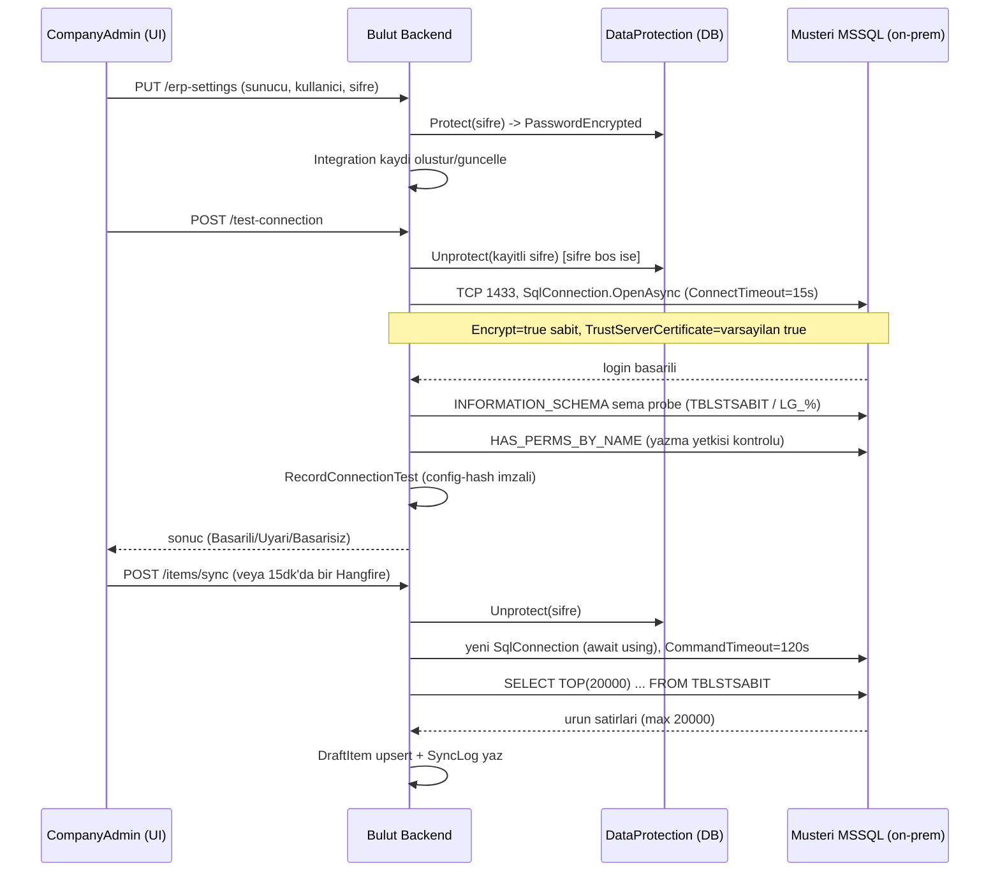
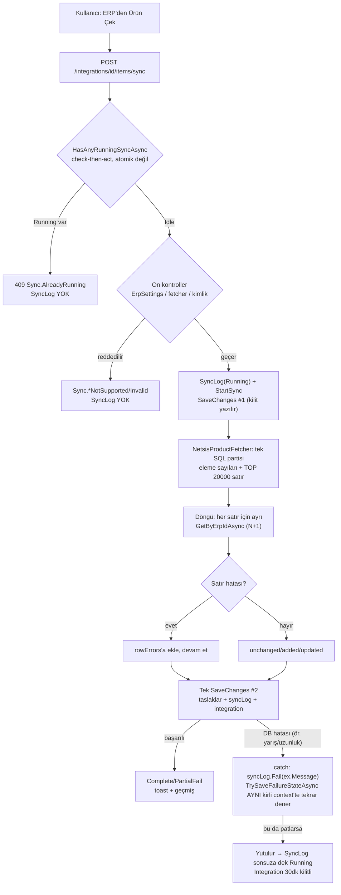
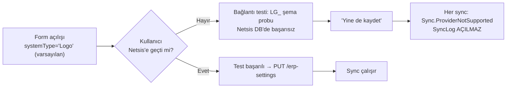

# CargoPilot — Netsis ERP Entegrasyonu Durum ve Sorun Analizi

## Yönetici Özeti

Netsis ERP entegrasyonu mimari olarak (dogrudan MSSQL + salt-okunur hesap + soyutlanmis fetcher/writer katmani) savunulabilir bir pilot tasarimidir, ancak uygulanisi production standardinin altindadir ve **mevcut haliyle production'a cikamaz**: onboarding checklist'i baglanti icin zorunlu ag on kosullarini (VPN/allowlist/port) hic anlatmiyor ve gercek WAN topolojisinde sifir kez dogrulanmis, formun varsayilan saglayicisi calismayan "Logo" oldugu icin Netsis musterisi elle degistirmezse sync hic calismaz, kritik bir SSRF/credential-exfiltration acigi (kayitli ERP sifresinin keyfi adrese gonderilebilmesi) mevcut, TrustServerCertificate varsayilani MITM'e acik, ve hata/kilit yonetimindeki kirilganliklar (kirli DbContext'le ikinci SaveChanges, atomik olmayan kilit) SyncLog'un sonsuza dek "Running" takilmasina yol acabiliyor. Bunlarin yaninda 20.000 satir siniri otesindeki urunlerin kalici olarak hic cekilmemesi, ERP'den gelen barkodun aktarimda sessizce silinmesi ve birim donusumu olmadan mm/gram girisinde sessiz yanlis kapasite hesabi gibi veri dogrulugu sorunlari da acil mudahale gerektiriyor.

### En Kritik 10 Bulgu

| # | Bulgu | Şiddet | Alan | Neden önemli |
|---|---|---|---|---|
| 1 | `test-connection` kayıtlı ERP şifresini keyfi `ServerAddress`'e gönderebiliyor (SSRF + credential exfiltration), rate-limit yok | YÜKSEK | Güvenlik/Bağlantı | Yetkili/çalınmış oturum kayıtlı ERP şifresini kendi sunucusuna sızdırabilir |
| 2 | Onboarding checklist ağ ön koşullarını (VPN/allowlist/port/TCP-IP) hiç anlatmıyor, örnek adres erişilemez özel IP | YÜKSEK | Bağlantı/Onboarding | NAT arkasındaki her müşteride ürün kurulumda hiç çalışmaz, teşhis imkânsız |
| 3 | Form varsayılan sağlayıcısı çalışmayan "Logo" (3 yerde tekrarlanıyor) | YÜKSEK | Frontend/UX | Netsis müşterisi elle değiştirmezse sync hiç çalışmaz; otomatik yolda SyncLog bile açılmaz, hata görünmez |
| 4 | `TrustServerCertificate` varsayılanı `true` — ADR normunun tersi | YÜKSEK | Güvenlik | WAN üzerinde MITM ile SQL parolası ve ERP verisi ele geçirilebilir |
| 5 | Kirli `DbContext` ile ikinci `SaveChanges` denemesi patlayabiliyor, SyncLog sonsuza dek "Running" kalabiliyor | YÜKSEK | Sync güvenilirliği | Entegrasyon 30 dk kilitlenir, geçmişte hiç bitmeyen kayıt oluşur |
| 6 | 20.000 satır limitinin ötesindeki ürünler kalıcı olarak hiç çekilmiyor (sayfalama/imleç yok) | YÜKSEK | Veri doğruluğu | 45.000 karta sahip kurulumda 25.000 ürün asla sisteme girmez |
| 7 | ERP'den gelen Barkod, ürüne aktarımda kalıcı olarak siliniyor | YÜKSEK | Veri doğruluğu | Barkodu dolu gelen her ürün aktarım anında barkodunu kaybeder, geri kazanılamaz |
| 8 | Boyut/ağırlık biriminde dönüşüm/üst sınır yok (`>0` tek kural) | ORTA (senaryoda YÜKSEK) | Veri doğruluğu | mm/gram giren kurulumda sessizce 10x/1000x hatalı ölçü ve yanlış kapasite hesabı |
| 9 | Logo için ürün çekimi (`IErpProductFetcher`) ve firma/dönem no alanı hiç yok | YÜKSEK | Kapsam/Ölçeklenme | Bağlantı testi başarılı görünse de Logo müşterisinde sync yapısal olarak imkânsız |
| 10 | `KAPATILMIS='H'` yazımı export'ta siparişi repo'nun kendi şemasına göre KAPALI işaretliyor | YÜKSEK (flag kapalı) | Export | Export açıldığında siparişler Netsis'te açık sipariş ekranında görünmeyebilir, hata da vermez |

### Production'a Çıkış Blocker'ları

1. SSRF/credential-exfiltration açığını kapat — kayıtlı şifre yalnızca kayıtlı adres/kullanıcıyla eşleşince kullanılsın, rate-limit ekle. (Efor: S)
2. Onboarding checklist'ine ağ ön koşullarını (VPN/allowlist/port/TCP-IP/çıkış IP'si) ekle ve özel IP örneğini kaldır. (Efor: S)
3. Form varsayılan sağlayıcısını Netsis'e çevir veya seçimi zorunlu boş bırak. (Efor: S)
4. `TrustServerCertificate` varsayılanını `false` yap. (Efor: S)
5. Sync hata/iptal yolunu sertleştir: kirli `DbContext`'le ikinci `SaveChanges` denemesini önle, iptal istisnasını satır-içi catch'ten ayır. (Efor: M)
6. Sync kilidini atomik hale getir (check-then-act yerine DB seviyeli kısıtlı update/rowversion). (Efor: M)
7. En az bir müşteride gerçek WAN topolojisinde uçtan uca doğrulama yap (Docker bridge içi test yeterli değil). (Efor: M)
8. Cargo Pilot'un kendi prod MSSQL'inin internete açık (`sa` ile) olmasını kapat. (Efor: S)
9. 20.000 satır sınırını keyset sayfalama ile kaldır. (Efor: M)
10. Barkod alanının aktarımda silinmesini düzelt (koşullu yazım). (Efor: S)

---

## Production Mimarisi ve Baglanti Katmani

### 1. Hedeflenen mimari (dokumanlarda yazan) vs kodda gerceklenen mimari

`docs/erp-integration/adr-baglanti-mimarisi.md` bulut backend'in musterinin on-prem MSSQL sunucusuna **dogrudan** baglandigi bir mimariyi bilincli tercih olarak belgeler; tunel/agent/gateway alternatifi ("musteri aginda agent") "pilot icin asiri" gerekcesiyle acikca reddedilmistir. ADR bu tercihin on kosulu olarak site-to-site VPN veya IP allowlist zorunlu kilar ve doğrudan internete acik 1433 portunu "kabul edilebilir bir kurulum degil" diye tanimlar.

Kodda gerceklenen mimari bu karari birebir uyguluyor: `ErpSqlConnection.cs:21-36` tek noktada `SqlConnectionStringBuilder` ile connection string kurar, `Microsoft.Data.SqlClient` ile bulut container'indan musteri sunucusuna dogrudan TCP acar. Aracı tunel/relay katmani kodda yoktur. Ancak asagidaki noktalarda kod, ADR'nin kendi normundan sapiyor:

| Konu | ADR normu | Kod | Durum |
|---|---|---|---|
| TrustServerCertificate varsayilani | Gecerli sertifikada **kapali** tutulur | `ErpSettings.cs:20` varsayilan **true** (acik) | SAPMA |
| Named instance | Sabit port'a alinmali | UI birinci secenek olarak `SUNUCU\INSTANCE` oneriyor (`erpFieldGuidance.ts:23-24,49,61`) — WAN'da UDP 1434 gerektirir | SAPMA (UI/ADR celiskisi) |
| Doğrudan tabloya yazma | "Yapilmaz", API/ara tablo tercih edilir | `NetsisOrderWriter.cs` `TBLSIPAMAS`/`TBLSIPATRA`'ya dogrudan INSERT eder (bayrak kapali, ama kod repoda mevcut) | SAPMA |
| Kendi prod MSSQL'i icin ic-agdan internete acik port | "1433 internete acik kabul edilemez" | Cargo Pilot'un kendi prod MSSQL'i `sa` ile internete acik (`docker-compose.prod.yml:22,100`) | SAPMA (kurala kendisi uymuyor) |
| Salt-okunur hesap = "guvenlik kilidi" | Geri yazim fiziksel olarak mumkun degil | Export ayni ErpSettings kimligini kullanir; bayrak acilirsa kilit kendiliginden kirilir | Ic celiski, cozulmemis |

### 2. Bulut -> on-prem MSSQL baglanti akisi (adim adim)



Kritik nokta: adimlarin hicbirinde bir aracı katman (agent/tunel/gateway) yoktur — her istek buluttan musteri agina dogrudan TCP baglantisi acar. Baglanti kurulumu, testi ve sync'i **ayni** `ErpSqlConnection.Build` fonksiyonundan gecer; tutarlilik saglanmis ama tek noktadaki her zayiflik (TrustServerCertificate varsayilani, serverAddress dogrulamasizligi) tum akislari etkiler.

### 3. Bu kurgu production'da calisir mi — NET KARAR

**Hayir, mevcut haliyle production'a hazir degil.** Gerekce:

1. **Hicbir gercek WAN topolojisinde dogrulanmamis.** Tum e2e testleri (`erp-sync-smoke.spec.ts`, `erp-canli-senaryolar.spec.ts`) backend ile sahte ERP'nin **ayni Docker bridge agi** icinde oldugu bir kurguda calisir (`docker-compose.test.yml`, `profiles: ["e2e"]`; CI'da `E2E_ERP_SERVER: erp-mssql,1433`). Bulut→internet→musteri NAT'i yolu sifir kez test edilmis.
2. **Onboarding checklist'i ag on kosullarini hic anlatmiyor.** ADR'nin VPN/allowlist zorunlulugu, `erpFieldGuidance.ts:29-38`'deki 5 maddelik "IT'ye gonderilecek bilgi" listesinde **yer almiyor** — port acma, firewall allowlist, cikis IP'si, VPN, TCP/IP protokolu etkinlestirme hicbiri yok. Ustelik ornek adres olarak `192.168.1.100` (RFC1918 ozel IP, buluttan asla erisilemez) gosteriliyor.
3. **Model dort on kosuldan birine bile bagimli, hicbiri kod tarafinda dogrulanmiyor:** SQL Server TCP/IP acik mi, Mixed Mode auth acik mi, sabit port/IP var mi, firewall'da Cargo Pilot'un cikis IP'si (`104.247.163.42`) allowlist'te mi. Bunlardan biri eksikse urun **hic calismaz** ve kullanici tek bir belirsiz "sunucuya ulasilamadi" mesaji gorur.
4. **Varsayilan sağlayici (Logo) desteklenmiyor**, form varsayilan olarak Logo secili acilir (`ERPConnectionForm.tsx:153`) — degistirilmezse bağlanti testi bile bosuna gecer, sync hicbir zaman calismaz.
5. **Kritik guvenlik acigi (dogrulanmis):** `TestErpConnectionCommandHandler.cs:95-108` kayitli ERP sifresini istekteki keyfi `ServerAddress`'e gonderebiliyor (SSRF + credential exfiltration), rate-limit yok.

Sonuc: mimari **karari** (dogrudan MSSQL + VPN/allowlist) bilincli ve pilot olcegi icin savunulabilir, ancak **uygulanisi** (checklist boslugu, guvensiz varsayilanlar, dogrulanmamis kod yolu, SSRF acigi) production standardinin altinda.

### 4. Alternatif mimariler karsilastirma tablosu

| Mimari | NAT/dinamik IP/firewall sorunu cozer mi | Kod degisikligi | Operasyonel yuk | Tavsiye |
|---|---|---|---|---|
| (a) Musteri tarafi outbound-only agent | Evet, tamamen | L (yeni fetcher implementasyonu + kuyruk modeli) | Kurulum/guncelleme/imzalama altyapisi | **Faz 2 hedefi** |
| (b) Site-to-site VPN | Evet | S (kod degismez) | Musteri basina IT projesi, olceklenmez | Kurumsal musteride opsiyon |
| (c) Reverse tunnel (ngrok vb.) | Kismen | S/M | 3. taraf bagimlilik, guvenlik onayi zor | Onerilmez |
| (d) Dogrudan port + IP allowlist (**mevcut**) | Hayir (dinamik IP'de kirilir) | S (checklist tamamlanmali) | Musteri basina firewall pazarligi | **Faz 1 (pilot)** |
| (e) Zamanlanmis export/dosya push | Evet (yalniz outbound HTTPS) | M | Canli senkron degil, geri yazim yok | Onerilmez |

**TAVSIYE EDILEN MIMARI: Iki fazli yaklasim.**
- **Faz 1 (simdi, pilot):** (d)'de kal ama B2/B3/B4/B8/B11 (asagida) kapatilmadan "production-ready" denmesin.
- **Faz 2 (ikinci musteriden once):** (a) agent modeline gec — taşıma katmani zaten `IErpProductFetcher` arkasinda soyutlanmis (`DependencyInjection.cs:109-110`), yani agent eklemek yeniden yazim degil ek implementasyondur. Bu ayrica en agir guvenlik borcunu (tum musteri sifrelerinin tek bulut DB'sinde durmasi) yapisal olarak cozer.

### 5. Baglanti katmani bulgulari (siddet sirali)

| # | Bulgu | Siddet | Dosya:Satir | Etki | Oneri |
|---|---|---|---|---|---|
| 1 | Bulut→on-prem dogrudan TCP varsayimi production topolojisinde hic dogrulanmamis; onboarding checklist'i ag on kosullarini (VPN/allowlist/port) hic anlatmiyor, ornek adres olarak erisilemez ozel IP gosteriyor | YUKSEK | `apps/backend/CargoPilot.Infrastructure/Services/Erp/ErpSqlConnection.cs:21-36`; `apps/frontend/src/features/platform/erp/utils/erpFieldGuidance.ts:29-38,49,61` | NAT arkasindaki her musteride urun kurulumda hic calismaz; destek "sunucuya ulasilamadi" disinda teshis yapamaz | Checklist'e ag on kosullarini ve cikis IP'sini ekle; ozel IP ornegini kaldir; en az bir musteride gercek WAN dogrulamasi yap |
| 2 | `test-connection` endpoint'i kayitli ERP sifresini istekteki keyfi ServerAddress'e gonderebiliyor (SSRF + credential exfiltration), rate-limit yok | YUKSEK | `apps/backend/CargoPilot.Application/Features/ErpSettings/TestErpConnection/TestErpConnectionCommandHandler.cs:95-108`; `TestErpConnectionCommandValidator.cs:12-14` | CompanyAdmin yetkisi olan (veya calinmis oturum) kayitli ERP sifresini kendi sunucusuna sizdirabilir | Kayitli-sifre fallback'ini yalnizca serverAddress/username kayitli degerle ayni oldugunda uygula; rate-limit ekle |
| 3 | `TrustServerCertificate` varsayilani `true` — ADR normunun tersi, WAN uzerinde MITM yuzeyi acik | YUKSEK | `apps/backend/CargoPilot.Domain/Entities/ErpSettings.cs:20`; `apps/frontend/src/features/platform/erp/components/ERPConnectionForm.tsx:158` | Yol uzerindeki saldirgan TLS'i sonlandirip SQL login parolasini ve ERP verisini okuyabilir | Varsayilani `false` yap; yalniz sertifika hatasinda kullaniciya acma onerisi goster |
| 4 | Bağlanti formunun varsayilan sağlayicisi desteklenmeyen "Logo"; degistirilmezse sync hic calismaz | YUKSEK | `apps/frontend/src/features/platform/erp/components/ERPConnectionForm.tsx:153,169,247`; `apps/backend/CargoPilot.Infrastructure/DependencyInjection.cs:109-110` | Netsis musterisi varsayilani degistirmezse bağlanti testi bile bosuna gecer | Varsayilani Netsis'e cevir veya sağlayici secimini zorunlu bos birak |
| 5 | Cargo Pilot'un kendi prod MSSQL'i internete acik, `sa` ile baglaniyor; ADR'nin kendi yasakladigi kurulum kendisinde mevcut | YUKSEK | `infra/compose/docker-compose.prod.yml:22,100`; `docs/devops/server-access.md:80,88` | Ic-ag saldiri yuzeyi; tum musterilerin ERP sifreleri bu DB'de | 1433'u 127.0.0.1'e bind et veya UFW ile kisitla; sa yerine kisitli hesap kullan |
| 6 | Hata siniflandirmasi (`ErpSqlErrorClassifier`) sync hata yolunda hic cagrilmiyor; kullaniciya ham ingilizce SqlException metni gidiyor | YUKSEK | `apps/backend/CargoPilot.Application/Features/Integrations/SyncErpItems/SyncErpItemsCommandHandler.cs:312,326` vs `SqlServerConnectionTester.cs:73` | Sunucu adi/instance bilgisi kaliciya sizar; kullanici anlamli VPN/adres uyarisi yerine ham hata gorur | Sync catch'inde de classifier'i cagir; ham metni yalniz log'a birak |
| 7 | Ağ hatalari tek kovada: timeout/refused/DNS/TCP-IP-kapali hepsi ayni belirsiz mesaja duser; named instance UI'da ADR'nin tersi one cikariliyor | ORTA | `apps/backend/CargoPilot.Infrastructure/Services/ErpConnectors/ErpSqlErrorClassifier.cs:10,16,30-31`; `erpFieldGuidance.ts:23-24` | Destek "port mu kapali, adres mi yanlis, TCP/IP mi kapali" ayrimini kullanicidan alamaz | Hata koduna gore daha ayrintili Turkce mesajlar; named instance yerine sabit port onerisini birincil yap |
| 8 | ERP icin monitoring/alert yok; otomatik sync hatasinda bildirim de yok — sessiz kalici ariza mumkun | ORTA | `infra/docker/grafana/**` (erp/sync grep: 0 sonuc); `SyncErpItemsCommandHandler.cs:319` | Musterinin otomatik sync'i haftalarca patlasa hic alarm calmaz | ERP sync basarisizligi icin Grafana alert kurali + sirket admin bildirim akisi ekle |
| 9 | DataProtection anahtar halkasi at-rest korumasiz ve şifreli parolalarla ayni DB'de | ORTA | `apps/backend/CargoPilot.Infrastructure/DependencyInjection.cs:113-114` | Tek DB dump'i = tum musterilerin ERP sifreleri (bulgu 5 ile birlesince kritik) | `ProtectKeysWithCertificate`/KMS ile sarma ekle |
| 10 | Cikis IP'si (`104.247.163.42`) hicbir yerde "musteriye verilecek allowlist degeri" olarak belgelenmemis; tek VM, IP degisim plani yok | DUSUK | `docs/devops/deployment.md:33`; `docs/devops/**` (allowlist grep: 0) | Ölcek buyudukce IP degisimi tum musterilerde firewall kesintisi yaratir | Dokumana ekle; IP degisim/duyuru sureci tanimla |

### 6. Guvenlik bulgulari (sifre saklama, port acma, yetki)

**Sifre saklama:**
- Sifre `IErpPasswordProtector` (ASP.NET DataProtection) ile sifrelenir, hicbir endpoint sifreyi geri dondurmez (`ErpSettingsResponse.cs` yalnizca `HasPassword` bool). DataProtection anahtarlari `PersistKeysToDbContext<AppDbContext>` ile **kalicidir** — container restart'inda cozulme sorunu **yoktur**, bu iyi kurulmus.
- Ancak anahtar halkasi `ProtectKeysWithCertificate`/`AzureKeyVault` gibi bir at-rest korumadan **gecmez** ve şifreli parolalarla (`PasswordEncrypted`) **ayni veritabanindadir** (`DependencyInjection.cs:113-114`). Tek DB dump'i hem ciphertext'i hem anahtari verir — "şifreleme" fiilen encoding'e iner.
- Bu risk, o DB'nin **internete acik** olmasiyla (`docker-compose.prod.yml:22,100`, `sa` hesabiyla) katlanir: ic-ag koruma katmani yok.

**Port acma:**
- ADR musteri tarafinda 1433'un dogrudan internete acilmasini "kabul edilemez" ilan eder, VPN/allowlist zorunlu kosuldur. Kod bu on kosulu ne zorlar ne dogrular; kullaniciya hicbir yerde anlatilmaz (checklist'te yok).
- Cargo Pilot'un **kendi** prod MSSQL'i ayni kurala uymuyor: 1433 portu host'a bind edilmis ve UFW'de acik, dokuman bunu "gelistirici erisimi icin acik tutulmaktadir" diye kabul ediyor.
- `test-connection` endpoint'i serverAddress'i dogrulamadan kabul ettigi icin, teoride bulut backend'inin bulundugu VPC ici servisleri probe etme (SSRF) riski de tasir.

**Yetki:**
- En az yetkili SQL kullanicisi konusu **projenin en iyi kurulmus kismi**: ADR'de kopyalanabilir `db_datareader` login sablonu var, bağlanti testi `HAS_PERMS_BY_NAME` ile yazma yetkisini aktif olarak denetliyor ve uyari donduruyor (`SqlServerConnectionTester.cs:31-40,60-61`), UI checklist'i de salt-okunur hesap istiyor.
- Tek celiski: export (ERP-18) bayragi acilirsa ayni hesaba `INSERT` yetkisi vermek gerekecek ve ADR'nin "salt-okunur hesap = guvenlik kilidi" argumani kendiliginden cokecek — bu karar ne ADR'de ne kodda cozulmus (export bugun `ExportEnabled=false` ile kapali).
- Uygulama ici yetkilendirme dogru: ErpSettings/Integrations uclari `CompanyAdmin` policy'siyle korunur, CompanyId JWT claim'inden alinir, cross-tenant erisim yolu bulunamadi.

**Minimum production-hazirlik seti (özet):** onboarding checklist'i (bulgu 1) + SSRF/credential exfiltration (bulgu 2) + TrustServerCertificate varsayilani (bulgu 3) + Logo varsayilani (bulgu 4) + kendi prod MSSQL'inin internete acik olmasi (bulgu 5) kapatilmadan bu mimari production'a cikamaz.

---

## Senkronizasyon Akışları: Manuel, Otomatik ve Sync Geçmişi

### 1. Manuel Sync Akışı — Olması Gereken vs Mevcut

**Olması gereken akış:** Kullanıcı "ERP'den Ürün Çek" butonuna basar → istek arka planda kuyruğa alınır → kullanıcı ilerlemeyi izleyebilir → sonuç geldiğinde ekliden/güncellenen/değişmeyen/atlanan sayıları ve mutabakat farkını gösteren bir özet döner → geçmişe kalıcı, sınıflandırılmış bir kayıt düşer.

**Mevcut akış (adım adım):**

1. `POST /integrations/{id}/items/sync` (`IntegrationsController.cs:141-154`) veya `POST /sync/run-now` (`TriggerSyncCommandHandler`) → **aynı** `SyncErpItemsCommand` MediatR komutuna gider (`SyncErpItemsCommandHandler.cs`).
2. Handler önce şirket bazlı kilit kontrolü yapar: `HasAnyRunningSyncAsync` (satır 84-90) — `check` ile sonraki `StartSync`+`SaveChanges` (satır 139-140) arasında transaction/rowversion **yok**.
3. On kontroller (ErpSettings var mı, sağlayıcıya uygun `IErpProductFetcher` var mı, kimlik bilgisi çözülebiliyor mu) geçmeden **SyncLog hiç açılmaz** — bu kontrollerden biri reddederse gecmişte hiçbir iz kalmaz.
4. Kontroller geçerse `SyncLog(Running)` DB'ye baştan yazılır (satır 135-140), ardından `NetsisProductFetcher` tek SQL partisiyle önce eleme sayılarını, sonra `TOP 20000` satırı çeker.
5. Handler dönen her satır için **ayrı bir `GetByErpIdAsync` SELECT'i** çalıştırır (N+1, satır 173-174).
6. Tüm taslak/log/entegrasyon değişiklikleri **tek `SaveChanges`** ile (satır 293) atomik yazılır — bu doğru tasarım.
7. İstek **HTTP içinde senkron** bekletilir (`IntegrationsController.cs:146-155`); arka plana atılmaz.



**Beklenen vs mevcut farklar:**

| Konu | Olması gereken | Mevcut | Kanıt |
|---|---|---|---|
| Çalışma biçimi | Arka plan job, `syncLogId` döner | HTTP içinde senkron, istemci 15 sn'de kesiyor | `IntegrationsController.cs:141-155`, `axiosInstance.ts:33` |
| Kilit | Atomik (DB seviyeli kısıtlı UPDATE/rowversion) | Check-then-act, transaction yok | `SyncErpItemsCommandHandler.cs:84-90, 139-140` |
| Hata sonrası durum | Temiz "Failed" kaydı | Kirli `DbContext` ile ikinci `SaveChanges` denemesi patlayabilir → SyncLog sonsuza dek "Running" | `SyncErpItemsCommandHandler.cs:293,317,351-363` |
| Reddedilen denemeler | Geçmişte görünür | SyncLog hiç açılmaz, iz yok | `SyncErpItemsCommandHandler.cs:80-133` |
| İptal (timeout/sekme kapatma) | Temiz iptal, "İptal edildi" durumu | Satır-içi `catch(Exception)` iptal istisnasını da yakalayıp sahte satır hatalarına çeviriyor (CHECKPOINT E-1) | `SyncErpItemsCommandHandler.cs:251-257,263,317,321` |

### 2. Otomatik Sync Akışı — Olması Gereken vs Mevcut

**Olması gereken:** Kullanıcının seçtiği periyotta (4 saat/günlük) sessizce çalışan, hatasız izlenebilir, açıp kapatılabilir, hata durumunda kullanıcıya haber veren bir arka plan işi.

**Mevcut:**

- **Cron/kapsam:** Hangfire recurring job `erp-scheduled-sync`, cron `*/15 * * * *` (15 dakikada bir **tarama**, gerçek sync periyodu değil) — `ErpScheduledSyncJob.cs:25`. Job her taramada `SyncFrequency != null AND NextScheduledSyncAt <= now` olan entegrasyonları bulur (`ErpSyncPolicy.cs:35-38`) ve her biri için **manuel ile birebir aynı** `SyncErpItemsCommand`'i `CompanyIdOverride` ile gönderir (`ErpScheduledSyncJob.cs:70-76`).
- **Aç/kapa ayarı:** `SyncFrequency` nullable; kullanıcı `null` göndererek kapatabilir (`UpdateSyncSettingsCommandHandler.cs:36-38`) — **backend destekliyor**. Ancak frontend `ERPSyncPanel.tsx:86-104`'te yalnızca `FourHours`/`Daily` seçenekleri var, **"Kapalı" seçeneği UI'da yok**; kapatmanın tek pratik yolu ERP bağlantısını tamamen silmektir.
- **Hata izolasyonu:** Entegrasyon başına `try/catch` (`ErpScheduledSyncJob.cs:97-102`) — bir şirketin patlaması diğerlerini durdurmaz. Seri (paralel değil) `foreach` döngüsü (satır 54-58).
- **Retry:** `ErpScheduledSyncJob`'da `[AutomaticRetry]`/`[DisableConcurrentExecution]` attribute'u **yok** (kontrast: `ErpExportJob.cs:10` `[AutomaticRetry(Attempts=3)]`). Ardışık başarısızlıkta devre kesici de yok — kalıcı bozuk bir bağlantı sonsuza dek kendi frekansında (günde 6 kez) denenmeye devam eder.
- **Vade ilerletme:** Başarıda `CompleteSync` ile, hatada `FailSync`+`RescheduleNextSync` ile (`SyncErpItemsCommandHandler.cs:263-265, 313-316`) vade her durumda ileri alınır — 15 dk'da tekrar deneme fırtınası **oluşmaz** (olumlu).
- **Bildirim:** Hata bildirimi `_currentUserService.UserId is { } userId` koşuluna bağlı (satır 319); Hangfire bağlamında `JwtCurrentUserService.UserId` her zaman `null` döner (`JwtCurrentUserService.cs:17-24`) → **otomatik sync başarısızlığında push bildirim hiç üretilmez**. Kullanıcı yalnızca ERP ekranındaki kalıcı "Failed" rozetinden (`ERPSyncPanel.tsx:51`) haberdar olur.

| Konu | Olması gereken | Mevcut | Kanıt |
|---|---|---|---|
| Periyot | Sabit saat beklentisi | Kayar takvim: vade son tamamlanma anına göre hesaplanır, sync süresi kadar kayar | `ErpSyncPolicy.cs:20-21`; Handler:263-265 |
| Kapatma | UI'dan tek tıkla | Backend destekliyor, **UI'da seçenek yok** | `ERPSyncPanel.tsx:86-104` |
| Bildirim | Hata → şirket adminine bildirim | `UserId` arka planda null → **bildirim hiç oluşmaz** | `SyncErpItemsCommandHandler.cs:319`; `JwtCurrentUserService.cs:17-24` |
| Devre kesici | N ardışık hatada frekansı askıya al | Yok; `CountFailedSyncLogsAsync` mevcut ama kullanılmıyor | `SyncErpItemsCommandHandler.cs:313-316` |
| Eşzamanlılık koruması | `DisableConcurrentExecution` | Yok; sirket bazlı kilit tek savunma | `ErpScheduledSyncJob.cs:22` |

### 3. Sync Geçmişi / Loglama — Olması Gereken vs Mevcut

**Olması gereken:** Her deneme (başarılı/başarısız/reddedilen/iptal edilen) geçmişte bir satır bırakır; "Running" durumu asla kalıcı takılı kalmaz; manuel/otomatik ayrımı görünür; hata mesajı kullanıcıya anlaşılır Türkçe döner.

**Mevcut:**

- **Muhasebe modeli olgun:** `SourceTotal = added+updated+unchanged+skipped+dropped` mutabakatı test edilmiş ve tutarlı (`ErpDropReason.cs:12-28`, `SyncLog.cs`).
- **Sessiz kayıp:** On kontrollerden (ErpSettings yok, sağlayıcı desteklenmiyor, kilit çakışması) reddedilen denemeler **SyncLog'a hiç yazılmaz** — `SyncErpItemsCommandHandler.cs:80-133` (`AddSyncLog` yalnızca satır 135'ten sonra). Bunun gerçekleşen somut senaryosu: form varsayılanı "Logo" (`ERPConnectionForm.tsx:153`) iken DI'da yalnızca `NetsisProductFetcher` kayıtlı (`DependencyInjection.cs:109-110`) → Logo seçen her müşteride her zamanlanmış deneme sessizce reddedilir, geçmiş bomboş kalır.
- **Takılı "Running":** Sync ortasında deploy/restart veya `SaveChanges` hatası olursa, `TrySaveFailureStateAsync` **aynı kirli `DbContext`** ile tekrar kaydetmeyi dener; bu da patlarsa hata yutulur ve `SyncLog.Status=Running` **sonsuza kadar** kalır — hiçbir zaman aşımı/temizlik job'u yok (`SyncErpItemsCommandHandler.cs:317,351-363`; `ErpSyncPolicy.RunningTimeout` yalnızca `Integration` kilidini çözer, `SyncLog` satırına dokunmaz).
- **Ham hata sızıntısı:** `syncLog.Fail(ex.Message)` (satır 312) ham `SqlException` metnini kalıcı loga yazar; `ErpSqlErrorClassifier` (bağlantı testinde kullanılan Türkçe sınıflandırıcı) **sync hata yolunda hiç çağrılmaz** — kullanıcı geçmişte İngilizce, sunucu adresi/instance içerebilen ham metin görür.
- **Manuel/otomatik ayrımı yok:** `SyncLog`'da `TriggerType` alanı yok; yalnızca dolaylı `CreatedBy` (SystemActor sabit Guid'i) ile DB'den çıkarılabilir, DTO'ya yansımaz.
- **Sayfalama korumasız:** `page=0` negatif OFFSET üretip 500 döndürebilir; `pageSize` üst sınırsız (mevcut UI bunu tetiklemiyor, ama API sözleşmesi zayıf).
- **Retention yok:** `SyncLogCleanupJob` yok; `CountFailedSyncLogsAsync` tarih filtresiz, yıllar önceki hataları sonsuza dek sayar.

| Konu | Olması gereken | Mevcut | Kanıt |
|---|---|---|---|
| Reddedilen denemeler | Log satırı bırakır | Hiç iz yok | `SyncErpItemsCommandHandler.cs:80-133` |
| Running temizliği | Zaman aşımında otomatik kapanır | Hiçbir mekanizma yok, sonsuza kadar Running | `SyncErpItemsCommandHandler.cs:317,351-363` |
| Hata mesajı | Sınıflandırılmış Türkçe | Ham `ex.Message` | `SyncErpItemsCommandHandler.cs:312` vs `SqlServerConnectionTester.cs:73` |
| Tetikleyici bilgisi | Manuel/Otomatik ayrımı | DTO'da yok | `SyncLog.cs`, `SyncLogDto.cs` |

### 4. Manuel ve Otomatik Arasındaki Davranış Farkları

| Boyut | Manuel | Otomatik |
|---|---|---|
| Komut yolu | `SyncErpItemsCommand` (aynı handler) | `SyncErpItemsCommand` (aynı handler), `CompanyIdOverride` ile |
| Kapsam filtresi | Kullanıcı kategori/depo filtresi verebilir | Her zaman `null` (tam kapsam) — kalıcı filtre ayarı yok |
| Audit izi | Gerçek kullanıcı `CreatedBy` | `SystemActor` sabit Guid'i (`SystemActor.BeginScope`) |
| Çalışma modeli | HTTP içinde senkron, istemci 15 sn timeout | Hangfire arka planında, timeout yok ama `job.RunAsync(CancellationToken.None)` — job seviyesinde iptal de yok |
| Hata bildirimi | `UserId` dolu → bildirim üretilir | `UserId` null → **bildirim hiç üretilmez** |
| Reddedilen deneme vadesi | Kullanıcı tekrar tıklayana kadar değişmez | Job `AdvanceScheduleIfStillDueAsync` ile vadeyi kendisi ileri alır (`ErpScheduledSyncJob.cs:112-135`) |

### 5. Bulgular Tablosu (Şiddet Sıralı)

| # | Bulgu | Şiddet | Dosya:Satır | Etki | Öneri |
|---|---|---|---|---|---|
| 1 | Hata/iptal yolunda kirli `DbContext` ile ikinci `SaveChanges` denenip patlayabiliyor; SyncLog sonsuza dek "Running" kalabiliyor | YÜKSEK | `SyncErpItemsCommandHandler.cs:293,317,351-363` | Entegrasyon 30 dk kilitlenir, geçmişte hiç bitmeyen bir "Devam Ediyor" satırı kalır | Failure state yazmadan önce `ChangeTracker` temizliği veya ayrı scope; iptal istisnasını satır-içi catch'ten önce ele al |
| 2 | Sync hata yolunda `ErpSqlErrorClassifier` hiç çağrılmıyor; ham İngilizce/altyapı bilgisi içeren `SqlException` mesajı kullanıcıya ve geçmişe yazılıyor | YÜKSEK | `SyncErpItemsCommandHandler.cs:312,326` vs `SqlServerConnectionTester.cs:73` | Kullanıcı anlamsız hata görür, altyapı bilgisi (sunucu adı) loglanır | `catch(SqlException)` dalını ayırıp sınıflandırıcıyı çağır |
| 3 | Reddedilen denemeler (ErpSettings yok, sağlayıcı desteklenmiyor, kilit çakışması) SyncLog'a hiç yazılmıyor — sessiz kayıp | YÜKSEK | `SyncErpItemsCommandHandler.cs:80-133` | Logo seçili müşteride otomatik sync hep reddedilir ve geçmiş bomboş kalır, kullanıcı asla fark etmez | On kontrol redlerinde de Failed SyncLog aç |
| 4 | Sync kilidi atomik değil (check-then-act); çakışma durumunda unique index ihlali → kirli context'te ikinci kayıt → 500 + 30 dk kilit | YÜKSEK/ORTA | `SyncErpItemsCommandHandler.cs:84-90,139-140` | Manuel+otomatik aynı anda tetiklenirse veya 30dk'dan uzun süren sync "takılmış" sayılırsa çift sync başlar | DB seviyeli kısıtlı UPDATE veya rowversion ile kilidi atomikleştir |
| 5 | Otomatik sync hatasında `UserId` null olduğu için bildirim hiç üretilmiyor | ORTA | `SyncErpItemsCommandHandler.cs:319`; `JwtCurrentUserService.cs:17-24` | Gece çalışan otomatik sync başarısız olsa kullanıcı ekrana bakmadıkça günlerce fark etmez | Bildirimi `companyId` üzerinden admin/owner'a hedefle |
| 6 | Otomatik senkronizasyon UI'dan kapatılamıyor (backend destekliyor, frontend'de "Kapalı" seçeneği yok) | ORTA | `ERPSyncPanel.tsx:86-104` | Kullanıcı otomatik cekimi durdurmak için ERP bağlantısını tamamen silmek zorunda | RadioGroup'a "Kapalı" seçeneği + `syncFrequency=null` gönderen uç ekle |
| 7 | Manuel sync HTTP içinde senkron; istemci timeout'u (15 sn) backend connect timeout'una (15 sn) eşit, komut timeout'u (120 sn) çok üstünde | ORTA | `axiosInstance.ts:33`; `ErpSqlConnection.cs:18-19` | Büyük tabloda istemci "başarısız" görür, sunucu yazmaya devam eder; tekrar tıklarsa 409 alır | Sync'i job'a al, `syncLogId` dönüp durumu poll et |
| 8 | Ardışık başarısızlıkta devre kesici yok; `[AutomaticRetry]`/`[DisableConcurrentExecution]` job'da tanımlı değil | DÜŞÜK | `ErpScheduledSyncJob.cs:22`; `SyncErpItemsCommandHandler.cs:313-316` | Kalıcı bozuk bağlantı aylarca günde 6 kez boşuna denenir | N ardışık hatada frekansı askıya al + bildirim gönder |
| 9 | Manuel/otomatik ayrımı SyncLog DTO'sunda yok, yalnızca DB'de dolaylı (`CreatedBy`) | DÜŞÜK | `SyncLog.cs`; `SyncLogDto.cs` | Destek "bu hatayı kim/ne tetikledi" sorusuna geçmiş ekranından cevap veremiyor | `TriggerType` alanı ekle |
| 10 | `SyncLogs` için retention/temizlik job'u yok, `CountFailedSyncLogsAsync` tarih filtresiz | DÜŞÜK | `IntegrationRepository.cs` | Hata rozeti yıllar önceki hataları sonsuza dek sayar | Retention job + tarih filtreli sayaç |

### 6. Senaryo Testi Sonuçları (CHECKPOINT A–F)

| Senaryo | BEKLENEN | GERÇEK | FARK |
|---|---|---|---|
| **A — İlk kurulum** | Çalışan sağlayıcı seçili gelir; sayılar tutarlı | Form varsayılanı "Logo" (desteklenmiyor); sync sessizce `Sync.ProviderNotSupported` ile reddedilir, SyncLog açılmaz. Ölçü/ağırlık muhasebesi (1200 taslak, 350 eksik alan) doğru çalışıyor | **VAR** — varsayılan sağlayıcı yanlış (`ERPConnectionForm.tsx:153`) |
| **B — İkinci sync (delta)** | Kullanıcının düzelttiği ölçüler korunur; ERP'den silinen ürün işaretlenir | Kullanıcının düzelttiği ölçü, alakasız bir alan (ör. isim) değişince ERP'nin dolu değeriyle sessizce eziliyor; silinen/STOK_KODU değişen ürün için hiçbir temizlik/işaretleme yok | **VAR** — `DraftItem.cs:185-207`; `ErpDropReason.cs:12-28` |
| **C — Bağlantı kopması** | Sınıflandırılmış Türkçe hata + bildirim | Ham İngilizce SQL hatası geçmişe yazılıyor (`ErpSqlErrorClassifier` çağrılmıyor); otomatik yolda bildirim hiç üretilmiyor; devre kesici yok | **VAR** — `SyncErpItemsCommandHandler.cs:312,319` |
| **D — Eşzamanlılık (manuel+otomatik)** | İkinci tetikleme nazikçe reddedilir | 30 dk'dan uzun süren sync'te `StaleThreshold` çalışan sync'i "takılmış" sayıp ikinci sync'e izin verebilir → unique index ihlali → kirli context'te ikinci `SaveChanges` → 500 + sonsuz Running log | **VAR** — `ErpSyncPolicy.cs:11,14`; `SyncErpItemsCommandHandler.cs:84-90,317` |
| **E — Ölçek (45.000 kart)** | Tüm ürünler sayfalanarak gelir; iptal temiz sonuçlanır | 20.000 satır sınırının ötesi **kalıcı olarak hiç gelmiyor** (deterministik `ORDER BY`, imleç yok); istemci timeout'unda iptal istisnası satır-içi `catch(Exception)`'a düşüp 20.000 sahte satır hatası üretiyor, ardından failure-state ve bildirim de iptal token'ıyla patlayıp 500 kaçırıyor | **VAR** — `NetsisProductFetcher.cs:16,188-193`; `SyncErpItemsCommandHandler.cs:251-257,263,293,317,321` |
| **F — Yanlış birim (mm)** | Makul-aralık kontrolü uyarı üretir | Hiçbir katmanda birim beyanı/dönüşüm/üst sınır yok (`> 0` tek kural); büyük ürünler "yerleşemedi" olarak sessizce düşer, küçük mm ürünler ise **tamamen sessiz** yanlış kapasite hesabı üretir | **VAR** — `NetsisProductFetcher.cs:67-70,98-101`; `ErpSettings.cs:9-24`; `ItemSpecValidatorBase.cs:29-53` |

**En yüksek getirili tek müdahale:** dış `catch` bloğunun sertleştirilmesi — iptal istisnasını satır-içi catch'ten ayırmak, failure-state/bildirim yazımını `CancellationToken.None` ile yapmak ve `SqlException` sınıflandırmasını sync yoluna da eklemek; bu tek değişiklik yukarıdaki bulgu 1, 2 ve 4'ün (D/E senaryolarının) büyük kısmını kapatır.

---

## Netsis Veri Cekme Dogrulugu ve Alan Eslesme Kontrati Uyumu

### 1. NetsisProductFetcher'in Gercek SQL Sorgusu ve Ne Cektigi

`NetsisProductFetcher`, Netsis stok master tablosu `TBLSTSABIT`'ten tek batch icinde iki result-set doner: birincisi kaynak muhasebesi (COUNT + SUM'li eleme sayimlari), ikincisi urun satirlaridir (`apps/backend/CargoPilot.Infrastructure/Services/Erp/NetsisProductFetcher.cs:181-194`).

```sql
-- 1. result-set: muhasebe
SELECT COUNT(*) AS SourceTotal,
       SUM(CASE WHEN ISNULL(SATISKILIT,'')='E' THEN 1 ELSE 0 END) AS SalesLocked,
       SUM(CASE WHEN <kategori filtresi disi> THEN 1 ELSE 0 END) AS CategoryFiltered,
       SUM(CASE WHEN <depo filtresi disi> THEN 1 ELSE 0 END) AS WarehouseFiltered,
       SUM(CASE WHEN <uygun> THEN 1 ELSE 0 END) AS Eligible
FROM TBLSTSABIT;

-- 2. result-set: satirlar
SELECT TOP (@MaxRowCount)
       STOK_KODU, STOK_ADI, BIRIM_AGIRLIK, EN, BOY, GENISLIK,
       GRUP_KODU, DEPO_KODU, BARKOD1
FROM TBLSTSABIT
WHERE NOT(SATISKILIT='E')
  [AND GRUP_KODU=@CategoryFilter]
  [AND CAST(DEPO_KODU AS NVARCHAR)=@WarehouseFilter]
ORDER BY STOK_KODU;
```

- `MaxRowCount = 20000` sabit ve konfigure edilemez (`NetsisProductFetcher.cs:16`).
- Okuma tamamen tipli ve `IsDBNullAsync` korumaliydir; ordinal eslesmesi `2=BIRIM_AGIRLIK→weight, 3=EN→width, 4=BOY→depth, 5=GENISLIK→height` (`NetsisProductFetcher.cs:65-75`).
- Sorgu tamamen parametreli (`AddWithValue`), injection yuzeyi yoktur (`NetsisProductFetcher.cs:52-56`).
- `OFFSET`/keyset/imlec **yoktur**; `ORDER BY STOK_KODU` deterministik olduğu icin 20.000'i asan kurulumlarda ayni ilk 20.000 satir her sync'te tekrar cekilir, otesi kalici olarak hic gelmez (`NetsisProductFetcher.cs:188-193`, dogrulanan CHECKPOINT bulgusu E-2).

### 2. Nihai Alan Esleme Kontrati Uyum Tablosu (27/27)

| # | Frontend etiketi | Items kolonu | ERP kaynagi | Kontrat | Kod | Uyum | Kanit |
|---|---|---|---|---|---|---|---|
| 1 | SKU | `SKU` | STOK_KODU | Aynen kopyalanir, her senkronda guncellenir | Fetcher `Sku: stokKodu`; refresh'te kosulsuz `SKU = refresh.Sku`; onayda `ItemFactory.Create(draft.SKU,…)` | UYUYOR | `NetsisProductFetcher.cs:95`, `DraftItem.cs:187`, `ItemFactory.cs:43` |
| 2 | Urun Adi | `Name` | STOK_ADI | Aynen kopyalanir; bossa STOK_KODU | `stokAdi = IsDBNull(1) ? stokKodu : GetString(1)`; refresh'te kosulsuz `Name = refresh.Name` | UYUYOR | `NetsisProductFetcher.cs:66,96`, `DraftItem.cs:188` |
| 3 | Genislik | `Width` | **EN** | Her senkronda EN'den guncellenir | `width=GetDecimal(3)` (ordinal 3=EN); DTO `Width: width` | UYUYOR | `NetsisProductFetcher.cs:68,98,189` |
| 4 | Yukseklik (+14cm palet) | `Height` | **GENISLIK** | Her senkronda GENISLIK'ten guncellenir | `height=GetDecimal(5)` (ordinal 5=GENISLIK); DTO `Height: height`; palet +14 yalnizca izgarada | UYUYOR | `NetsisProductFetcher.cs:70,99`, `BulkImportDialog.tsx:100`, `draftItemToRow.ts:18-21` |
| 5 | Derinlik | `Length` | **BOY** | Her senkronda BOY'dan guncellenir | `depth=GetDecimal(4)` (ordinal 4=BOY); DTO `Length: depth` | UYUYOR | `NetsisProductFetcher.cs:69,100` |
| 6 | Cap | `Diameter` | — | ERP'de karsiligi yok; Varil'de Width'ten turer | Fetcher `Diameter: null`; izgara `diameter: isVaril ? width : null` | UYUYOR | `NetsisProductFetcher.cs:105`, `BulkImportDialog.tsx:103`, `ItemSpec.cs:32` |
| 7 | Agirlik | `Weight` | BIRIM_AGIRLIK | Her senkronda guncellenir | `weight=GetDecimal(2)` (ordinal 2=BIRIM_AGIRLIK) | UYUYOR | `NetsisProductFetcher.cs:67,101` |
| 8 | Urun Tipi → `ProductType` | `ProductType` | — | Aynen kopyalanir (hep "General") | Taslakta "General" sabit; **onayda izgara `row.tip` gonderiyor** → Item'a koli/varil/palet yaziliyor | SAPMA (S-2, ORTA) | `NetsisProductFetcher.cs:97`, `BulkImportDialog.tsx:97`, `DraftItem.cs:141` |
| 9 | Urun Tipi → `Category` | `Category` | — | Sabit "Koli" (Box) | `ItemCategory.Box` sabit; refresh'e girmiyor | UYUYOR | `SyncErpItemsCommandHandler.cs:231`, `ItemCategory.cs:6` |
| 10 | Yuk Grubu | `StackGroup` | GRUP_KODU | Anahtar kelime esleşmesiyle otomatik; eslesme yoksa "Genel" | `ErpLoadGroupResolver.Resolve(GroupCode)`; 5 grup + General fallback; refresh'te `CarriesGroupInfo` ise yazilir | UYUYOR | `SyncErpItemsCommandHandler.cs:220,392-393`, `ErpLoadGroupResolver.cs:14-49` |
| 11 | (turer) | `IncompatibleGroupsJson` | StackGroup'tan | StackGroup dolunca ayni kural tablosuyla otomatik hesaplanir | `LoadGroups.IncompatibleWith(stackGroup)`; backend/frontend sozlugu ayni | UYUYOR | `SyncErpItemsCommandHandler.cs:245,405`, `LoadGroups.cs:20-41` |
| 12 | Yuk Kisitlari | `ConstraintIdsJson` | — | ERP'de kisit kavrami yok, `"[]"` kalir | `ErpConstraints` hic tuketilmiyor; ctor `"[]"` varsayilan | UYUYOR | `NetsisProductFetcher.cs:106`, `DraftItem.cs:25,46-69` |
| 13 | Yuk Kisitlari (en yuksek) | `FragilityType` | — | Sabit `NonFragile` | `FragilityType.NonFragile` sabit; refresh'e girmiyor | UYUYOR | `SyncErpItemsCommandHandler.cs:236` |
| 14 | Istifleme Izni | `IsStackable` | — | Sabit — `Normalize(true,1,0,agirlik)`; onayda yeniden calisir | Sync + onay ikisinde de `ItemStacking.Normalize` | UYUYOR | `SyncErpItemsCommandHandler.cs:212-216`, `ItemFactory.cs:13-14,52-53` |
| 15 | Maks. Istif Sayisi | `MaxStackCount` | — | Ayni | Ayni (`Normalize` → `count=max(1,…)`) | UYUYOR | `ItemStacking.cs:19` |
| 16 | (otomatik) | `MaxWeightOnTop` | — | Ayni | Ayni; agirlik 0 iken `Math.Max(0,1)=1kg` kalicilasiyor (bilinen dusuk-etkili yan etki) | UYUYOR | `ItemStacking.cs:20-21` |
| 17 | X/Y/Z Ekseni | `AllowedRotations` | — | Sabit `All` | `AllowedRotations.All` sabit; refresh'e girmiyor | UYUYOR | `SyncErpItemsCommandHandler.cs:240` |
| 18 | (yalnizca ERP'den) | `Barcode` | BARKOD1 | Aynen kopyalanir, her senkronda guncellenir | Taslaga dogru yaziliyor **ama onayda Item'a hic tasinmiyor, taslaktaki deger de siliniyor** | SAPMA (S-1, YUKSEK) | `NetsisProductFetcher.cs:75,104`, `DraftItem.cs:153,196-197`, `BulkImportDialog.tsx:87-119` |
| 19 | Tasima Notu | `SpecialNotes` | — | ERP'de karsiligi yok, bos kalir | ctor SpecialNotes almiyor → null | UYUYOR | `DraftItem.cs:34,46-69` |
| 20 | (formda yok) | `ErpId` | STOK_KODU | Yeni kayitta tasinir, guncellemede dokunulmaz | `SetErpSource` yalnizca `CreateFromDraft`'ta; `Item.Update` imzasinda ErpId/IntegrationId yok | UYUYOR | `NetsisProductFetcher.cs:94`, `ItemFactory.cs:44`, `Item.cs:80-83,90-129` |
| 21 | (formda yok) | `IntegrationId` | Entegrasyon kimligi | Yeni kayitta tasinir, guncellemede dokunulmaz | Ayni | UYUYOR | `ItemFactory.cs:44` |
| 22 | (sistem) | `CompanyId` | Oturum | Taslaktaki degil oturumdaki sirket | `_currentUserService.CompanyId`; `draft.CompanyId` kullanilmiyor | UYUYOR | `ApproveDraftItemCommandHandler.cs:32,74` |
| 23 | (sistem) | `Id` | Guid.NewGuid() | Tasinmaz — yeni Guid | `new Item(id: Guid.NewGuid(),…)` | UYUYOR | `ItemFactory.cs:17` |
| 24 | — | `ErpRawDataJson` | "8 kolon" | Item'a hic gecmez; her senkronda guncellenir | Item'a gecmiyor; JSON gercekte **9 alan** (Barkod eklenmis, kasitli) | SAPMA (S-3, DUSUK — kontrat metni bayat) | `NetsisProductFetcher.cs:80-91` |
| 25 | — | `MissingFieldsJson` | olcu+agirlik | Item'a gecmez; her senkronda yeniden hesaplanir | `CollectMissingFields` 4 alan `<=0`; refresh'te yeniden yazilip budaniyor | UYUYOR | `NetsisProductFetcher.cs:225-237`, `DraftItem.cs:205-206` |
| 26 | — | `Status` | Sistem | Item'a gecmez; taslak Approved/Pending | Item'da Status alani yok | UYUYOR | `DraftItem.cs:75,161` |
| 27 | (sistem) | Denetim alanlari | — | Taslaktan tasinmaz; SaveChanges aninda yazilir | `ApplyAuditFields` Added'da yazar; `ItemFactory` dokunmuyor | UYUYOR | `AppDbContext.cs:76-104` |

**Skor: 24 UYUYOR / 3 SAPMA (1 YUKSEK, 1 ORTA, 1 DUSUK) / 0 BELIRSIZ**

### 3. Kritik Sapmalar — Eksen ve Birim Cevrimi

**Eksen eslesmesi bugun dogru:** `EN→Width`, `BOY→Length/Depth`, `GENISLIK→Height` — Turkce isim tuzagina (GENISLIK≠Width) dusulmemis, SELECT kolon sirasi (`STOK_KODU(0), STOK_ADI(1), BIRIM_AGIRLIK(2), EN(3), BOY(4), GENISLIK(5), GRUP_KODU(6), DEPO_KODU(7), BARKOD1(8)`) ile ordinal okuma birebir tutarli (`NetsisProductFetcher.cs:65-75,189-194`).

**Ancak bu eslesme hicbir testle korunmuyor.** `NetsisProductFetcherTests.cs` yalnizca `BuildSql`'in urettigi metnin `Contain` fragmanlarini (`FROM TBLSTSABIT`, `TOP (@MaxRowCount)`, `ORDER BY STOK_KODU`) dogrular; SELECT kolon sirasi hicbir yerde assert edilmiyor ve `FetchAsync`'in ordinal-okuma dongusu hicbir testte cagirilmiyor. Kolon sirasi degisip ordinal'ler guncellenmezse (or. `BIRIM_AGIRLIK` ile `EN` yer degistirirse) tum urunlerin genisligi agirlikla dolar ve **hicbir test kirilmaz** (DUSUK siddet, korumasiz risk — `NetsisProductFetcherTests.cs`).

**Birim cevrimi hic yoktur — en yuksek riskli bulgu:**
- `EN/BOY/GENISLIK/BIRIM_AGIRLIK` degerleri hicbir carpan uygulanmadan dogrudan `Width/Length/Height/Weight`'e yazilir (`NetsisProductFetcher.cs:67-70,98-101`).
- `OLCU_BR1-3` kolonlari sorguya hic girmiyor; birim/carpan alani `ErpSettings`'te de yoktur (`ErpSettings.cs:9-24`).
- Tek dogrulama kurali `> 0` — ust sinir yoktur (`ItemSpecValidatorBase.cs:29-53`).
- **Somut senaryo:** mm giren bir Netsis kurulumunda 830 mm'lik urun 830 cm (8,3 m) olarak icerlenir. Buyuk urunler "yerlesemedi" diye dusup nedeni soylenmez; kucuk mm urunler (or. 120×80×60 mm → 120×80×60 cm) **sessizce** yanlis kapasite hesabi uretir, cunku deger pozitif oldugundan `MissingFields` hic tetiklenmez.
- **Siddet:** CHECKPOINT-senaryo'da YUKSEK olarak dogrulanmis (F-1); statik-analiz turunda ORTA'ya cekilmis cunku ERP satirlari once `DraftItem`'a duser ve kullanici aktarim izgarasinda gorup onaylamak zorundadir — bir onay adimi zinciri kesiyor, ama operator fark etmezse risk gercek kalir.

### 4. NULL/Eksik Veri, Dusurulen Satirlar, Sessiz Veri Kaybi

- **Satir dusurme yok:** NULL/sifir/negatif olcu-agirlik satiri elemez; `IsDBNullAsync` ile okunup `0m` yazilir, `CollectMissingFields` (`<=0` kontrolu) ile `MissingFields` listesine isaretlenir ve taslakta "eksik alan" rozeti gosterilir (`NetsisProductFetcher.cs:67-70,225-237`, ERP-09 tasarimina uygun).
- **Bes eleme nedeni tam muhasebelidir:** `SalesLocked`, `CategoryFiltered`, `WarehouseFiltered`, `RowLimitExceeded`, `DuplicateErpId` (`ErpDropReason.cs:12-28`). `SourceTotal = cekilen + elenen` mutabakati testlerle sabitlenmis.
- **Gercek sessiz kayip kaynagi — 20.000 satir limiti:** `Eligible - fetchedCount` farki `RowLimitExceeded` olarak raporlanir (gorunur), ama **hic telafi edilmez**: `OFFSET`/keyset yok, deterministik `ORDER BY STOK_KODU` her sync'te ayni ilk 20.000 satiri getirir. 45.000 kartlik bir kurulumda 25.000 urun kalici olarak sisteme hic girmez; dokumandaki "bir sonraki calismaya kalir" iddiasi kodda karsiliksizdir (dogrulanan CHECKPOINT bulgusu E-2, YUKSEK).
- **`NextResultAsync` donus degeri kontrol edilmiyor** (`NetsisProductFetcher.cs:61`): ikinci result-set gelmezse dongu hic donmez, sonuc 0 urun olur ve fark `RowLimitExceeded` kilifiyla raporlanir — gercek neden (sorgu/batch sorunu) yanlis etiketlenmis olur.
- **`ErpRawDataJson` 8 degil 9 alan** icerir (Barkod eklenmis); bu kasitlidir çünkü `MatchesErpSnapshot` degisiklik tespitinin tek mekanizmasidir — barkod snapshot'ta olmasaydi yalniz barkodu degisen urun "unchanged" sayilip taslaga hic yansimazdi (S-3, dokuman-kod uyumsuzlugu, kod dogru).
- **STOK_KODU** tek NULL-korumasiz okumadir (`GetString(0)`, `IsDBNullAsync` yok); ozellestirilmis semada NULL gelirse tum fetch coker.

### 5. StackGroup / IncompatibleGroups Turetme Dogrulugu

- `StackGroup ← GRUP_KODU`, `ErpLoadGroupResolver.Resolve` ile 5 sabit desen + `General` fallback uzerinden turer; Turkce normalizasyon (`İ/ı→I`, `Ş/Ç/Ğ/Ü/Ö→ASCII`, `Ordinal` karsilastirma) dogru kurulmus (`ErpLoadGroupResolver.cs:14-49,52-71`).
- `IncompatibleGroupsJson`, StackGroup'tan `LoadGroups.IncompatibleWith` ile otomatik turer; backend sozlugu frontend `INCOMPATIBLE_BY_GROUP` ile ayni (`LoadGroups.cs:20-41`).
- Yeniden senkronda yalnizca `CarriesGroupInfo=true` oldugunda uzerine yazilir (`SyncErpItemsCommandHandler.cs:392-393`).
- **Risk:** eslesme serbest substring'dir (`normalized.Contains(keyword, Ordinal)`), yani `ADRESLI-DEPO` gibi bir kod yanlislikla `ADR` anahtarina takilip Tehlikeli Madde'ye duşebilir. Bu **kasitli bir tasarim** (test paketi `098-GIDA-XXX` gibi bilesik kodlari kasitli olarak substring ile test ediyor) ve gercek bir musteri kodunda henuz gosterilmemis — kontrata gore "anahtar kelime eslesmesi" oldugu icin sapma sayilmiyor, ama kirilgan bir mekanizma (ORTA siddet, statik-analiz).
- Kural tablosu koda gomulu ve tenant-bazli ozellestirilemez.

### 6. Taslak → Urun Aktarim Dogrulugu (ItemFactory)

Genel olarak saglam: `Id` her zaman yeni `Guid`, `CompanyId` taslaktan degil oturumdan alinir, `ErpId`/`IntegrationId` yalnizca yeni kayitta `SetErpSource` ile yazilir ve guncellemede (`Item.Update`) bu iki alana dokunulamaz (imzada yok), `ErpRawDataJson`/`MissingFieldsJson`/`Status` Item'a hic sizmiyor (`ItemSpec.FromDraft` bu alanlari okumuyor). Onayda `ItemStacking.Normalize` yeniden calisir, yani izgaranin gonderdigi degerler backend'de tutarlilastirilir.

**Ama zincirde bir gercek veri kaybi var — Barkod (S-1, YUKSEK):**

1. `editableRowSchema`'da `barcode` alani yok (`itemImportRow.ts:13-35`).
2. `draftItemToRow` barkodu satira hic koymuyor (`draftItemToRow.ts:23-43`) — ERP'den gelen deger izgaraya girmiyor.
3. `rowToUpdatePayload` govdesinde `barcode` yok (`BulkImportDialog.tsx:87-119`).
4. `UpdateDraftItemRequest.Barcode` nullable ve zorunlu degil; eksik alan `null` olarak baglanir.
5. `DraftItem.UpdateUserFields` kosulsuz yazar: `Barcode = barcode;` (`DraftItem.cs:153`) → **ERP'den gelen barkod siliniyor**.
6. Ardindan onay calisir → `ItemSpec.FromDraft(draft).Barcode` artik `null` → `Item.Barcode = null`.

**Etki:** ERP'den barkodu dolu gelen her urun, "Urunlere Aktar" akisindan gectigi anda barkodunu kaybeder. Mevcut ornek veri setinde BARKOD1'in %100 NULL olmasi bu hatayi gizliyor; gercek musteri verisinde ilk aktarimda ortaya cikar. Duzeltme tek satirdir: `if (!string.IsNullOrWhiteSpace(barcode)) Barcode = barcode;`

**S-2 (ORTA):** `ProductType` taslakta kontrata uygun sekilde "General" sabit kalir, ama onay izgarasi `row.tip` (koli/varil/palet) gonderir ve `UpdateUserFields` kosulsuz yazar — Item'in `ProductType`'i kontratin dedigi gibi "General" degil, kullanicinin sectigi tip olur. Kod muhtemelen daha dogru davraniyor (`productTypeDisplay.ts` yorumu da "General" degerini zaten guvenilmez sayiyor); bu bir kontrat-kod uyumsuzlugu, teknik hata degil.

### 7. Bulgular Tablosu

| # | Bulgu | Siddet | Dosya:Satir | Etki | Oneri |
|---|---|---|---|---|---|
| 1 | Barkod (BARKOD1), Item'a aktarimda kalici olarak siliniyor — kontrat "aynen kopyalanir" der | YUKSEK | `DraftItem.cs:153`; `itemImportRow.ts:13-35`; `BulkImportDialog.tsx:87-119`; `draftItemToRow.ts:23-43` | ERP'den barkodu dolu gelen her urun aktarimda barkodunu kaybeder; taslaktaki deger de silindigi icin geri kazanilamaz | `UpdateUserFields`'te barkodu kosullu yaz: `if (!string.IsNullOrWhiteSpace(barcode)) Barcode = barcode;`; izgaraya salt-okunur barkod hucresi ekle |
| 2 | 20.000 satir limitinin otesindeki urunler kalici olarak hic cekilmiyor (sayfalama/imlec yok) | YUKSEK | `NetsisProductFetcher.cs:16,188-193`; `ErpScheduledSyncJob.cs:19-20` (yanlis dokuman) | 20.000'i asan kurulumda kalan urunler hicbir sync'te sisteme girmez; dokumandaki "bir sonraki calismaya kalir" karsiliksiz | Keyset sayfalama: `Integration`'a cursor ekle, `WHERE STOK_KODU > @Cursor` ile devam et |
| 3 | Boyut/agirlik birimi (cm/kg) kodda ortuk varsayim; carpan yok, makul-aralik dogrulamasi yok | ORTA (senaryo-testinde YUKSEK) | `NetsisProductFetcher.cs:67-70,98-101`; `ErpSettings.cs:9-24`; `ItemSpecValidatorBase.cs:29-53` | mm/gram giren kurulumda olculer 10×/1000× hatali girer; kucuk urunlerde sessizce yanlis kapasite hesabi | `ErpSettings`'e `DimensionUnit`/`WeightUnit` ekle; sync sonrasi makul-aralik kontrolu (1-300cm, 0.01-2000kg) ile `SuspiciousValue` bayragi |
| 4 | ProductType onayda kontrata aykiri sekilde "General" degil, izgaradaki tip (koli/varil/palet) oluyor | ORTA | `BulkImportDialog.tsx:97`; `DraftItem.cs:141` | Kontrat metniyle kod ayrisiyor; Item.ProductType ERP kaynaginda da manuel urunle ayni davranir | Kontrati guncelle (tavsiye edilen) veya ERP modunda `productType` gonderimini kaldir |
| 5 | `ErpLoadGroupResolver` substring eslesmesi yanlis-pozitif uretebiliyor; kural tablosu gomulu | ORTA | `ErpLoadGroupResolver.cs:14-21,36` | `ADRESLI-DEPO` gibi kod yanlislikla Tehlikeli Madde'ye duşebilir; kasitli tasarim ama kirilgan | Kelime-siniri/prefix eslesme veya tenant-bazli konfigure edilebilir kural tablosu |
| 6 | EN→Width/BOY→Length/GENISLIK→Height ordinal eslemesi hicbir testle korunmuyor | DUSUK | `NetsisProductFetcherTests.cs`; `NetsisProductFetcher.cs:65-75,189` | Bugun dogru calisiyor ama SELECT kolon sirasi degisirse hicbir test kirilmaz, hata ancak musteri verisinde fark edilir | `BuildSql` testine tam kolon listesini ekle; `MapRow` metodunu sahte reader ile test edilebilir hale getir |
| 7 | `ErpRawDataJson` 9 alan iceriyor, kontrat metni "8 kolon" diyor | DUSUK | `NetsisProductFetcher.cs:80-91` | Kod dogru (Barkod kasitli eklenmis, snapshot degisiklik tespiti icin gerekli); yalniz kontrat dokumani bayat | Kontrat metnini "9 kolon (…, Barkod)" olarak guncelle |
| 8 | `NextResultAsync` donus degeri kontrol edilmiyor | DUSUK | `NetsisProductFetcher.cs:61` | Ikinci result-set gelmezse 0 urun doner ve gercek neden "RowLimitExceeded" olarak yanlis etiketlenir | Donus degerini kontrol edip ayri bir hata/uyari uret |
| 9 | STOK_KODU tek NULL-korumasiz okuma | DUSUK | `NetsisProductFetcher.cs:65` | Ozellestirilmis semada STOK_KODU NULL gelirse tum fetch coker | `IsDBNullAsync` kontrolu ekle, tutarli savunma sagla |

---

## Logo ve Netsis Kurgulari Arasindaki Farklar

### Yetenek Karsilastirma Tablosu

| Yetenek | Netsis | Logo | Durum |
|---|---|---|---|
| Baglanti testi (login + sema probu) | Var — `TABLE_NAME = 'TBLSTSABIT'` | Var — `TABLE_NAME LIKE 'LG[_]%'` | Ikisi de calisir |
| Urun cekimi (`IErpProductFetcher`) | Var — `NetsisProductFetcher` | **Yok** — DI'da hicbir implementasyon kayitli degil | Logo'da sync imkansiz |
| Siparis yazma (`IErpOrderWriter`) | Var — `NetsisOrderWriter` (flag ile kapali) | **Yok** | Logo'da export imkansiz |
| Firma no / donem no / surum alani | Gerekmiyor | **ErpSettings modelinde hic yok** | Yapisal eksik |
| Sema probu kesinligi | Kesin tablo adi (`TBLSTSABIT`) | Genis desen (`LG[_]%`) — yanlis pozitif verebilir | Zayif |
| Frontend alan rehberi | Uygun | Netsis'in birebir kopyasi, firma/donem sormuyor | Eksik |
| Onboarding checklist | Uygun | Ayni checklist, Logo'ya ozgu alan yok | Eksik |
| Varsayilan secim (UI) | — | **Form varsayilani Logo** (calismayan saglayici) | UX riski |

### Logo Destegi Kodda Gercekte Ne Durumda

Logo icin kodda yazilmis olan **tek** sey bağlanti testidir:

```
apps/backend/CargoPilot.Infrastructure/Services/ErpConnectors/LogoErpConnector.cs:11-13
```
`LogoErpConnector`, `SqlServerConnectionTester.TestAsync` uzerinden SQL Server'a baglanip `INFORMATION_SCHEMA`'da `TABLE_NAME LIKE 'LG[_]%'` desenine uyan bir tablo arayan bir sema probundan ibarettir; `TestConnectionAsync` disinda hicbir metodu yoktur (`LogoErpConnector.cs:24-28`).

Urun cekme (`IErpProductFetcher`) ve siparis yazma (`IErpOrderWriter`) icin DI kaydi **yalnizca Netsis** icindir ve bu bilincli, yorumla belgelenmis bir karardir:

```
apps/backend/CargoPilot.Infrastructure/DependencyInjection.cs:109-112
// Saglayici-basina fetcher: Logo icin kayit yok, sync acik hata dondurur (ERP-21).
services.AddScoped<IErpProductFetcher, NetsisProductFetcher>();
...
services.AddScoped<IErpOrderWriter, NetsisOrderWriter>();
```

Sync tetiklendiginde handler, `_erpProductFetchers` koleksiyonunda Logo'ya esit `ProviderType` bulamayinca acik bir validasyon hatasi doner — yanlis sema sorgulanmaz, ama sync de calismaz:

```
apps/backend/CargoPilot.Application/Features/Integrations/SyncErpItems/SyncErpItemsCommandHandler.cs:106-117
```
→ `"Sync.ProviderNotSupported"`: *"Logo urun senkronizasyonu henuz desteklenmiyor."*

Ayni desen siparis aktariminda da var: `apps/backend/CargoPilot.Infrastructure/Services/ErpExportService.cs:58-61` → `"Erp.ExportProviderNotSupported"`.

**Ozet:** Logo icin destek seviyesi = "yari-destek". Baglanti testi basarili doner (LG_ tabloları bulunursa), ama urun cekimi ve siparis yazimi tamamen yoktur.

### Logo Icin Yapisal Eksikler

REFERANS 1 arastirma raporundaki `logo-vs-netsis` bulgularina gore, Logo'nun tablo adlari dinamiktir: `LG_{FirmaNo}_ITEMS`, `LG_{FirmaNo}_{DonemNo}_ORFICHE` gibi. Bu bilgi olmadan Logo'dan urun cekmek yapisal olarak imkansizdir.

`ErpSettings` entity'si su alanlari tasir:
```
apps/backend/CargoPilot.Domain/Entities/ErpSettings.cs:9-14
ProviderType, CompanyCode, Username, PasswordEncrypted, ServerAddress, TrustServerCertificate
```
**Firma numarasi (3 hane), donem numarasi (2 hane) veya urun surumu (Tiger/Go/Wings) icin hicbir alan yoktur.** Frontend formu da (`erpConnectionSchema.ts`) bu alanlari toplamaz; `erpFieldGuidance.ts` hatta "buradaki alan Logo icindeki firma numarasi **degildir**" diye acikca uyarir ama hicbir yerde bu bilgiyi toplamaz.

Ek eksikler (REFERANS 1'in "kacirilan" ve bulgu listesinden):
- **ACTIVE/CARDTYPE filtreleri**: Netsis fetcher'inda `SATISKILIT='E'` gibi kaynak-seviyesi eleme kosullari var (`NetsisProductFetcher.cs:168-171`); Logo'ya ozgu `ACTIVE=0` (aktif kart) veya `CARDTYPE` filtresi kavramina dair kodda hicbir iz yoktur.
- **LOGICALREF**: Netsis'te satir anahtari `STOK_KODU`/`INCKEYNO` iken Logo'nun genel anahtari `LOGICALREF`'tir; bu kavram kodda hic gecmez.
- **Sema probu asiri genis**: `LIKE 'LG[_]%'` herhangi bir LG_ onekli tablo iceren veritabanini "Logo semasi var" sayar; firma numarasi bilinmedigi icin kesin bir tablo dogrulamasi da yapilamaz (`LogoErpConnector.cs:11-13`).

### Kullanici Logo Secerse Ne Olur (UX Riski)

En ciddi risk, bunun bir kenar durum degil **varsayilan davranis** olmasidir:

```
apps/frontend/src/features/platform/erp/components/ERPConnectionForm.tsx:153
defaultValues.systemType = 'Logo'
```
Ayni varsayilan iki yerde daha tekrarlanir: satir 169 (kayitli ayar okunamazsa `?? 'Logo'` fallback) ve satir 247 (baglanti kaldirildiktan sonraki reset).

Somut akis:
1. Yeni bir sirket ERP baglanti ekranini acar → **Logo onceden secili**.
2. Kullanici Netsis'e elle gecmezse, baglanti testi Netsis veritabaninda `LG_` deseni bulamayacagi icin **basarisiz** doner.
3. Kullanici "Yine de kaydet" derse (`ERPConnectionForm.tsx:228-236`), ayar Logo olarak kaydedilir.
4. Her manuel sync `Sync.ProviderNotSupported` ile reddedilir.
5. **Daha kotusu — zamanlanmis (oto) sync yolunda**: `ErpScheduledSyncJob.cs` fetcher kontrolunden once SyncLog acmadigi icin (`SyncErpItemsCommandHandler.cs:106-117`, kontrol log olusturmadan once calisir) hata yalnizca sunucu loguna yazilir (`LogSyncFailed`); **kullanici arayuzunde hicbir iz kalmaz**. Entegrasyon "saglikli" gorunur ama hicbir zaman senkronize olmaz.

Bir Tiger/Logo musterisi gercekten LG_ semali bir sunucuya baglanirsa durum daha da yaniltici: baglanti testi **basarili** doner (LastTestSucceeded=true, yesil rozet), kullanici sistemin calistigina inanir; "Senkronize et" dediginde ilk kez gercek hatayi gorur.

### Logo'yu Duzgun Desteklemek Icin Gereken Degisiklikler

| Oncelik | Degisiklik | Efor | Not |
|---|---|---|---|
| 1 (acil, dusuk maliyetli) | Form varsayilanini `Logo`'dan `Netsis`'e cevir (veya bos birak, zorunlu secim yaptir) | **S** (birkaç satir) | A-1 sınıfı hatanın gerçek dünya isabetini büyük ölçüde azaltır |
| 2 | `ErpSettings`'e nullable `FirmNumber` (3 hane), `PeriodNumber` (2 hane), opsiyonel `ProductEdition` alanlari + migration; validator'da `ProviderType==Logo` iken zorunlu kil | **M** | Logo desteğinin ön koşulu |
| 3 | `LogoProductFetcher` implementasyonu: dinamik tablo adi kurulumu (`LG_{Firma}_ITEMS`), ACTIVE/CARDTYPE filtreleri, LOGICALREF anahtari | **L** | Netsis fetcher'ı kadar kapsamlı bir SQL/eşleme katmanı gerektirir |
| 4 | `LogoOrderWriter` implementasyonu (ORFICHE/ORFLINE) | **L** | Yalnızca export açılacaksa; bugün flag zaten kapalı |
| 5 | Sema probunu firma numarasına göre kesinleştir (`LG_{FirmaNo}_ITEMS` var mı) | **S** | 2. madde tamamlanınca yapılabilir |
| 6 | Frontend rehberi/checklist'e firma no, donem no, sürüm maddelerini ekle | **S** | 2-3 ile birlikte |

Not: Domain/Application katmani saglayicidan yalitilmis oldugu icin (secim `IErpProductFetcher`/`IErpOrderWriter` koleksiyonlari uzerinden), Logo eklemek mevcut sync akisini yeniden yazmayi gerektirmez — yeni bir implementasyon eklemektir. Asil is yuku SQL/sema tarafindadir (madde 2-3).

### Provider Soyutlamasinin Mimari Kalitesi ve Enum Kaymasi Riski

Provider secimi **factory/keyed-service degil**, enjekte edilen `IEnumerable<T>` uzerinde `FirstOrDefault(x => x.ProviderType == provider)` deseniyle **3 ayri noktada** tekrarlanir:
```
apps/backend/CargoPilot.Application/Features/ErpSettings/TestErpConnection/TestErpConnectionCommandHandler.cs:36  (connector)
apps/backend/CargoPilot.Application/Features/Integrations/SyncErpItems/SyncErpItemsCommandHandler.cs:108        (fetcher)
apps/backend/CargoPilot.Infrastructure/Services/ErpExportService.cs:58                                            (writer)
```
Ayrica `ProviderDisplayName` switch'i iki dosyada birebir kopyalanmis (`SyncErpItemsCommandHandler.cs:340-345`, `ErpExportService.cs:140-145`). Yeni bir saglayici eklemek en az 7-8 dosyanin (enum, 3 implementasyon sinifi, DI kayitlari, 2 display-name switch'i, frontend `z.enum`, `erpFieldGuidance`, provider rozeti) elle senkron guncellenmesini gerektirir — Open/Closed ihlali, ama bugun iki saglayicida pratik risk dusuk.

**Enum kaymasi riski (kismen kapali, tamamen degil):**
- Backend'de `ErpProviderType` DB'de `HasConversion<string>` ile **isim** olarak saklanir (`ErpSettingsConfiguration.cs:16-19`), bu yuzden enum'a yeni **sayisal** deger eklemek DB'yi bozmaz.
- Ancak `apps/frontend/src/lib/api/useERPIntegration.ts:22` `PROVIDER_TYPE_TO_INT = { Logo: 1, Netsis: 2 }` backend enum degerleriyle **elle senkron** tutulan ayri bir sayisal haritadir; PUT/test uclarinda providerType SAYISAL gonderilir.
- Bu tam olarak `FixErpProviderTypeEnumShift` migration'inin duzelttigi hata sinifidir: eski frontend 0-tabanli sayi gonderirken backend 1-tabanli bekliyordu, Netsis secimleri "Logo" olarak kaydedilmisti (migration Down'i bilincli olarak bos, geri alinamaz).
- Bugun ayni risk azalmis (string persistans + iki taraf hizali) ama **elimine edilmemis**: enum'a araya deger eklenmesi veya numaralarin degismesi durumunda iki tarafta da derleme hatasi vermeden saglayici sessizce kayar. Bunu kilitleyen bir test/sozlesme yok.

### Bulgular Tablosu

| # | Bulgu | Siddet | Dosya:Satir | Etki | Oneri |
|---|---|---|---|---|---|
| 1 | Logo urun cekimi (`IErpProductFetcher`) hic yok; baglanti testi basarili gorunse de sync calismiyor | YUKSEK | `apps/backend/CargoPilot.Infrastructure/DependencyInjection.cs:109-110` | Logo'yu secen (Tiger dahil) her musteride urun senkronizasyonu tamamen calismaz; baglanti testinin basarisi yanlis bir "her sey hazir" izlenimi verir | UI'da Logo'yu "yakinda" etiketiyle isaretle veya `LogoProductFetcher`'i implemente et |
| 2 | `ErpSettings` modelinde firma no/donem no/surum alani yok — Logo entegrasyonu yapisal olarak imkansiz | YUKSEK | `apps/backend/CargoPilot.Domain/Entities/ErpSettings.cs:9-14` | Dinamik `LG_{FirmaNo}_ITEMS` tablo adi kurulamaz; fetcher yazilsa bile hangi firmanin verisi sorgulanacagi bilinemez | `FirmNumber`, `PeriodNumber`, opsiyonel `ProductEdition` alanlari + migration ekle, `ProviderType==Logo` iken zorunlu kil |
| 3 | Form varsayilan sağlayıcısı desteklenmeyen "Logo"; aynı varsayılan 3 yerde tekrarlanıyor | YUKSEK | `apps/frontend/src/features/platform/erp/components/ERPConnectionForm.tsx:153,169,247` | Kullanıcı sağlayıcıyı bilinçli değiştirmezse doğrudan çalışmayan yapılandırmaya yönlendirilir; zamanlanmış sync yolunda hata hiçbir yerde görünmez (SyncLog açılmaz) | Varsayılanı `Netsis` yap veya seçimi zorunlu boş bırak |
| 4 | Logo siparis yazma (`IErpOrderWriter`) karsiligi yok | ORTA | `apps/backend/CargoPilot.Infrastructure/Services/ErpExportService.cs:58-61` | Logo secili sirkette plan aktarimi her denemede acik hatayla reddedilir (sessiz degil, ama ozellik tamamen kullanilamaz) | Kontrat netlesene kadar Logo'da export butonunu UI'da gizle/disable et |
| 5 | Provider secimi 3 ayri noktada tekrarlanan `FirstOrDefault` deseni; ProviderDisplayName iki dosyada kopya | DUSUK | `apps/backend/CargoPilot.Application/Features/Integrations/SyncErpItems/SyncErpItemsCommandHandler.cs:108-109` | Yeni saglayici eklenirken bir kopyanin unutulmasi riski (jenerik/yanlis mesaj veya sessiz "desteklenmiyor") | `ProviderDisplayName`'i ortak yardimciya topla; uzun vadede keyed DI veya `ErpProviderRegistry` |
| 6 | Frontend/backend arasinda providerType icin elle senkron tutulan sayisal harita — enum kaymasi riski tam kapanmamis | DUSUK | `apps/frontend/src/lib/api/useERPIntegration.ts:22,128` | Enum'a deger eklenir/yeniden numaralanirsa saglayici sessizce kayar (FixErpProviderTypeEnumShift'in duzelttigi hatanin ayni sinifi) | Sabit bir sozlesme testiyle (backend enum degerleri ↔ frontend harita) kilitle |
| 7 | Logo sema probu asiri genis (`LIKE 'LG[_]%'`) | DUSUK | `apps/backend/CargoPilot.Infrastructure/Services/ErpConnectors/LogoErpConnector.cs:11-13` | Iceriginde tesadufen LG_ onekli tablo olan farkli bir veritabanina Logo secilerek baglanildiginda test yanlislikla basarili doner | Firma no eklendikten sonra probu `LG_{FirmaNo}_ITEMS` kesinligine cek |
| 8 | Frontend Logo rehberi Netsis'in kopyasi; firma no/donem no/ACTIVE-CARDTYPE/LOGICALREF kavramlarindan habersiz | BILGI | `apps/frontend/src/features/platform/erp/utils/erpFieldGuidance.ts` (GUIDANCE.Logo) | Logo implementasyonu yapildiginda IT ekibi ikinci bir bilgi toplama turuna ihtiyac duyar | Fetcher implementasyonuyla birlikte rehberi/checklist'i guncelle |

---

## Frontend Deneyimi ve ERP Geri Yazma (Export)

### 1. Bağlantı formu ve backend sözleşmesi uyumu

Frontend ERP bağlantı katmanı genel olarak backend sözleşmesine uygun kurulmuş: tüm API yanıtları Zod ile boundary'de doğrulanıyor, query key'ler tuple, `any` kullanımı yok. Şifre hijyeni sağlam — API hiçbir zaman şifre döndürmez (`hasPassword: boolean`), form yüklenince şifre alanı boş basılır, boş bırakılırsa `buildErpSettingsBody` şifreyi body'den çıkarır ve backend kayıtlı şifreyi korur (`apps/frontend/src/lib/api/useERPIntegration.ts:126-138`; `apps/frontend/src/features/platform/erp/components/ERPConnectionForm.tsx:168-175`).

Ancak formun **varsayılan sağlayıcısı çalışmayan `Logo`'dur**: `ERPConnectionForm.tsx:153` (`defaultValues.systemType = 'Logo'`), ayrıca `:169` (kayıtlı ayar okunamazsa fallback) ve `:247` (bağlantı kaldırıldıktan sonraki reset) aynı değeri tekrarlıyor. Backend'de `IErpProductFetcher` olarak yalnızca `NetsisProductFetcher` kayıtlıdır (`apps/backend/CargoPilot.Infrastructure/DependencyInjection.cs:109-110`). Kullanıcı sağlayıcıyı elle değiştirmezse bağlantı testi (Logo şema probu `LG[_]%`, `LogoErpConnector.cs:11-13`) gerçek bir Netsis veritabanında başarısız olur; "Yine de kaydet" ile devam edilirse her sync `Sync.ProviderNotSupported` ile reddedilir ve zamanlanmış yolda **SyncLog bile açılmaz** (`SyncErpItemsCommandHandler.cs:106-117`).

Zod şeması alan adları ve zorunluluklar bakımından backend validator ile birebir uyumlu, ancak backend `MaximumLength(100/200/500)` kurallarının frontend karşılığı yok (`erpConnectionSchema.ts:3-12` yalnızca `min(1)`); aşım durumunda hata alan altında değil genel toast'ta gösterilir — kullanıcı deneyimini düşürür ama veri kaybı üretmez.

`trustServerCertificate` varsayılanı `true` (TLS doğrulaması kapalı) hem backend hem frontend'de aynı (`ERPConnectionForm.tsx:158`); switch açıklaması riski doğru anlatıyor ama güvensiz varsayılan olduğu gibi duruyor.



### 2. Sync paneli, otomatik sync UI eksikliği, sync geçmişi ekranı

**Sync paneli** (`ERPSyncPanel.tsx`) yalnızca sıklık seçimi (4 saat/günlük) ve bir sonraki çalışma zamanını gösterir; elle çekim bu panelde yoktur, `/erp` sayfasına yönlendirir. `syncStatus=Running` iken 5 sn'de bir polling yapar (`useERPIntegration.ts:344`).

**Otomatik sync'i kapatma seçeneği yok.** `ERPSyncPanel.tsx:86-104`'teki `RadioGroup` yalnızca `FourHours` ve `Daily` seçenekleri sunar; "Kapalı" yoktur. `useSaveERPSyncSettings` `syncInterval` parametresini zorunlu alır, `null` gönderme yolu frontend'de mevcut değildir (`useERPIntegration.ts:357,363`) — backend bunu destekliyor olsa da (`UpdateSyncSettingsCommand.cs:11`), eksik olan tamamen frontend tarafıdır. Kullanıcının otomatik çekimi durdurmak için tek yolu ERP bağlantısını tamamen silmektir.

**Manuel tetikleme tek uzun POST'tur** (`useERPIntegration.ts:263-304`), job-id/polling/iptal modeli yok. Kritik nokta: global axios timeout'u **15 sn** (`apps/frontend/src/lib/api/axiosInstance.ts:33`), hiçbir ERP isteğinde override edilmiyor; backend komut zaman aşımı ise **120 sn** (`ErpSqlConnection.cs:19`). Binlerce satırlık bir cekimde 15 sn'yi aşan her istek frontend'de "başarısız" görünürken sunucu arka planda işlemeye devam eder — kullanıcı yanıltıcı hata görür, tekrar tıklarsa 409 alır.

**Sync geçmişi** (`ERPSyncHistory.tsx`) zengin (drop kırılımı, satır hataları, mutabakat rozeti) ama:
- Otomatik/manuel calışmalar DTO'da ayırt edilemiyor (`syncLogDtoSchema`'da `triggerType` alanı yok).
- Elle yenileme butonu yok, `refetchInterval` de tanımlı değil; tazeleme yalnızca global `staleTime: 5dk` veya pencere odağı ile olur — "Devam Ediyor" satırı sanılandan daha uzun süre bayat kalabilir.
- `status: z.number().int() as z.ZodType<SyncLogStatusValue>` (`lib/types/erp.ts:76`) — runtime aralık doğrulaması yapmayan bir `as` cast; CLAUDE.md'nin "as casting kullanılmaz" kuralına aykırı. Bugün backend tam 4 değer ürettiği için (`SyncLogStatus.cs:3-8`) etkisiz, ama sözleşme kaymasına karşı korumasız.

### 3. Taslak ürün ekranı (ERPItemsPage/ERPItemsTable) ve kontrata göre etiket doğruluğu

Boyut etiketleri (`Genişlik(X)/Yükseklik(Y)/Derinlik(Z)`) `apps/frontend/src/lib/config/erpTerms.ts:29-33`'te merkezi tanımlı ve sahne sözleşmesiyle tutarlı; frontend değerleri dönüştürmeden basar (`formatDimensionDisplay` yalnızca birim biçimlendirir). Genişlik←EN, Yükseklik←GENİŞLİK, Derinlik←BOY eşlemesi backend tarafında doğrulanmış (checkpoint 2), frontend bu eşlemeye müdahale etmiyor.

İki ciddi veri-görünürlük kusuru var:

- **Arama yalnızca ilk 100 kaydı tarar.** `ERPItemsTable.tsx:234-235`: arama aktifken `queryPageSize=100` sabitlenir ve filtreleme client-side yapılır; arama terimi sunucuya hiç gitmez. 100'den fazla taslakta 101. ve sonrası kayıtlar aramaya hiç girmez; "bulunamadı" mesajı kesin bir olumsuzlama gibi sunulur, "sınırlı arama" uyarısı yoktur.
- **Tip filtresi, sunucu sayfalamasıyla çelişen client-side bir filtredir.** `ERPItemsTable.tsx:285-308`: `typeFilters` yalnızca o an çekilmiş sayfanın satırlarına uygulanır ama `totalCount`/`totalPages` sunucunun filtresiz toplamından hesaplanmaya devam eder — bu, bos sayfalar ve yanlış "1/12" göstergesi üretir. Daha kötüsü: filtre sonucu sayfada satır kalmayınca `isEmpty` mantığı bunu "Bekleyen ERP ürünü yok" + yeniden-çek CTA'sı olarak gösterir (`ERPItemsTable.tsx:601-618`), kullanıcı filtre yüzünden boş kalan ekranı veri yokluğu sanıp gereksiz tam senkron tetikleyebilir.

Ayrıca:
- Bilinmeyen `providerType` sessizce "Logo"ya düşer (`ERPConnectionForm.tsx:169` `?? 'Logo'`); şema herhangi bir tam sayıyı kabul ediyor.
- `RequiresErpConnection` yüklenirken tamamen boş (`null`) render eder (`RequiresErpConnection.tsx:33`), skeleton yok.
- "Tümünü seç" `pageSize=9999` sabitiyle sınırlı; backend'de üst sınır clamp'i yok, 9999'dan fazla taslakta seçim sessizce eksik kalır.

### 4. Frontend bulguları tablosu

| # | Bulgu | Şiddet | Dosya:Satır | Etki | Öneri |
|---|---|---|---|---|---|
| 1 | Bağlantı formunun varsayılan sağlayıcısı çalışmayan `Logo` | YÜKSEK | `ERPConnectionForm.tsx:153,169,247` | Netsis müşterisi sağlayıcıyı değiştirmezse bağlantı testi başarısız olur veya "yine de kaydet" ile sync sessizce hiç çalışmaz; zamanlanmış yolda SyncLog bile açılmaz | Varsayılanı `Netsis` yap veya seçim boş bırakılıp zorunlu kılınsın; `Logo` "yakında" etiketiyle kilitlensin |
| 2 | Global axios timeout (15 sn) backend ERP komut timeout'undan (120 sn) çok kısa | ORTA | `apps/frontend/src/lib/api/axiosInstance.ts:33`; `ErpSqlConnection.cs:19` | Büyük cekimde kullanıcı "çekilemedi" hatası görürken sunucu işi bitirir; tekrar denemede 409 alır | ERP uçları için istek bazlı timeout'u (180 sn) override et; asıl çözüm sync'i job'a alıp `syncLogId` döndürmek |
| 3 | Otomatik senkronizasyon bir kez açılınca UI'dan kapatılamıyor | ORTA | `ERPSyncPanel.tsx:86-104`; `useERPIntegration.ts:357,363` | Kullanıcının tek kaçış yolu ERP bağlantısını tamamen silmek; istenmeyen otomatik çekimler taslak kuyruğunu kirletmeye devam eder | RadioGroup'a "Kapalı" seçeneği ekle, backend'e `syncFrequency=null` gönderebilen yol kur |
| 4 | ERP ürün araması yalnızca ilk 100 kaydı tarar | ORTA | `ERPItemsTable.tsx:234-235,292-302` | 100'den fazla taslakta arama sonucu eksik; kullanıcı ürünün ERP'den gelmediğini sanıp gereksiz yeniden çekim yapar | Aramayı sunucu tarafına taşı; geçici olarak "100 kayıtla sınırlı" uyarısı göster |
| 5 | Tip filtresi client-side, sunucu sayfalamasıyla çelişiyor ve yanlış "veri yok" ekranı üretiyor | ORTA | `ERPItemsTable.tsx:285-308,601-618` | Bos sayfalar, yanlış sayfa sayısı; filtre sonucu boşalan ekran "veri yok" CTA'sıyla gösterilip gereksiz tam sync tetiklenir | Tip filtresini sunucu sorgusuna taşı veya arama akışındaki desenle (tüm kümeyi çekip client-side sayfala) hizala |
| 6 | Sync geçmişinde otomatik/manuel ayrımı ve elle yenileme yok | DÜŞÜK | `ERPSyncHistory.tsx:199-205,153-156` | Kullanıcı hangi çalışmayı kendisinin başlattığını ayırt edemez; "Devam Ediyor" satırı gecikmeli tazelenir | DTO'ya `triggerType` ekle; Running kayıt varken kısa aralıkla refetch + yenile butonu |
| 7 | `SyncLog.status` dogrulanmayan `as` cast ile tipleniyor | DÜŞÜK | `apps/frontend/src/lib/types/erp.ts:76` | Backend'e yeni durum eklenirse rozet `undefined` olur, hata sessiz kalır; CLAUDE.md "as casting yok" kuralına aykırı | `z.union` ile gerçek aralık doğrulaması yap |
| 8 | Zod şeması backend max-length kurallarını içermiyor | DÜŞÜK | `erpConnectionSchema.ts:3-12` | Uzunluk aşımı hatası alan altında değil genel toast'ta görünür | `.max(100/200/500)` ekle |
| 9 | Bilinmeyen `providerType` sessizce "Logo"ya düşüyor | DÜŞÜK | `ERPConnectionForm.tsx:169` | Yeni bir sağlayıcı eklenirse form yanlış saglayıcı gösterir | Şemada `providerType` union(1,2) ile doğrulansın |
| 10 | `RequiresErpConnection` yüklenirken tamamen boş render ediyor | DÜŞÜK | `RequiresErpConnection.tsx:33` | Yavaş bağlantıda sekme kısa süre bozuk görünür | `isLoading`'de Skeleton döndür |

### 5. Export (NetsisOrderWriter) akışı, müşteri ERP'sine yazma riskleri, idempotency

Export, plan onayıyla tetiklenen, Hangfire üzerinden asenkron çalışan ve **feature-flag arkasında bilinçli kapalı** (`Erp:ExportEnabled=false`, `apps/backend/CargoPilot.WebAPI/appsettings.json:40-50`) bir mekanizmadır — bugün production'da hiçbir müşteri ERP'sine yazma yapılmıyor.

Akış: `ApprovePlanCommandHandler` flag açıksa `plan.MarkErpPending()` + `HangfireErpExportJobScheduler.Enqueue`; `ErpExportJob` ([AutomaticRetry(Attempts=3)]) planı yükler, tek entegrasyon varsa `ErpExportService.ExportAsync`'i çağırır; bu servis plandaki yerleşimlerden (`LoadingPlanPlacements`, ErpId/SKU/Name gruplu) satırlar üretir ve `NetsisOrderWriter.WriteOrderAsync`'e verir. Writer, `TBLSIPAMAS`(başlık)+`TBLSIPATRA`(satırlar)'a **tek Serializable transaction** içinde, tamamen parametreli SQL ile yazar.

**İdempotency tasarımı sağlam:** sipariş numarası plan GUID'inden deterministik üretilir (`FATIRS_NO = '{prefix}-{planId ilk 12 hex}'`, `ErpExportService.cs:126-132`); yazımdan önce `SELECT COUNT FROM TBLSIPAMAS WHERE FATIRS_NO=@p` ile varlık kontrolü yapılır — varsa rollback + `AlreadyExists` (hata değil, başarı sayılır). Retry sırasında mükerrer sipariş riski bu sayede kapalıdır; commit-sonrası bağlantı kopması senaryosunda bile retry "zaten var" ile güvenle sonuçlanır. Kısmi yazma riski yoktur (tek transaction, tek commit).

**En ciddi gerçek kusur — KAPATILMIS='H' yazımı, siparişi repo'nun kendi şema tanımına göre KAPALI işaretliyor:**

```
NetsisOrderWriter.cs:35  private const string NotClosed = "H";
NetsisOrderWriter.cs:121 AddWithValue("@Kapatilmis", NotClosed)
```

`erp-schema-divizyon.md` TBLSIPAMAS #48: `'H' = kapalı. NULL/boş = açık sipariş`, önerilen açık-sipariş sorgusu `WHERE KAPATILMIS IS NULL OR KAPATILMIS != 'H'`. Kod yorumu ("'H' siparişin kapatılmadığını belirtir") repo'nun kendi şema dokümanıyla doğrudan çelişiyor. Anahtar açıldığı gün yazılan siparişler Netsis açık sipariş ekranlarında görünmeyebilir, hata da vermez — bu, export-yazma alanının **flag açıldığında en yüksek etkili gizli kusurudur**.

Diğer gerçek kusurlar:
- 100+ satırlı siparişte `SIRA` batch'ler arası 1'den yeniden başlıyor (`NetsisOrderWriter.cs:148-153,87`) — satır sıralaması bozulur (benzersiz anahtar `INCKEYNO` olduğu için kayıt çakışması değil).
- `CustomerCode`/`BranchCode`/`Depo` gibi ticari sabitler sunucu geneli tek appsettings değeri (`ErpExportSettings.cs:15-40`) — çok kiracılı senaryoda ikinci müşteri için anahtar açılamaz.
- `ApprovePlanCommandHandler` önce `MarkErpPending`+SaveChanges yapıp sonra `Enqueue` çağırır; `Enqueue` başarısız olursa plan Pending'de takılı kalır ve yeniden onaylanamaz.
- Sipariş tarihi `DateTime.UtcNow` yazılıyor (`ErpExportService.cs:94`); TR 00:00-03:00 arası onaylanan plan Netsis'te bir önceki güne düşer.
- Export ile ürün senkronu **aynı SQL hesabını** paylaşıyor; ADR'nin "salt-okunur hesap = fiziksel güvenlik kilidi" argümanı export açıldığında zorunlu olarak çöküyor.
- Sipariş satırlarına hiçbir fiyat alanı yazılmıyor (STHAR_NF/BF/KDV INSERT listesinde yok) — sipariş sıfır tutarla düşer, kabul edilip edilmediği belirsiz.

### 6. Export bulguları tablosu

| # | Bulgu | Şiddet | Dosya:Satır | Etki | Öneri |
|---|---|---|---|---|---|
| 1 | `KAPATILMIS='H'` yazımı siparişi repo'nun kendi şemasına göre KAPALI işaretliyor | YÜKSEK | `NetsisOrderWriter.cs:35,121` vs `erp-schema-divizyon.md` TBLSIPAMAS #48 | Anahtar açıldığında yazılan siparişler Netsis açık sipariş ekranlarında/sorgularında görünmeyebilir, hata da vermez — sessiz kayıp | `Kapatilmis` değerini NULL/boş yaz veya şema ile doğrulanmış doğru semantiği netleştir |
| 2 | 100+ satırlı siparişte SIRA numarası batch'ler arası 1'den yeniden başlıyor | ORTA | `NetsisOrderWriter.cs:148-153,87` | 100'den fazla farklı ürünlü planda TBLSIPATRA'da mükerrer SIRA değerleri; satır sıralaması bozulur (kayıt çakışması değil, çünkü asıl benzersiz anahtar INCKEYNO) | `InsertLinesAsync`'e global offset geçir (`Sira = globalOffset + i + 1`) |
| 3 | ERP ticari sabitleri (CustomerCode/BranchCode/Depo) çok kiracılı ortamda tek sunucu geneli appsettings değeri | ORTA | `ErpExportSettings.cs:15-40`; `ErpExportService.cs:63-65,92-96` | İkinci müşteri için anahtar açılamaz veya yanlış cariye sipariş yazılır | Bu alanları company bazlı `ErpSettings`'e taşı |
| 4 | Pending'de takılan plan kullanıcı tarafından kurtarılamıyor | ORTA | `ApprovePlanCommandHandler.cs:49-51,72-77` | `Enqueue` istisna atarsa veya worker hiç çalışmazsa plan sonsuza dek Pending kalır, yeniden onay `Plan.AlreadyExported` ile reddedilir | Enqueue'yu SaveChanges ile aynı transaction'a al veya eski Pending planları Failed'e düşüren bir süpürücü ekle |
| 5 | Sipariş tarihi UTC yazılıyor, Netsis yerel saatle çalışıyor | DÜŞÜK | `ErpExportService.cs:94` | TR 00:00-03:00 arası onaylanan plan bir önceki günün siparişi olarak görünür | Yerel saat dilimiyle (Europe/Istanbul) tarih üret |
| 6 | Varlık kontrolü yalnızca FATIRS_NO üzerinden; FTIRSIP/SUBE_KODU dahil değil | DÜŞÜK | `NetsisOrderWriter.cs:39-40` | Aynı numara deseniyle farklı tipte bir belge varsa export hiç yazmadan "zaten mevcut" döner, sipariş oluşmaz | Exists sorgusuna FTIRSIP/SUBE_KODU koşulu ekle |
| 7 | OrderNumberPrefix değişirse idempotency kırılabilir, üretilen numara hiçbir yerde kalıcı saklanmıyor | DÜŞÜK | `ErpExportService.cs:126-132` | Prefix config değişirse aynı plan iki ayrı sipariş olarak yazılabilir; Sent planın hangi ERP siparişine karşılık geldiği izlenemez | Üretilen OrderNumber'ı ilk denemede plana/SyncLog'a kalıcı yaz |
| 8 | Export, ürün senkronuyla aynı salt-okunur öngörülen SQL hesabını paylaşıyor | BİLGİ | `ErpSqlConnection.cs:28-36`; `ErpExportService.cs:80-84` | ADR'nin "salt-okunur hesap = güvenlik kilidi" argümanı export açıldığında zorunlu çöküyor | Flag açılmadan önce yalnızca TBLSIPAMAS/TBLSIPATRA'ya INSERT yetkili ayrı login planla |
| 9 | Sipariş satırlarına fiyat alanı yazılmıyor | BİLGİ | `NetsisOrderWriter.cs:183-186` | Sipariş Netsis'e sıfır tutarla düşer; iş açısından kabul durumu dokümante değil | Flag açılmadan önce netleştir |

---

## Önerilen Yol Haritası

### Faz 1 — Blocker'lar (production öncesi zorunlu)

- SSRF/credential-exfiltration açığını kapat: kayıtlı şifre yalnızca istekteki adres/kullanıcı kayıtlı değerle eşleştiğinde kullanılsın, rate-limit ekle.
  Dosya: `apps/backend/CargoPilot.Application/Features/ErpSettings/TestErpConnection/TestErpConnectionCommandHandler.cs:95-108`, `TestErpConnectionCommandValidator.cs:12-14` — Efor: S
- `TrustServerCertificate` varsayılanını `false` yap, yalnız sertifika hatasında kullanıcıya açma seçeneği sun.
  Dosya: `apps/backend/CargoPilot.Domain/Entities/ErpSettings.cs:20`, `apps/frontend/src/features/platform/erp/components/ERPConnectionForm.tsx:158` — Efor: S
- Form varsayılan sağlayıcısını Netsis'e çevir (üç tekrar noktası).
  Dosya: `apps/frontend/src/features/platform/erp/components/ERPConnectionForm.tsx:153,169,247` — Efor: S
- Onboarding checklist'ine ağ ön koşullarını (VPN/allowlist/port/TCP-IP/çıkış IP'si `104.247.163.42`) ekle, özel IP örneğini kaldır.
  Dosya: `apps/frontend/src/features/platform/erp/utils/erpFieldGuidance.ts:23-38,49,61` — Efor: S
- Sync hata/iptal yolunu sertleştir: failure-state yazımından önce `ChangeTracker` temizliği/ayrı scope, iptal istisnasını satır-içi catch'ten önce ele al, `CancellationToken.None` ile failure yazımı yap.
  Dosya: `apps/backend/CargoPilot.Application/Features/Integrations/SyncErpItems/SyncErpItemsCommandHandler.cs:251-257,263,293,317,321,351-363` — Efor: M
- Sync kilidini atomikleştir (DB seviyeli kısıtlı UPDATE veya rowversion).
  Dosya: `SyncErpItemsCommandHandler.cs:84-90,139-140` — Efor: M
- `ErpSqlErrorClassifier`'ı sync hata yoluna da bağla; ham `SqlException` metnini kullanıcıya/geçmişe yazmayı bırak.
  Dosya: `SyncErpItemsCommandHandler.cs:312,326`, `SqlServerConnectionTester.cs:73` — Efor: S
- Reddedilen denemeleri (ErpSettings yok, sağlayıcı desteklenmiyor, kilit çakışması) de Failed SyncLog olarak kaydet.
  Dosya: `SyncErpItemsCommandHandler.cs:80-133` — Efor: S
- Cargo Pilot'un kendi prod MSSQL'ini internete kapat (127.0.0.1 bind veya UFW kısıtı), `sa` yerine kısıtlı hesap kullan.
  Dosya: `infra/compose/docker-compose.prod.yml:22,100`, `docs/devops/server-access.md:80,88` — Efor: S
- En az bir müşteride gerçek WAN topolojisinde uçtan uca bağlantı/sync doğrulaması yap (mevcut testler yalnız Docker bridge içi).
  Dosya: `apps/e2e/erp-sync-smoke.spec.ts`, `docker-compose.test.yml` — Efor: M

### Faz 2 — Doğruluk ve veri bütünlüğü

- 20.000 satır sınırını keyset sayfalama ile kaldır (`Integration`'a cursor, `WHERE STOK_KODU > @Cursor`).
  Dosya: `apps/backend/CargoPilot.Infrastructure/Services/Erp/NetsisProductFetcher.cs:16,188-193` — Efor: M
- Barkod alanının aktarımda silinmesini düzelt (koşullu yazım) ve izgaraya salt-okunur barkod hücresi ekle.
  Dosya: `apps/backend/CargoPilot.Domain/Entities/DraftItem.cs:153`; `apps/frontend/src/features/data-management/products/.../draftItemToRow.ts:23-43`, `BulkImportDialog.tsx:87-119` — Efor: S
- `ErpSettings`'e `DimensionUnit`/`WeightUnit` ekle, sync sonrası makul-aralık kontrolü (1-300cm, 0.01-2000kg) ile `SuspiciousValue` bayrağı üret.
  Dosya: `apps/backend/CargoPilot.Domain/Entities/ErpSettings.cs:9-24`; `NetsisProductFetcher.cs:67-70,98-101`; `ItemSpecValidatorBase.cs:29-53` — Efor: M
- Otomatik sync hata bildirimini şirket admin/owner'a hedefle (Hangfire bağlamında `UserId` null sorunu).
  Dosya: `SyncErpItemsCommandHandler.cs:319`; `JwtCurrentUserService.cs:17-24` — Efor: S
- Otomatik senkronizasyon için UI'da "Kapalı" seçeneği ekle.
  Dosya: `apps/frontend/src/features/platform/erp/components/ERPSyncPanel.tsx:86-104`; `useERPIntegration.ts:357,363` — Efor: S
- Manuel sync'i arka plan job'a taşı, `syncLogId` döndürüp polling ile takip et (15sn istemci timeout / 120sn backend timeout uyumsuzluğunu çöz).
  Dosya: `apps/frontend/src/lib/api/axiosInstance.ts:33`; `apps/backend/CargoPilot.Infrastructure/Services/Erp/ErpSqlConnection.cs:19`; `IntegrationsController.cs:141-155` — Efor: M
- ERP ürün aramasını sunucu tarafına taşı (şu an ilk 100 kayıtla sınırlı); tip filtresini sunucu sorgusuna taşı.
  Dosya: `apps/frontend/src/features/platform/erp/.../ERPItemsTable.tsx:234-235,285-308,601-618` — Efor: M
- Ardışık başarısızlıkta devre kesici ekle (`[AutomaticRetry]`/`[DisableConcurrentExecution]` + N ardışık hatada frekansı askıya al).
  Dosya: `apps/backend/CargoPilot.Infrastructure/Jobs/ErpScheduledSyncJob.cs:22`; `SyncErpItemsCommandHandler.cs:313-316` — Efor: S
- `SyncLog`'a `TriggerType` (manuel/otomatik) alanı ekle, DTO'ya yansıt.
  Dosya: `apps/backend/CargoPilot.Domain/Entities/SyncLog.cs`; `SyncLogDto.cs` — Efor: S
- SyncLog retention/temizlik job'u ekle, `CountFailedSyncLogsAsync`'e tarih filtresi koy.
  Dosya: `apps/backend/CargoPilot.Infrastructure/Repositories/IntegrationRepository.cs` — Efor: S
- Export açılmadan önce: `KAPATILMIS` semantiğini düzelt, ayrı salt-yazma yetkili SQL hesabı planla, sipariş tarihini yerel saat dilimiyle üret, `SIRA` batch offset'ini düzelt.
  Dosya: `apps/backend/CargoPilot.Infrastructure/Services/Erp/NetsisOrderWriter.cs:35,121,148-153,87`; `ErpExportService.cs:80-84,94` — Efor: M

### Faz 3 — Logo desteği ve ölçeklenme

- `ErpSettings`'e nullable `FirmNumber` (3 hane), `PeriodNumber` (2 hane), opsiyonel `ProductEdition` alanları + migration; validator'da Logo için zorunlu kıl.
  Dosya: `apps/backend/CargoPilot.Domain/Entities/ErpSettings.cs:9-14` — Efor: M
- `LogoProductFetcher` implementasyonu: dinamik tablo adı (`LG_{Firma}_ITEMS`), ACTIVE/CARDTYPE filtreleri, LOGICALREF anahtarı.
  Dosya: `apps/backend/CargoPilot.Infrastructure/DependencyInjection.cs:109-110` (yeni sınıf) — Efor: L
- Logo şema probunu firma numarasına göre kesinleştir (`LIKE 'LG[_]%'` yerine `LG_{FirmaNo}_ITEMS` doğrulaması).
  Dosya: `apps/backend/CargoPilot.Infrastructure/Services/ErpConnectors/LogoErpConnector.cs:11-13` — Efor: S
- Frontend rehberi/checklist'e firma no, dönem no, sürüm alanlarını ekle.
  Dosya: `apps/frontend/src/features/platform/erp/utils/erpFieldGuidance.ts` — Efor: S
- `LogoOrderWriter` implementasyonu (ORFICHE/ORFLINE) — yalnızca export açılacaksa.
  Dosya: `apps/backend/CargoPilot.Infrastructure/Services/ErpExportService.cs:58-61` (yeni sınıf) — Efor: L
- Provider seçimini tekrarlanan `FirstOrDefault` deseninden `ErpProviderRegistry`/keyed DI'a taşı; `ProviderDisplayName`'i ortak yardımcıya topla.
  Dosya: `TestErpConnectionCommandHandler.cs:36`, `SyncErpItemsCommandHandler.cs:108,340-345`, `ErpExportService.cs:58,140-145` — Efor: M
- Frontend/backend arasındaki elle senkron tutulan providerType sayısal haritasını sözleşme testiyle kilitle (enum kayması riski).
  Dosya: `apps/frontend/src/lib/api/useERPIntegration.ts:22,128` — Efor: S
- Mimariyi outbound-only agent modeline geçirmeyi değerlendir (ikinci müşteriden önce) — taşıma katmanı zaten `IErpProductFetcher` arkasında soyutlanmış.
  Dosya: `apps/backend/CargoPilot.Infrastructure/DependencyInjection.cs:109-110` — Efor: L
